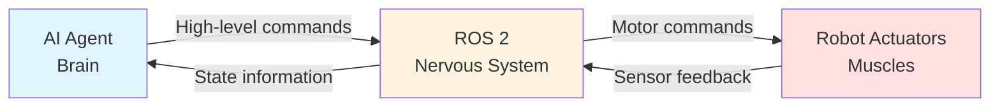

# Introduction: ROS 2 as the Robotic Nervous System

## Learning Objectives

By the end of this section, you will be able to:

- Explain why physical AI systems need middleware like ROS 2
- Describe the "robotic nervous system" analogy and how it maps to ROS 2 architecture
- Identify the problem ROS 2 solves in connecting AI agents to physical robots
- Understand the high-level flow from AI decision to robot actuation

## The Challenge of Physical AI

Imagine you've built an intelligent AI agent capable of making complex decisions: "navigate to the kitchen," "pick up the cup," or "avoid that obstacle." Now imagine this AI needs to control a physical humanoid robot with dozens of motors, sensors, and actuators. How does a high-level AI decision like "raise left arm" translate into precise motor commands that move servos, read sensor feedback, and coordinate multiple joints?

This is the fundamental challenge of **physical AI**: bridging the gap between abstract decision-making and concrete physical action. Without a robust communication layer, you'd need to write custom code for every sensor, every actuator, and every possible interaction—a maintenance nightmare that doesn't scale.

## ROS 2: The Robotic Nervous System

This is where ROS 2 (Robot Operating System 2) comes in. ROS 2 acts as the **robotic nervous system**, serving as the communication middleware that connects AI "brains" to robot "bodies."

Just as your biological nervous system transmits signals from your brain to your muscles, ROS 2 transmits messages from AI decision-making logic to robot actuators. When you decide to pick up a cup, your brain doesn't directly control each muscle fiber—it sends high-level commands through your nervous system, which coordinates the complex biomechanics. Similarly, when an AI agent decides to "grasp an object," it doesn't directly control each motor—it publishes messages through ROS 2, which handles the communication infrastructure.

### The Nervous System Analogy

**Figure 1**: ROS 2 as the nervous system connecting AI decision-making to physical robot actuation

In this analogy:

- **AI Agent = Brain**: Makes high-level decisions based on goals and sensor input
- **ROS 2 = Nervous System**: Transmits messages bidirectionally between brain and body
- **Robot Actuators = Muscles**: Execute physical actions based on received commands

The beauty of this architecture is **modularity**: your AI agent doesn't need to know the low-level details of motor control, and your robot hardware doesn't need to understand AI decision-making logic. ROS 2 provides the standardized communication layer that lets these components work together.

## What Problem Does ROS 2 Solve?

ROS 2 addresses several critical challenges in robotics:

### 1. **Distributed Communication**

Physical robots are inherently distributed systems. A humanoid robot might have:
- Vision processing running on a GPU
- Path planning on a CPU
- Motor control on real-time microcontrollers
- AI decision-making in the cloud or edge device

ROS 2 enables these distributed components to communicate seamlessly using a publish-subscribe pattern and request-response services [ROS 2 Concepts](https://docs.ros.org/en/foxy/Concepts.html) (retrieved 2025-12-26).

### 2. **Hardware Abstraction**

Different robot platforms use different sensors and actuators. ROS 2 provides a **hardware abstraction layer** through standardized message types. An AI agent publishing a `geometry_msgs/Twist` message to command velocity works regardless of whether the robot uses wheels, legs, or treads.

### 3. **Modularity and Reusability**

By defining clear communication interfaces, ROS 2 enables:
- Swapping components without rewriting entire systems
- Reusing AI algorithms across different robot platforms
- Testing individual components in isolation
- Collaborative development where different teams work on different nodes

### 4. **Real-Time Capable Communication**

Unlike ROS 1, ROS 2 is built on DDS (Data Distribution Service), a real-time communication standard used in aerospace and industrial applications [ROS 2 Design](https://design.ros2.org/) (retrieved 2025-12-26). This makes ROS 2 suitable for safety-critical robotics applications requiring deterministic timing.

## From AI Decision to Robot Action: The Flow

Let's trace a simple example: an AI agent decides to move the robot forward.

1. **AI Decision**: The AI agent's decision-making logic determines "move forward at 0.5 m/s"
2. **ROS 2 Message**: The AI node publishes a `geometry_msgs/Twist` message to the `/cmd_vel` topic
3. **Message Routing**: ROS 2's middleware routes this message to all subscribed nodes
4. **Robot Control**: The robot's motor controller node receives the message and translates it into motor commands
5. **Physical Actuation**: Motors execute the commands, moving the robot forward
6. **Feedback Loop**: Sensors publish position/velocity feedback back through ROS 2 to the AI agent

This entire flow happens through ROS 2's communication infrastructure—no direct connections between the AI and hardware are needed.

## Why This Matters for Physical AI

As AI systems increasingly control physical robots—from warehouse automation to humanoid assistants—the need for reliable, scalable communication infrastructure becomes critical. ROS 2 provides:

- **Standardization**: Common message formats enable interoperability
- **Scalability**: From small research robots to industrial systems
- **Ecosystem**: Thousands of open-source packages for perception, planning, and control
- **Community**: Active development and support from industry and academia

Understanding ROS 2 as the "nervous system" helps you reason about system architecture: Where should processing happen? How should components communicate? What happens when communication fails? These questions become clearer when you think of ROS 2 as the infrastructure connecting intelligent decision-making to physical action.

## What's Next

In the following sections, we'll dive deeper into ROS 2's architecture and core concepts:

- **Section 02**: ROS 2 Architecture Overview - Understanding the distributed node-based system
- **Section 03**: ROS 2 Nodes - The building blocks of ROS 2 applications
- **Section 04**: Topics - Publish/subscribe communication for data streams
- **Section 05**: Services - Request/response patterns for remote procedure calls

By the end of this module, you'll understand how to integrate AI agents with ROS 2 and trace message flow from high-level decisions to low-level robot control.

---

## Comprehension Check

Test your understanding of this section:

1. **What is the primary role of ROS 2 in a physical AI system?**
   

   
Answer

   ROS 2 serves as the communication middleware (the "nervous system") that connects AI decision-making logic to physical robot hardware, enabling distributed components to exchange messages.
   

2. **In the nervous system analogy, what does ROS 2 represent, and why is this analogy useful?**
   

   
Answer

   ROS 2 represents the nervous system that transmits signals between the AI "brain" and robot "muscles." This analogy is useful because it emphasizes ROS 2's role as bidirectional communication infrastructure that doesn't make decisions or perform actions itself, but enables coordination between high-level intelligence and low-level execution.
   

3. **Name two key problems that ROS 2 solves for physical AI systems.**
   

   
Answer

   Any two of: (1) Distributed communication between heterogeneous components, (2) Hardware abstraction enabling platform-independent AI code, (3) Modularity and component reusability, (4) Real-time capable communication for safety-critical applications.
   

---

**Word Count**: ~680 words
**Reading Time**: ~5 minutes at 120 wpm
**Prerequisites**: Basic understanding of AI agents and robotics concepts
**Next Section**: [ROS 2 Architecture Overview](./02-ros2-architecture.md)
