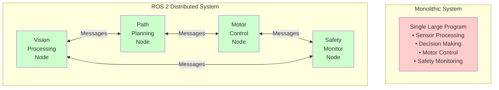

# ROS 2 Architecture Overview

## Learning Objectives

By the end of this section, you will be able to:

- Describe ROS 2's distributed, node-based architecture
- Explain the advantages of distributed systems over monolithic approaches
- Identify the role of DDS (Data Distribution Service) in ROS 2
- Understand how nodes communicate without centralized coordination

## Distributed vs. Monolithic Architecture

Traditional robot control systems often use a **monolithic architecture**: a single large program that handles all robot functionality—sensor processing, decision-making, motor control, and safety monitoring—in one tightly coupled codebase.

**Problems with Monolithic Approaches**:
- **Difficult to modify**: Changing one component risks breaking others
- **Hard to test**: Can't test individual functions in isolation
- **No parallelization**: All processing runs sequentially on one CPU
- **Team bottlenecks**: Multiple developers can't work on different parts independently
- **No reusability**: Code is too intertwined to extract and reuse

ROS 2 takes a fundamentally different approach: **distributed architecture** where the robot's control system is decomposed into independent **nodes** that communicate via messages.



**Figure 1**: Monolithic vs. Distributed Architecture in robotics systems

## ROS 2's Node-Based Architecture

At its core, ROS 2 is a **middleware** that enables communication between independent processes called **nodes**. According to the official documentation, "A node is an executable process that performs computation" and "each node can send and receive data from other nodes via topics, services, actions, or parameters" [ROS 2 Concepts: Nodes](https://docs.ros.org/en/iron/Concepts/Basic/About-Nodes.html) (retrieved 2025-12-26).

### Key Architectural Principles

**1. Process Isolation**

Each node runs as a separate operating system process. If one node crashes, others continue running. This fault isolation is critical for safety-critical robotics applications.

**2. Language Agnostic**

Nodes can be written in different programming languages (Python, C++, Rust) and still communicate seamlessly. An AI agent in Python can send commands to a motor controller in C++ without any language barriers.

**3. Location Transparency**

Nodes don't need to know where other nodes are running. A node can run:
- On the same computer as other nodes
- On a different computer in the local network
- In a Docker container
- In the cloud

ROS 2 handles the networking details automatically.

**4. Discovery and Dynamic Configuration**

Nodes discover each other automatically at runtime—no central registry or configuration server required (unlike ROS 1). When a new node starts publishing to a topic, subscribers automatically detect and connect to it.

## The Role of DDS (Data Distribution Service)

ROS 2 is built on **DDS (Data Distribution Service)**, an industry-standard middleware used in military, aerospace, and industrial control systems. DDS provides:

- **Quality of Service (QoS)**: Configure reliability, durability, and latency requirements per-topic
- **Real-time capable**: Deterministic communication suitable for safety-critical systems
- **Scalability**: Supports thousands of nodes and high-throughput data streams
- **No single point of failure**: Fully distributed—no central broker

Unlike ROS 1's centralized roscore, ROS 2 has no master node. This eliminates a critical failure point and enables true peer-to-peer communication [ROS 2 Design: DDS and ROS middleware](https://design.ros2.org/articles/ros_on_dds.html) (retrieved 2025-12-26).

:::info What is Middleware?
Middleware is software that sits between the operating system and applications, providing common services like communication, data management, and concurrency. ROS 2 is robotics-specific middleware that handles message passing, service calls, and data distribution.
:::

## Communication Patterns in ROS 2

ROS 2 supports multiple communication patterns to suit different use cases:

### Topics (Publish/Subscribe)
- **Pattern**: One-to-many, asynchronous
- **Use Case**: Streaming sensor data, continuous commands
- **Example**: Camera node publishes images; multiple vision processing nodes subscribe

### Services (Request/Response)
- **Pattern**: One-to-one, synchronous
- **Use Case**: Remote procedure calls, state queries
- **Example**: "Get current battery level" returns a single response

### Actions (Goal-Feedback-Result)
- **Pattern**: Long-running tasks with feedback
- **Use Case**: Navigation, grasping, motion planning
- **Example**: "Navigate to kitchen" with periodic progress updates

Each pattern serves a specific purpose. According to ROS 2 guidance, "Topics provide asynchronous, one-to-many communication suitable for streaming data" while "services should be used for remote procedure calls that terminate quickly" [Topics vs Services vs Actions](https://docs.ros.org/en/foxy/How-To-Guides/Topics-Services-Actions.html) (retrieved 2025-12-26).

## Advantages of ROS 2's Distributed Architecture

### 1. **Modularity**
Swap components without rewriting the system. Replace a simple path planner with an advanced one by creating a new node with the same communication interface.

### 2. **Parallel Processing**
Different nodes run on different CPU cores or computers. Vision processing can run on a GPU while motor control runs on a real-time CPU.

### 3. **Fault Isolation**
A crash in the vision processing node doesn't bring down the entire robot. Safety-critical nodes (motor control, emergency stop) can continue operating.

### 4. **Incremental Development**
Build and test one node at a time. Add new functionality by adding new nodes without modifying existing ones.

### 5. **Team Collaboration**
Different team members work on different nodes with clear interface contracts. The person working on vision doesn't need to understand motor control details.

### 6. **Component Reusability**
A localization node developed for one robot can be reused on a different robot platform if both use the same message interfaces.

## Example: Humanoid Robot Architecture

Consider a humanoid robot's ROS 2 architecture:

```
┌─────────────────┐     ┌──────────────────┐     ┌─────────────────┐
│  AI Decision    │────▶│  Path Planning   │────▶│  Motion         │
│  Making Node    │     │  Node            │     │  Control Node   │
└─────────────────┘     └──────────────────┘     └─────────────────┘
         │                                                 │
         │                                                 ▼
         │                                        ┌─────────────────┐
         │                                        │  Joint          │
         │                                        │  Controllers    │
         │                                        └─────────────────┘
         ▼                                                 │
┌─────────────────┐     ┌──────────────────┐             │
│  Vision         │────▶│  Object          │             │
│  Processing     │     │  Detection       │             │
└─────────────────┘     └──────────────────┘             │
         ▲                                                 │
         │                                                 ▼
┌─────────────────┐                              ┌─────────────────┐
│  Camera         │                              │  Motors &       │
│  Driver Node    │                              │  Sensors        │
└─────────────────┘                              └─────────────────┘
```

Each box is an independent node. Vision processing nodes don't need to know about motor control. The AI decision-making node doesn't need to understand camera drivers. Clear interfaces enable independent development and testing.

## What ROS 2 Is NOT

It's important to understand what ROS 2 doesn't provide:

❌ **Not an operating system**: ROS 2 runs on top of Linux, Windows, or macOS
❌ **Not a robot platform**: You still need to choose or build your robot hardware
❌ **Not AI/ML libraries**: You bring your own (TensorFlow, PyTorch, etc.)
❌ **Not a real-time OS**: While DDS enables real-time communication, the underlying OS must also be real-time

ROS 2 is **middleware**—infrastructure that connects components and enables communication, not the components themselves.

## Key Takeaways

- ROS 2 uses **distributed architecture** with independent nodes instead of monolithic programs
- **DDS middleware** provides real-time, scalable, fault-tolerant communication
- **Multiple communication patterns** (topics, services, actions) suit different use cases
- **Process isolation** and fault tolerance make ROS 2 suitable for safety-critical robotics
- **Modularity** enables parallel development, component reuse, and incremental testing
- ROS 2 is **middleware**, not an OS or robot platform—it provides communication infrastructure

This architectural foundation enables the modular, flexible robotics systems that power modern physical AI applications. In the following sections, we'll explore each architectural component in detail, starting with nodes.

---

## Comprehension Check

1. **What are three advantages of ROS 2's distributed architecture compared to monolithic systems?**
   <details>
   <summary>Answer</summary>
   Any three of: (1) Fault isolation - crashes are contained to individual nodes, (2) Parallel processing - different nodes run on different cores/computers, (3) Modularity - components can be swapped without rewriting the system, (4) Team collaboration - different developers work on different nodes independently, (5) Component reusability - nodes can be reused across robot platforms.
   </details>

2. **What is DDS and why is it important for ROS 2?**
   <details>
   <summary>Answer</summary>
   DDS (Data Distribution Service) is an industry-standard middleware that ROS 2 is built upon. It's important because it provides real-time capable communication, Quality of Service configuration, scalability to thousands of nodes, and eliminates single points of failure through fully distributed peer-to-peer architecture.
   </details>

3. **How does ROS 2 differ from ROS 1 in terms of architecture?**
   <details>
   <summary>Answer</summary>
   ROS 2 has no central master node (roscore), using DDS for fully distributed peer-to-peer communication instead. This eliminates a single point of failure and enables true distributed systems. ROS 2 also supports real-time communication and is built on modern middleware standards.
   </details>

---

**Word Count**: ~670 words
**Reading Time**: ~5-6 minutes
**Prerequisites**: Understanding of ROS 2's role from Section 01
**Next Section**: [ROS 2 Nodes: The Building Blocks](./03-nodes.md)
