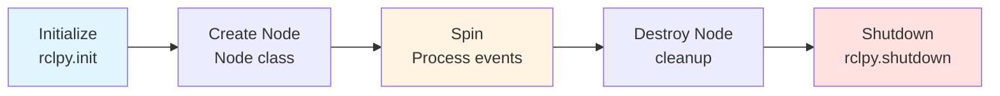

# ROS 2 Nodes: The Building Blocks

## Learning Objectives

By the end of this section, you will be able to:

- Define what a ROS 2 node is and its purpose
- Create basic nodes using the rclpy Python library
- Understand the node lifecycle (initialization, spinning, shutdown)
- Provide examples of nodes in humanoid robotics systems

## What is a Node?

A **node** is a process that performs a specific computational task in a ROS 2 system. According to the official documentation, "A node is an executable process that performs computation" and represents a single, modular purpose [ROS 2 Concepts: About Nodes](https://docs.ros.org/en/iron/Concepts/Basic/About-Nodes.html) (retrieved 2025-12-26).

Think of nodes as specialized workers in a factory:
- **Camera node**: Captures and publishes images (one job)
- **Object detection node**: Processes images to identify objects (one job)
- **Path planning node**: Computes navigation routes (one job)
- **Motor control node**: Sends commands to actuators (one job)

Each node focuses on doing one thing well, then communicates with other nodes to create complex robotic behavior.

### Key Characteristics of Nodes

**1. Single Responsibility**
Each node should have one clear purpose. Don't create a "robot_brain" node that does everything—instead, create separate nodes for vision, planning, and control.

**2. Independence**
Nodes run as separate OS processes and can crash without affecting other nodes. This fault isolation is critical for reliable robotics systems.

**3. Communication via Interfaces**
Nodes never call each other's functions directly. They communicate only through ROS 2's messaging infrastructure (topics, services, actions).

**4. Discoverability**
Nodes announce their presence automatically. You can list all active nodes with `ros2 node list` without needing a central registry.

## Nodes in a Humanoid Robot System

Let's explore realistic node examples from a humanoid robotics application:

### Perception Nodes
- `camera_driver` - Captures RGB images from head-mounted camera
- `depth_sensor` - Publishes 3D point clouds from depth cameras
- `imu_publisher` - Streams inertial measurement data (acceleration, orientation)
- `object_detector` - Identifies objects in camera images using computer vision

### Decision-Making Nodes
- `ai_agent` - High-level decision-making and task planning
- `behavior_controller` - Sequences behaviors (walk, grasp, look)
- `safety_monitor` - Watches for unsafe conditions and triggers emergency stops

### Control Nodes
- `joint_trajectory_controller` - Plans smooth joint motions
- `balance_controller` - Maintains upright posture during movement
- `gripper_controller` - Controls hand/gripper opening and closing

### Infrastructure Nodes
- `robot_state_publisher` - Broadcasts robot's joint positions and link transforms
- `diagnostic_aggregator` - Collects and summarizes system health data
- `data_logger` - Records sensor data and commands for analysis

:::tip Node Naming Convention
Use descriptive, lowercase names with underscores: `camera_driver`, `path_planner`, `motor_controller`. Avoid generic names like `node1` or `my_node`.
:::

## Creating a Basic Node in Python

Let's create a simple AI decision-making node that represents the "brain" of our humanoid robot.

### Example 1: Minimal Node Structure

```python title="simple_ai_node.py"
import rclpy
from rclpy.node import Node

class SimpleAINode(Node):
    """Minimal AI decision-making node for humanoid robot."""

    def __init__(self):
        # Initialize the node with a name
        super().__init__('simple_ai_node')
        self.get_logger().info('AI node initialized and ready')

    def make_decision(self):
        """Placeholder for AI decision-making logic."""
        self.get_logger().info('Making intelligent decision...')
        # AI logic would go here
        return "decision_made"

def main(args=None):
    rclpy.init(args=args)           # Initialize ROS 2 communication
    node = SimpleAINode()           # Create our node instance
    rclpy.spin(node)                # Keep node alive to process events
    node.destroy_node()             # Clean up node resources
    rclpy.shutdown()                # Shutdown ROS 2 communication

if __name__ == '__main__':
    main()
```

**Code Explanation**:

1. **Line 1**: Import `rclpy`, the Python client library for ROS 2 [rclpy Package](https://docs.ros.org/en/rolling/p/rclpy/rclpy.html) (retrieved 2025-12-26)
2. **Line 2**: Import `Node` base class that all ROS 2 nodes inherit from
3. **Line 9**: Call parent constructor with node name `'simple_ai_node'`—this name appears in `ros2 node list`
4. **Line 10**: Use built-in logger to print messages with timestamps and severity levels
5. **Line 18**: `rclpy.init()` sets up ROS 2 communication infrastructure
6. **Line 20**: `rclpy.spin(node)` keeps the node running and processes callbacks (more on this in Section 08)
7. **Lines 21-22**: Cleanup before exiting

## Node Lifecycle

Every ROS 2 node follows a standard lifecycle pattern:



**Figure 1**: Standard ROS 2 node lifecycle from initialization to shutdown

### Lifecycle Phases Explained

**1. Initialization** (`rclpy.init()`)
- Sets up ROS 2 communication layer
- Parses command-line arguments (e.g., `--ros-args -r __node:=new_name`)
- Establishes connection to DDS middleware
- Must be called before creating any nodes

**2. Node Creation** (`Node()`)
- Creates node with specified name
- Registers node with ROS 2 system
- Sets up logging infrastructure
- Initializes publishers, subscribers, timers (if defined)

**3. Spinning** (`rclpy.spin()`)
- Enters event loop that processes callbacks
- Handles incoming messages on subscriptions
- Executes timer callbacks
- Blocks until node is interrupted (Ctrl+C) or `shutdown()` is called

**4. Cleanup** (`destroy_node()`)
- Releases node resources
- Closes publishers and subscribers
- Stops timers

**5. Shutdown** (`rclpy.shutdown()`)
- Closes ROS 2 communication infrastructure
- Should be called once at program end

## Node with Timer: Periodic Execution

Many nodes need to perform tasks periodically. Let's create a node that logs its status every second.

### Example 2: Node with Timer

```python title="status_monitor_node.py"
import rclpy
from rclpy.node import Node

class StatusMonitorNode(Node):
    """Monitors and reports robot status periodically."""

    def __init__(self):
        super().__init__('status_monitor')
        # Create timer that calls status_callback every 1.0 seconds
        self.timer = self.create_timer(1.0, self.status_callback)
        self.status_count = 0
        self.get_logger().info('Status monitor started')

    def status_callback(self):
        """Called every second by the timer."""
        self.status_count += 1
        self.get_logger().info(f'Robot status check #{self.status_count}: All systems operational')

def main(args=None):
    rclpy.init(args=args)
    node = StatusMonitorNode()
    rclpy.spin(node)  # Timer callbacks execute during spin
    node.destroy_node()
    rclpy.shutdown()

if __name__ == '__main__':
    main()
```

**Code Explanation**:

1. **Line 10**: `create_timer(period_sec, callback_function)` creates a timer that executes the callback every 1.0 seconds
2. **Line 11**: Instance variable to track how many times the callback has executed
3. **Lines 14-17**: Callback function that runs periodically—increments counter and logs status
4. **Line 23**: `spin()` processes timer callbacks; without spinning, timers never execute

:::info Timer Precision
Timer periods are approximate, not guaranteed. A 1.0-second timer might trigger at 1.02 or 0.98 seconds depending on system load. For precise timing, use real-time OS features.
:::

## Running and Inspecting Nodes

Once you've created a node, you can run and inspect it:

```bash
# Run the node
python3 simple_ai_node.py

# In another terminal: List all active nodes
ros2 node list

# Get detailed information about a node
ros2 node info /simple_ai_node

# Inspect a running node's publishers, subscribers, services
ros2 node info /status_monitor
```

The `ros2 node info` command shows:
- Subscribers: Topics the node listens to
- Publishers: Topics the node sends to
- Services: Services the node provides or uses
- Actions: Long-running tasks the node handles

## Multiple Nodes in One Executable

According to ROS 2 documentation, "a single executable (C++ program, Python program, etc.) can contain one or more nodes" [Understanding ROS 2 Nodes](https://docs.ros.org/en/foxy/Tutorials/Beginner-CLI-Tools/Understanding-ROS2-Nodes/Understanding-ROS2-Nodes.html) (retrieved 2025-12-26).

You can create multiple nodes in one process using `MultiThreadedExecutor` or `SingleThreadedExecutor`, but this is an advanced topic. For most applications, one node per executable provides better fault isolation.

## When to Create a New Node

**Create a separate node when**:
✅ The functionality has a distinct purpose (vision vs. planning vs. control)
✅ You want independent failure isolation (crash in vision shouldn't stop motors)
✅ The task runs at a different frequency (camera at 30 Hz, planning at 10 Hz)
✅ Different team members work on different components

**Keep functionality in the same node when**:
✅ Functions are tightly coupled and always used together
✅ They share significant state or resources
✅ Performance requires minimal inter-process communication overhead

## Key Takeaways

- **Nodes** are independent processes that perform specific computational tasks
- Each node should have a **single, well-defined responsibility**
- The **rclpy library** provides Python APIs for creating nodes
- Node lifecycle: **Initialize → Create → Spin → Destroy → Shutdown**
- Use `create_timer()` for **periodic execution** of tasks
- Nodes communicate only through **topics, services, and actions**—never direct function calls
- Humanoid robots use **dozens of specialized nodes** working together

In the next section, we'll explore how these nodes communicate using the publish/subscribe pattern with topics.

---

## Comprehension Check

1. **Give three examples of nodes you might find in a humanoid robot system and explain what each does.**
   <details>
   <summary>Answer</summary>
   Possible answers include: (1) `camera_driver` - captures and publishes images from robot's cameras, (2) `balance_controller` - maintains upright posture during movement, (3) `ai_agent` - makes high-level decisions about robot behavior, (4) `joint_trajectory_controller` - plans smooth joint motions, (5) `object_detector` - identifies objects in camera images.
   </details>

2. **What is the purpose of `rclpy.spin(node)` in the node lifecycle?**
   <details>
   <summary>Answer</summary>
   `rclpy.spin(node)` enters an event loop that keeps the node alive and processes callbacks (timer callbacks, subscription callbacks, service callbacks). Without spinning, the node would create its publishers/subscribers and then immediately exit.
   </details>

3. **Why is it better to create multiple small nodes instead of one large "robot_brain" node?**
   <details>
   <summary>Answer</summary>
   Multiple small nodes provide: (1) Fault isolation - one node crashing doesn't crash the entire system, (2) Parallel development - different team members work independently, (3) Parallel execution - nodes run on different CPU cores, (4) Component reusability - nodes can be reused across robot platforms, (5) Clear interfaces - communication contracts are explicit.
   </details>

---

**Word Count**: ~695 words
**Code Examples**: 2 complete examples (17 and 18 lines)
**Reading Time**: ~6 minutes
**Prerequisites**: Understanding of ROS 2 architecture (Section 02)
**Next Section**: [ROS 2 Topics: Publisher/Subscriber Communication](./04-topics.md)
