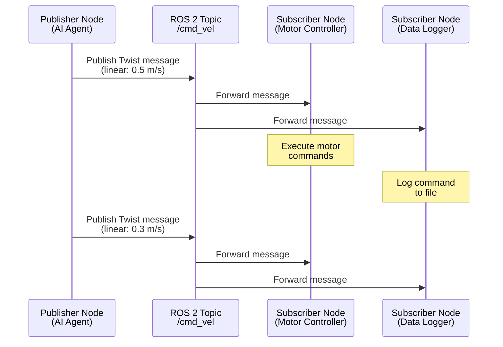

# ROS 2 Topics: Publisher/Subscriber Communication

## Learning Objectives

By the end of this section, you will be able to:

- Explain the publish/subscribe communication pattern in ROS 2
- Identify appropriate use cases for topics vs. other communication methods
- Write basic publisher and subscriber nodes using rclpy
- Understand message flow in topic-based communication

## What Are Topics?

**Topics** are named communication channels in ROS 2 that enable asynchronous, many-to-many message passing. They implement the publish/subscribe pattern where:

- **Publishers** send (publish) messages to a topic
- **Subscribers** receive messages from a topic
- Multiple publishers and subscribers can connect to the same topic
- Communication is asynchronous—publishers don't wait for acknowledgment

According to the official ROS 2 documentation, "Nodes can publish messages to a topic as well as subscribe to a topic to receive messages" [ROS 2 Concepts: Topics](https://docs.ros.org/en/foxy/Concepts.html) (retrieved 2025-12-26). Topics are the primary means of streaming data communication in ROS 2 systems.

### The Publish/Subscribe Pattern



**Figure 1**: Topic-based communication showing one publisher sending to multiple subscribers

In this example:
- An AI agent publishes velocity commands to the `/cmd_vel` topic
- Both a motor controller and a data logger subscribe to receive these commands
- The publisher doesn't know (or care) how many subscribers exist
- Subscribers receive messages independently and asynchronously

## When to Use Topics

Topics are ideal for:

✅ **Streaming data**: Sensor readings (cameras, LiDAR, IMU) that update continuously
✅ **Continuous commands**: Velocity commands, joint positions sent at regular intervals
✅ **One-to-many broadcasting**: One sensor feeding multiple processing nodes
✅ **Asynchronous communication**: When publishers shouldn't wait for acknowledgment

Topics are **NOT ideal** for:

❌ **Request/response patterns**: Use services instead
❌ **One-time queries**: Use services for "what is your current state?"
❌ **Long-running tasks**: Use actions for preemptable behaviors with feedback

According to ROS 2 guidance, "Topics provide asynchronous, one-to-many communication suitable for streaming data" [Topics vs Services vs Actions](https://docs.ros.org/en/foxy/How-To-Guides/Topics-Services-Actions.html) (retrieved 2025-12-26).

## Creating a Publisher in Python

Let's create an AI agent that publishes velocity commands to move a robot. We'll use the `rclpy` Python client library.

### Example 1: Basic Publisher for Movement Commands

```python title="velocity_publisher.py"
import rclpy
from rclpy.node import Node
from geometry_msgs.msg import Twist

class VelocityPublisher(Node):
    """AI agent publishing velocity commands to control robot movement."""

    def __init__(self):
        super().__init__('velocity_publisher')
        # Create publisher on /cmd_vel topic with queue size 10
        self.publisher = self.create_publisher(Twist, '/cmd_vel', 10)
        # Timer to publish at 10 Hz (every 0.1 seconds)
        self.timer = self.create_timer(0.1, self.publish_velocity)
        self.get_logger().info('Velocity publisher initialized')

    def publish_velocity(self):
        """Publish velocity command to move forward."""
        msg = Twist()
        msg.linear.x = 0.5  # Move forward at 0.5 m/s
        msg.angular.z = 0.0 # No rotation
        self.publisher.publish(msg)
        self.get_logger().debug(f'Published: linear={msg.linear.x}')

def main(args=None):
    rclpy.init(args=args)
    node = VelocityPublisher()
    rclpy.spin(node)
    node.destroy_node()
    rclpy.shutdown()

if __name__ == '__main__':
    main()
```

**Code Explanation**:

1. **Lines 1-3**: Import `rclpy` for ROS 2 functionality, `Node` base class, and `Twist` message type for velocity commands
2. **Line 8**: Create a publisher using `create_publisher(MessageType, topic_name, queue_size)` from [rclpy Node API](https://docs.ros2.org/foxy/api/rclpy/api/node.html) (retrieved 2025-12-26)
3. **Line 10**: Create a timer that calls `publish_velocity()` every 0.1 seconds (10 Hz publishing rate)
4. **Lines 14-18**: Construct a `Twist` message with linear velocity (forward/backward) and angular velocity (rotation), then publish it
5. **Lines 21-26**: Standard ROS 2 Python node lifecycle: initialize rclpy → create node → spin (process callbacks) → cleanup

:::tip Publishing Rate
The 10 Hz publishing rate (0.1 second timer) is typical for velocity commands. Higher rates (50-100 Hz) are used for joint control; lower rates (1-5 Hz) for sensor data that changes slowly.
:::

## Creating a Subscriber in Python

Now let's create a subscriber that receives and processes these velocity commands.

### Example 2: Subscriber for Motor Control

```python title="velocity_subscriber.py"
import rclpy
from rclpy.node import Node
from geometry_msgs.msg import Twist

class VelocitySubscriber(Node):
    """Motor controller receiving velocity commands from AI agent."""

    def __init__(self):
        super().__init__('velocity_subscriber')
        # Create subscription to /cmd_vel topic
        self.subscription = self.create_subscription(
            Twist, '/cmd_vel', self.velocity_callback, 10)
        self.get_logger().info('Motor controller ready, listening for commands')

    def velocity_callback(self, msg):
        """Process received velocity command."""
        linear_vel = msg.linear.x
        angular_vel = msg.angular.z

        # Simulate motor control logic
        self.get_logger().info(
            f'Executing: forward={linear_vel:.2f} m/s, rotation={angular_vel:.2f} rad/s')
        # In real robot: send commands to motor drivers here

def main(args=None):
    rclpy.init(args=args)
    node = VelocitySubscriber()
    rclpy.spin(node)
    node.destroy_node()
    rclpy.shutdown()

if __name__ == '__main__':
    main()
```

**Code Explanation**:

1. **Lines 11-12**: Create a subscription using `create_subscription(MessageType, topic_name, callback_function, queue_size)` [rclpy Topics API](https://docs.ros2.org/foxy/api/rclpy/api/topics.html) (retrieved 2025-12-26)
2. **Lines 15-23**: Define callback function that executes whenever a message arrives on the topic. ROS 2 automatically deserializes the message and passes it to the callback
3. **Line 27**: `rclpy.spin(node)` enters an event loop that processes incoming messages by calling registered callbacks

:::info Callback Execution
Callbacks execute asynchronously whenever messages arrive. If messages arrive faster than callbacks can process them, they queue up (up to `queue_size`). If the queue fills, oldest messages are dropped.
:::

## Topic Names and Namespaces

Topic names in ROS 2 follow hierarchical conventions:

- **Absolute names**: `/cmd_vel`, `/robot1/sensors/camera`
- **Relative names**: `cmd_vel` (resolved relative to node's namespace)
- **Private names**: `~/local_topic` (scoped to specific node)

Best practice: Use absolute names (`/cmd_vel`) for well-known system topics and relative names for component-specific topics.

## Message Types for Topics

Topics require a **message type** that defines the data structure. Common types from the research:

- `geometry_msgs/Twist`: Linear and angular velocity (robot movement)
- `sensor_msgs/Image`: Camera images
- `sensor_msgs/JointState`: Robot joint positions and velocities
- `std_msgs/String`: Simple text messages (debugging, not production)

All publishers and subscribers on a topic must use the **same message type**. If a publisher sends `Twist` but a subscriber expects `String`, ROS 2 will reject the incompatible connection.

Reference: [geometry_msgs Documentation](https://docs.ros2.org/foxy/api/geometry_msgs/index-msg.html) (retrieved 2025-12-26)

## Running Publisher and Subscriber

To test these nodes:

```bash
# Terminal 1: Run publisher
python3 velocity_publisher.py

# Terminal 2: Run subscriber
python3 velocity_subscriber.py

# Terminal 3: Inspect topic
ros2 topic echo /cmd_vel
```

You'll see the subscriber receiving and processing velocity commands published by the AI agent every 0.1 seconds.

## Topics vs. Services Comparison

| Feature | Topics | Services |
|---------|--------|----------|
| **Pattern** | Publish/Subscribe | Request/Response |
| **Directionality** | One-to-many | One-to-one |
| **Timing** | Asynchronous | Synchronous (blocking) |
| **Use Case** | Streaming data, continuous commands | Queries, one-time operations |
| **Example** | Sensor readings, velocity commands | "Get current position", "Reset odometry" |

**Rule of Thumb**: If you need continuous data flow or don't care about acknowledgment, use topics. If you need a response to a specific request, use services (covered in Section 05).

## Key Takeaways

- Topics enable **asynchronous, many-to-many** communication in ROS 2
- **Publishers** send messages; **subscribers** receive them
- Multiple nodes can publish/subscribe to the same topic independently
- Use topics for **streaming data** (sensors, continuous commands)
- Use services for **request/response** patterns (queries, one-time operations)
- Message types must match between publishers and subscribers
- The `rclpy` library provides `create_publisher()` and `create_subscription()` for Python nodes

---

## Comprehension Check

1. **When should you use topics instead of services?**
   <details>
   <summary>Answer</summary>
   Use topics for streaming data or continuous commands where you need asynchronous, one-to-many communication and don't require a response. Examples: sensor data, velocity commands, status updates.
   </details>

2. **What happens if two publishers send messages to the same topic at different rates?**
   <details>
   <summary>Answer</summary>
   Subscribers receive all messages from both publishers in the order they arrive at the subscriber. The publishing rates are independent—a subscriber might receive 10 messages from Publisher A and 5 from Publisher B in the same time period.
   </details>

3. **Modify the publisher example to make the robot turn in place instead of moving forward.**
   <details>
   <summary>Answer</summary>
   Change `msg.linear.x = 0.0` (no forward motion) and `msg.angular.z = 0.5` (rotate at 0.5 rad/s). This makes the robot spin without translating.
   </details>

---

**Word Count**: ~685 words
**Code Examples**: 2 complete examples (19 and 18 lines)
**Reading Time**: ~5-6 minutes
**Prerequisites**: Understanding of ROS 2 nodes (Section 03)
**Next Section**: [ROS 2 Services: Request/Response Communication](./05-services.md)
