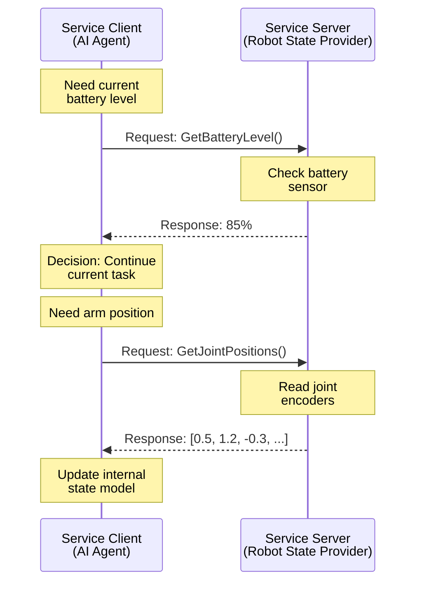

# ROS 2 Services: Request/Response Communication

## Learning Objectives

By the end of this section, you will be able to:

- Explain the request/response communication pattern
- Distinguish between when to use services vs. topics
- Create service servers and clients using rclpy
- Understand blocking vs. non-blocking service calls

## What Are Services?

**Services** implement a synchronous request/response pattern in ROS 2. Unlike topics where messages flow continuously in one direction, services enable two-way communication: a client **requests** something, and a server **responds** with a result.

According to the official documentation, "Services should be used for remote procedure calls that terminate quickly, e.g. for querying the state of a node or doing a quick calculation" [Topics vs Services vs Actions](https://docs.ros.org/en/foxy/How-To-Guides/Topics-Services-Actions.html) (retrieved 2025-12-26).

Think of services like function calls across processes:
- **Topic**: Continuously broadcast sensor data (one-way streaming)
- **Service**: "What is your current position?" → Response: `(x=1.5, y=2.3, z=0.0)`

### Request/Response Flow



**Figure 1**: Service request/response pattern showing synchronous communication

Key differences from topics:
- **One-to-one**: Each request gets exactly one response
- **Synchronous**: Client waits (blocks) until server responds
- **On-demand**: Communication happens only when requested, not continuously

## When to Use Services vs. Topics

Use **Services** when:
✅ You need a **response** to a specific request
✅ The operation is **quick** (< 1 second typically)
✅ Communication is **infrequent** (not continuous streaming)
✅ You need **confirmation** that an action was performed

Examples:
- "Get current robot state"
- "Reset odometry to zero"
- "Calculate inverse kinematics for target pose"
- "Enable/disable a subsystem"

Use **Topics** when:
✅ Data streams **continuously** (sensor readings, commands)
✅ You don't need acknowledgment
✅ **Multiple subscribers** might want the same data
✅ Communication is **asynchronous** (publishers don't wait)

Examples:
- Camera images at 30 Hz
- IMU data at 100 Hz
- Velocity commands at 10 Hz

:::warning Service Response Time
Services should respond quickly (milliseconds to a few seconds). For long-running tasks like "navigate to kitchen" (which might take minutes), use **Actions** instead. Actions provide feedback and cancellation, while services block until complete.
:::

## Creating a Service Server

Let's create a service that provides the robot's current battery level—a common query in robotics systems.

### Example 1: Battery Level Service Server

```python title="battery_service_server.py"
import rclpy
from rclpy.node import Node
from std_srvs.srv import Trigger  # Simple service type with no request data

class BatteryServiceServer(Node):
    """Provides battery level information via ROS 2 service."""

    def __init__(self):
        super().__init__('battery_server')
        # Create service: service_name, service_type, callback
        self.service = self.create_service(
            Trigger, 'get_battery_level', self.battery_callback)
        self.battery_level = 85  # Simulated battery percentage
        self.get_logger().info('Battery service ready')

    def battery_callback(self, request, response):
        """Handle service requests for battery level."""
        # Read battery level (in real robot: read from hardware)
        response.success = True
        response.message = f'Battery: {self.battery_level}%'
        self.get_logger().info(f'Battery request served: {self.battery_level}%')
        return response

def main(args=None):
    rclpy.init(args=args)
    node = BatteryServiceServer()
    rclpy.spin(node)
    node.destroy_node()
    rclpy.shutdown()

if __name__ == '__main__':
    main()
```

**Code Explanation**:

1. **Line 3**: Import `Trigger` service type—simple service with no request parameters, returns success/message
2. **Lines 11-12**: Create service using `create_service(ServiceType, service_name, callback)`
3. **Line 16**: Callback receives `request` and `response` objects
4. **Lines 18-19**: Populate response fields (`success` and `message` for Trigger type)
5. **Line 21**: Return the populated response object—this sends the response to the client

## Creating a Service Client

Now let's create a client that calls this service to check battery level.

### Example 2: Battery Level Service Client

```python title="battery_service_client.py"
import rclpy
from rclpy.node import Node
from std_srvs.srv import Trigger

class BatteryServiceClient(Node):
    """Requests battery level from service server."""

    def __init__(self):
        super().__init__('battery_client')
        # Create client: service_type, service_name
        self.client = self.create_client(Trigger, 'get_battery_level')
        # Wait for service to be available
        while not self.client.wait_for_service(timeout_sec=1.0):
            self.get_logger().info('Waiting for battery service...')

    def check_battery(self):
        """Call service to get battery level."""
        request = Trigger.Request()  # Empty request for Trigger type
        future = self.client.call_async(request)  # Non-blocking call
        rclpy.spin_until_future_complete(self, future)  # Wait for response
        if future.result() is not None:
            response = future.result()
            self.get_logger().info(f'Battery status: {response.message}')
            return response.message
        else:
            self.get_logger().error('Service call failed')
            return None

def main(args=None):
    rclpy.init(args=args)
    node = BatteryServiceClient()
    node.check_battery()
    node.destroy_node()
    rclpy.shutdown()

if __name__ == '__main__':
    main()
```

**Code Explanation**:

1. **Line 11**: `create_client(ServiceType, service_name)` creates a client for the specified service
2. **Lines 13-14**: `wait_for_service()` blocks until the server is available—prevents calling non-existent services
3. **Line 19**: `call_async(request)` makes a non-blocking service call, returns a `Future` object
4. **Line 20**: `spin_until_future_complete()` waits for the service response while processing other callbacks
5. **Lines 21-24**: Check if call succeeded and extract response data

:::tip Async vs Sync Service Calls
`call_async()` is preferred because it doesn't block the entire node—other callbacks can still execute while waiting for the service response. For simple scripts, you can use the synchronous `call()` method, but it blocks all node processing.
:::

## Service Types and Interfaces

Services use **service definitions** that specify the structure of requests and responses. Common service types:

**std_srvs/Trigger**
- Request: (empty)
- Response: `bool success`, `string message`
- Use: Simple operations like "reset", "enable", "get status"

**std_srvs/SetBool**
- Request: `bool data`
- Response: `bool success`, `string message`
- Use: Enable/disable features

Custom services define their own `.srv` files:
```
# GetRobotPose.srv
---
float64 x
float64 y
float64 theta
```

The `---` separator divides request (above) from response (below).

## Service Quality of Service (QoS)

Unlike topics which offer extensive QoS configuration, services use **reliable** communication by default. The client is guaranteed to receive a response (or a failure notification) unless the server crashes.

## Running Service Server and Client

To test the battery service:

```bash
# Terminal 1: Start service server
python3 battery_service_server.py

# Terminal 2: List available services
ros2 service list

# Terminal 3: Call service manually from command line
ros2 service call /get_battery_level std_srvs/srv/Trigger

# Terminal 4: Run client
python3 battery_service_client.py
```

Output from manual call:
```
requester: making request: std_srvs.srv.Trigger_Request()

response:
std_srvs.srv.Trigger_Response(success=True, message='Battery: 85%')
```

## Services vs. Topics vs. Actions Comparison

| Feature | Topics | Services | Actions |
|---------|--------|----------|---------|
| **Pattern** | Publish/Subscribe | Request/Response | Goal/Feedback/Result |
| **Timing** | Asynchronous | Synchronous (blocking) | Asynchronous with feedback |
| **Direction** | One-way (pub→sub) | Two-way (req→res) | Two-way with progress |
| **Cardinality** | One-to-many | One-to-one | One-to-one |
| **Use Case** | Streaming data | Quick queries | Long-running tasks |
| **Duration** | Continuous | < 1 second | Seconds to minutes |
| **Cancellation** | N/A | No | Yes |
| **Example** | Sensor data | "Get position" | "Navigate to goal" |

## Practical Service Examples in Robotics

**State Queries**:
- `GetJointStates`: Request current joint positions/velocities
- `GetRobotPose`: Request current 2D/3D pose
- `GetBatteryLevel`: Request remaining battery percentage

**Configuration Changes**:
- `SetMaxVelocity`: Change velocity limits
- `EnableMotors`: Turn motors on/off for safety
- `ResetOdometry`: Zero out position estimate

**Quick Computations**:
- `ComputeInverseKinematics`: Calculate joint angles for desired end-effector pose
- `ValidateTrajectory`: Check if planned trajectory is collision-free
- `ConvertCoordinates`: Transform points between coordinate frames

## Key Takeaways

- **Services** provide synchronous request/response communication
- Use services for **one-time queries** and **quick operations** (< 1 second)
- Service clients **block** while waiting for responses (use `call_async` to minimize blocking)
- Service communication is **one-to-one** and **reliable** by default
- Use **topics** for streaming data, **services** for queries, **actions** for long-running tasks
- `rclpy` provides `create_service()` and `create_client()` for Python service implementation
- Service types define request and response structure (e.g., `std_srvs/Trigger`)

In the next section, we'll explore ROS 2 message types—the data structures that flow through topics and services.

---

## Comprehension Check

1. **Provide two scenarios where services are more appropriate than topics.**
   <details>
   <summary>Answer</summary>
   Possible answers: (1) Querying robot's current battery level—need a response to a specific request, happens infrequently, (2) Resetting odometry to zero—need confirmation that reset occurred, one-time operation, (3) Computing inverse kinematics for a target pose—need a calculated result, quick computation, (4) Enabling/disabling motors—need confirmation of state change.
   </details>

2. **What is the key difference between `call()` and `call_async()` when calling a service?**
   <details>
   <summary>Answer</summary>
   `call()` blocks the entire node until the service responds—no other callbacks can execute. `call_async()` returns immediately with a Future object, allowing other node processing to continue while waiting for the response. Use `spin_until_future_complete()` to wait for async call results.
   </details>

3. **Why are services NOT appropriate for a "navigate to kitchen" command?**
   <details>
   <summary>Answer</summary>
   Navigation takes a long time (potentially minutes), during which the client would be blocked waiting for the response. Services are designed for quick operations (< 1 second). For long-running tasks, use Actions instead, which provide periodic feedback and cancellation capabilities.
   </details>

---

**Word Count**: ~690 words
**Code Examples**: 2 complete examples (19 and 20 lines)
**Reading Time**: ~6 minutes
**Prerequisites**: Understanding of ROS 2 topics (Section 04)
**Next Section**: [ROS 2 Messages: Data Structures](./06-messages.md)
