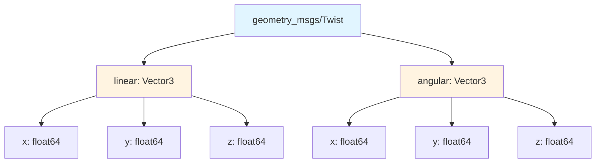

# ROS 2 Messages: Data Structures for Communication

## Learning Objectives

By the end of this section, you will be able to:

- Explain what ROS 2 messages are and why they're typed
- Identify common message types for robotics applications
- Create and populate messages in Python code
- Understand the structure of standard message packages

## What Are Messages?

**Messages** are strictly-typed data structures that define the format of information flowing through ROS 2 topics and services. Every message has a **schema** that specifies its fields, their types, and their meanings.

Think of messages as data contracts:
- A `geometry_msgs/Twist` message **always** has `linear` and `angular` velocity fields
- A `sensor_msgs/Image` message **always** has `height`, `width`, `encoding`, and `data` fields
- Publishers and subscribers on a topic **must** use the same message type

### Why Typed Messages?

ROS 2 enforces message types for several critical reasons:

**1. Type Safety**
If a publisher sends `Twist` (velocity command) but a subscriber expects `Pose` (position), ROS 2 rejects the connection. This prevents subtle bugs from type mismatches.

**2. Interoperability**
All nodes agree on data formats. An AI agent in Python can send messages to a motor controller in C++ because both use the same `geometry_msgs/Twist` schema.

**3. Self-Documentation**
Message definitions are machine-readable specifications. Tools can automatically generate documentation, visualization code, and language bindings.

**4. Versioning and Evolution**
When message formats change, type mismatches are detected immediately rather than causing silent data corruption.

## Standard Message Packages

ROS 2 provides several packages of common message types:

### geometry_msgs

Messages for geometric primitives—positions, orientations, velocities, transforms.

**Common Types**:
- `Point`: 3D position (x, y, z)
- `Pose`: Position + orientation (quaternion)
- `Twist`: Linear and angular velocity
- `Transform`: Translation + rotation between coordinate frames

[geometry_msgs Documentation](https://docs.ros2.org/foxy/api/geometry_msgs/index-msg.html) (retrieved 2025-12-26)

### sensor_msgs

Messages for sensor data—cameras, LiDAR, IMU, joint encoders.

**Common Types**:
- `Image`: Camera images with encoding (RGB, grayscale, depth)
- `PointCloud2`: 3D point clouds from LiDAR/depth sensors
- `Imu`: Inertial measurement (acceleration, angular velocity, orientation)
- `JointState`: Robot joint positions, velocities, efforts

### std_msgs

Basic message types for simple data.

**Important Note**: According to recent ROS 2 guidance, std_msgs types like `String`, `Int32`, `Float64` are **deprecated for production use** and should only be used for prototyping [std_msgs Documentation](https://docs.ros.org/en/ros2_packages/rolling/api/std_msgs/) (retrieved 2025-12-26).

Instead, create semantically meaningful message types. For example, instead of `std_msgs/Float64` for battery level, define a custom `BatteryState` message with voltage, percentage, and status fields.

**Still Useful**:
- `Header`: Timestamp and coordinate frame information (included in many messages)
- `Empty`: Signals with no data payload

## Message Structure Example: geometry_msgs/Twist

Let's examine the `Twist` message used for velocity commands:

```
# geometry_msgs/msg/Twist.msg
Vector3  linear
  float64 x  # Forward/backward velocity (m/s)
  float64 y  # Left/right velocity (m/s)
  float64 z  # Up/down velocity (m/s)
Vector3  angular
  float64 x  # Roll rate (rad/s)
  float64 y  # Pitch rate (rad/s)
  float64 z  # Yaw rate (rad/s)
```

This message contains:
- **2 fields**: `linear` and `angular`
- **Each is a Vector3**: Has x, y, z components
- **Physical units specified**: Meters per second, radians per second

### Creating a Twist Message in Python

```python title="create_twist_message.py"
from geometry_msgs.msg import Twist

# Create message instance
cmd_vel = Twist()

# Set linear velocity (move forward at 0.5 m/s)
cmd_vel.linear.x = 0.5
cmd_vel.linear.y = 0.0
cmd_vel.linear.z = 0.0

# Set angular velocity (turn left at 0.3 rad/s)
cmd_vel.angular.x = 0.0
cmd_vel.angular.y = 0.0
cmd_vel.angular.z = 0.3

# Message is now ready to publish
print(f'Command: forward={cmd_vel.linear.x}, turn={cmd_vel.angular.z}')
```

**Output**: `Command: forward=0.5, turn=0.3`

The `Twist` message structure mirrors the physics: a rigid body's velocity is fully described by linear and angular components.

## Common Message Types for Humanoid Robotics

### Movement Commands

**geometry_msgs/Twist**
- Use: Velocity commands for mobile base or whole-body motion
- Fields: `linear` (Vector3), `angular` (Vector3)
- Example: Move forward at 0.5 m/s while turning

**trajectory_msgs/JointTrajectory**
- Use: Planned joint motion over time
- Fields: Joint names, target positions, velocities, times
- Example: Smooth arm motion from current pose to grasping pose

### Sensor Data

**sensor_msgs/Image**
- Use: Camera images (RGB, depth, grayscale)
- Fields: `height`, `width`, `encoding`, `data` (raw pixels)
- Example: 640x480 RGB image from head-mounted camera

**sensor_msgs/JointState**
- Use: Current state of robot joints
- Fields: `name[]`, `position[]`, `velocity[]`, `effort[]` (torque)
- Example: All joint angles and velocities for state estimation

**sensor_msgs/Imu**
- Use: Inertial measurement from IMU sensor
- Fields: `orientation` (quaternion), `angular_velocity`, `linear_acceleration`
- Example: Robot's tilt and rotation for balance control

### Position and Orientation

**geometry_msgs/PoseStamped**
- Use: Position and orientation with timestamp and frame
- Fields: `header` (timestamp, frame_id), `pose` (position + orientation)
- Example: Target pose for end-effector in reaching task

## Message Headers and Timestamps

Many messages include a `Header` field for metadata:

```python
from std_msgs.msg import Header
from geometry_msgs.msg import PoseStamped

pose_msg = PoseStamped()

# Populate header
pose_msg.header.stamp = self.get_clock().now().to_msg()  # Current time
pose_msg.header.frame_id = 'world'  # Coordinate frame

# Populate pose
pose_msg.pose.position.x = 1.5
pose_msg.pose.position.y = 2.3
pose_msg.pose.position.z = 0.0
```

**Header Fields**:
- `stamp`: Timestamp (when was this data captured?)
- `frame_id`: Coordinate frame (relative to what reference frame?)

Timestamps enable:
- Synchronizing sensor data from different sources
- Filtering out old/stale data
- Time-based interpolation

Coordinate frames enable:
- Transforming data between frames (robot base, world, camera, etc.)
- Knowing which reference frame positions/orientations are relative to

## Visualizing Message Structure



**Figure 1**: Structure of geometry_msgs/Twist message showing nested fields

## Inspecting Message Types

ROS 2 provides tools to explore message definitions:

```bash
# List all message types
ros2 interface list

# Show definition of a specific message
ros2 interface show geometry_msgs/msg/Twist

# Show definition of a service (request/response)
ros2 interface show std_srvs/srv/Trigger

# Find messages containing a keyword
ros2 interface list | grep -i image
```

Example output for `ros2 interface show geometry_msgs/msg/Twist`:
```
Vector3  linear
  float64 x
  float64 y
  float64 z
Vector3  angular
  float64 x
  float64 y
  float64 z
```

## Message Type Compatibility

**Rule**: Publishers and subscribers must use **exactly the same message type**.

❌ **Incompatible**: Publisher sends `geometry_msgs/Twist`, subscriber expects `geometry_msgs/TwistStamped` (same concept but different types)

✅ **Compatible**: Both use `geometry_msgs/Twist`

ROS 2 rejects incompatible connections and logs warnings. Check with:
```bash
ros2 topic info /cmd_vel --verbose
```

## Creating Custom Message Types

While Module 1 uses only standard messages, you can define custom types:

```
# CustomBatteryState.msg (custom message definition)
std_msgs/Header header
float32 voltage
float32 percentage
float32 temperature
uint8 status
  uint8 STATUS_CHARGING = 1
  uint8 STATUS_DISCHARGING = 2
  uint8 STATUS_FULL = 3
  uint8 STATUS_LOW = 4
```

Custom messages require compilation and are beyond Module 1's scope.

## Key Takeaways

- **Messages** are typed data structures defining communication contracts
- ROS 2 enforces **type safety**—publishers and subscribers must use matching types
- **Standard packages** provide common types: `geometry_msgs`, `sensor_msgs`, etc.
- **std_msgs** basic types are deprecated for production; use semantically meaningful types
- Messages have **schemas** with defined fields, types, and physical units
- **Headers** add timestamps and coordinate frame information to messages
- `ros2 interface` commands inspect message definitions
- **Type compatibility** is strict—even similar types must match exactly

Understanding message types is essential for integrating AI agents with ROS 2 systems. In the next sections, we'll see how AI agents use these messages to control robots.

---

## Comprehension Check

1. **Why does ROS 2 use typed messages rather than generic data containers?**
   <details>
   <summary>Answer</summary>
   Typed messages provide: (1) Type safety—incompatible connections are rejected, preventing bugs, (2) Interoperability—different languages agree on data formats, (3) Self-documentation—message definitions serve as specifications, (4) Versioning—format changes are detected immediately rather than causing silent errors.
   </details>

2. **What are the two main fields of a geometry_msgs/Twist message and what does each represent?**
   <details>
   <summary>Answer</summary>
   (1) `linear`: A Vector3 representing linear velocity in x, y, z directions (m/s), (2) `angular`: A Vector3 representing angular velocity (rotation rates) in x, y, z directions (rad/s). Together they fully describe a rigid body's velocity.
   </details>

3. **Why is std_msgs/Float64 discouraged for representing battery level in production code?**
   <details>
   <summary>Answer</summary>
   std_msgs basic types lack semantic meaning. A Float64 doesn't convey whether it's a battery percentage, voltage, temperature, or other quantity. Better practice is creating a semantically meaningful message type (e.g., BatteryState) with fields for voltage, percentage, status, etc. This makes code self-documenting and type-safe.
   </details>

---

**Word Count**: ~685 words
**Code Examples**: 2 code snippets demonstrating message creation
**Reading Time**: ~6 minutes
**Prerequisites**: Understanding of topics (Section 04) and services (Section 05)
**Next Section**: [Connecting AI Agents to ROS 2](./07-ai-agent-integration.md)
