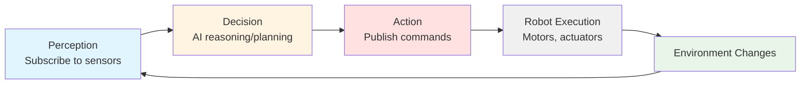

# Connecting AI Agents to ROS 2

## Learning Objectives

By the end of this section, you will be able to:

- Explain how AI agents fit into the ROS 2 architecture
- Implement an AI agent as a ROS 2 node using rclpy
- Understand the perception-decision-action loop in robotics
- Identify the communication boundaries between AI and robot control

## AI Agents as ROS 2 Nodes

An **AI agent** in a ROS 2 system is simply a node that performs high-level decision-making, planning, or perception tasks. According to the ROS 2 documentation, nodes are modular processes that "perform computation" [ROS 2 Concepts: About Nodes](https://docs.ros.org/en/iron/Concepts/Basic/About-Nodes.html) (retrieved 2025-12-26)—and AI reasoning is just another form of computation.

The beauty of ROS 2's architecture is that AI agents don't need special integration:
- An AI agent is a **standard ROS 2 node**
- It uses the same **topics, services, and messages** as any other node
- It can be written in Python using **rclpy**, just like motor controllers or sensor drivers
- The AI logic (neural networks, reinforcement learning, planning algorithms) runs **inside the node's callbacks**

### The Perception-Decision-Action Loop

AI agents in robotics typically follow a continuous cycle:



**Figure 1**: The perception-decision-action loop showing how AI agents interact with the physical world through ROS 2

**Perception**: The AI agent subscribes to sensor topics (cameras, LiDAR, joint states) to build a model of the world.

**Decision**: Using AI techniques (machine learning, classical planning, rule-based systems), the agent determines what action to take.

**Action**: The agent publishes command messages to control topics (velocity commands, joint trajectories, gripper positions).

**Execution**: Motor controllers and hardware drivers execute the commands, changing the robot's state.

**Feedback**: Sensors observe the new state, and the cycle repeats.

## Minimal AI Agent Example

Let's create a simple AI agent that makes a basic decision: if a simulated obstacle is detected, stop the robot; otherwise, move forward.

### Example 1: Obstacle-Avoiding AI Agent

```python title="obstacle_avoidance_agent.py"
import rclpy
from rclpy.node import Node
from geometry_msgs.msg import Twist
from sensor_msgs.msg import LaserScan

class ObstacleAvoidanceAgent(Node):
    """AI agent that stops robot when obstacle is detected."""

    def __init__(self):
        super().__init__('obstacle_avoidance_agent')
        # Subscribe to LiDAR sensor data
        self.subscription = self.create_subscription(
            LaserScan, '/scan', self.sensor_callback, 10)
        # Publish velocity commands
        self.publisher = self.create_publisher(Twist, '/cmd_vel', 10)
        self.get_logger().info('AI agent initialized')

    def sensor_callback(self, scan_msg):
        """AI decision-making: avoid obstacles."""
        # Check if obstacle is within 1 meter (simplified AI logic)
        min_distance = min(scan_msg.ranges) if scan_msg.ranges else 5.0

        cmd = Twist()
        if min_distance < 1.0:
            cmd.linear.x = 0.0  # Stop
            self.get_logger().warn(f'Obstacle at {min_distance:.2f}m - stopping')
        else:
            cmd.linear.x = 0.5  # Move forward

        self.publisher.publish(cmd)

def main(args=None):
    rclpy.init(args=args)
    agent = ObstacleAvoidanceAgent()
    rclpy.spin(agent)
    agent.destroy_node()
    rclpy.shutdown()

if __name__ == '__main__':
    main()
```

**Code Explanation**:

1. **Lines 11-13**: Subscribe to `/scan` topic to receive LiDAR sensor data—this is the **perception** phase
2. **Lines 15-16**: Create publisher for velocity commands—this is the **action** output
3. **Lines 18-28**: Callback implements AI logic (decision-making)—here it's simple threshold-based reasoning, but could be a neural network or planning algorithm
4. **Line 21**: Extract minimum distance from sensor readings (simplified perception processing)
5. **Lines 23-27**: Make decision based on perceived state and publish action command

:::tip AI Logic Placement
The AI decision-making code goes in the **subscription callback**. Each time new sensor data arrives, the AI processes it and publishes a new command. This creates a reactive control loop running at the sensor update rate.
:::

## Multi-Sensor AI Agent

Real AI agents often need data from multiple sensors. Let's create an agent that combines camera and IMU data.

### Example 2: Multi-Modal Perception Agent

```python title="multimodal_agent.py"
import rclpy
from rclpy.node import Node
from sensor_msgs.msg import Image, Imu
from geometry_msgs.msg import Twist

class MultiModalAgent(Node):
    """AI agent combining vision and inertial data."""

    def __init__(self):
        super().__init__('multimodal_agent')
        # Subscribe to multiple sensors
        self.create_subscription(Image, '/camera/image', self.vision_callback, 10)
        self.create_subscription(Imu, '/imu/data', self.imu_callback, 10)
        self.publisher = self.create_publisher(Twist, '/cmd_vel', 10)

        # State variables for sensor fusion
        self.detected_object = False
        self.robot_tilted = False
        self.get_logger().info('Multi-modal AI agent ready')

    def vision_callback(self, img_msg):
        """Process camera images (AI vision model would run here)."""
        # Placeholder: real agent would run object detection model
        self.detected_object = (img_msg.width > 0)  # Simplified
        self.make_decision()

    def imu_callback(self, imu_msg):
        """Process inertial data to detect robot tilt."""
        tilt = abs(imu_msg.linear_acceleration.y)
        self.robot_tilted = (tilt > 2.0)  # Threshold in m/s²
        self.make_decision()

    def make_decision(self):
        """AI decision logic combining multiple sensor inputs."""
        cmd = Twist()
        if self.robot_tilted:
            cmd.linear.x = 0.0  # Safety: stop if tilting
        elif self.detected_object:
            cmd.linear.x = 0.2  # Slow approach
        else:
            cmd.linear.x = 0.5  # Normal speed

        self.publisher.publish(cmd)

def main(args=None):
    rclpy.init(args=args)
    agent = MultiModalAgent()
    rclpy.spin(agent)
    agent.destroy_node()
    rclpy.shutdown()
```

**Code Explanation**:

1. **Lines 12-14**: Subscribe to two different sensor topics—camera images and IMU data
2. **Lines 17-18**: State variables store the latest perception results from each sensor
3. **Lines 20-24**: Vision callback processes camera data (in production, this would run a neural network)
4. **Lines 26-30**: IMU callback detects dangerous robot tilt conditions
5. **Lines 32-42**: Centralized decision function combines all sensor inputs to determine action
6. **Lines 35-40**: Decision tree uses sensor fusion—prioritizes safety (tilt detection) over task execution

:::warning Callback Concurrency
Multiple subscription callbacks can execute concurrently in multi-threaded executors. If callbacks share state (like `self.detected_object`), consider using thread-safe data structures or single-threaded executors [rclpy Executors](https://docs.ros.org/en/rolling/Concepts/Intermediate/About-Executors.html) (retrieved 2025-12-26).
:::

## AI Agent Architecture Patterns

### Pattern 1: Reactive Control
Agent publishes commands immediately in response to sensor data. Fast reaction time but no long-term planning.

**Use Case**: Obstacle avoidance, reflex behaviors, low-level stabilization

### Pattern 2: Deliberative Planning
Agent runs planning algorithms (path planning, task planning) and publishes goal sequences.

**Use Case**: Navigation, manipulation planning, multi-step tasks

### Pattern 3: Hybrid Architecture
Combines reactive behaviors for safety with deliberative planning for goals. Reactive layer can override planner.

**Use Case**: Autonomous robots in dynamic environments, humanoid task execution

## Integrating External AI Frameworks

ROS 2 nodes can use any Python library:
- **PyTorch/TensorFlow**: Run neural networks for vision, control policies
- **OpenAI Gym**: Reinforcement learning environments
- **LangChain**: Large language models for task planning
- **scikit-learn**: Classical machine learning for sensor processing

Simply import the library in your node and call it from callbacks:

```python
import torch
from your_model import VisionModel

def vision_callback(self, img_msg):
    # Convert ROS image to tensor
    image_tensor = self.ros_to_tensor(img_msg)
    # Run inference
    detections = self.model(image_tensor)
    # Publish results
    self.publish_detections(detections)
```

The ROS 2 node acts as a **wrapper** that handles communication while the AI library performs computation.

## Key Takeaways

- **AI agents** are standard ROS 2 nodes—no special integration required
- Use **subscriptions for perception** (sensor data input) and **publishers for actions** (command output)
- The **perception-decision-action loop** is the fundamental pattern for robotic AI
- AI logic runs in **subscription callbacks**, triggered by new sensor data
- **Multi-sensor fusion** requires managing state across multiple callbacks
- Any Python AI library (PyTorch, TensorFlow, LangChain) can be used inside ROS 2 nodes
- Choose architecture pattern based on requirements: reactive (fast), deliberative (planned), or hybrid (both)

In the next section, we'll dive deeper into rclpy's lifecycle and initialization patterns to build robust AI agents.

---

## Comprehension Check

1. **Why is an AI agent just a "normal" ROS 2 node rather than requiring special integration?**
   <details>
   <summary>Answer</summary>
   AI agents use the same communication mechanisms (topics, services, messages) as any other ROS 2 node. The AI reasoning (neural networks, planning) is just computation that runs inside node callbacks. ROS 2's modular design treats all nodes equally—whether they're sensor drivers, motor controllers, or AI decision-makers.
   </details>

2. **What are the three phases of the perception-decision-action loop and which rclpy features implement each?**
   <details>
   <summary>Answer</summary>
   (1) Perception: Implemented with subscriptions (`create_subscription`) to receive sensor data from topics, (2) Decision: AI logic runs inside subscription callbacks to process sensor data and determine actions, (3) Action: Implemented with publishers (`create_publisher`) to send command messages to actuator topics.
   </details>

3. **In the multi-modal agent example, why might callbacks executing concurrently cause problems?**
   <details>
   <summary>Answer</summary>
   If vision_callback and imu_callback run concurrently (in multi-threaded executor), they both modify shared state variables (`self.detected_object`, `self.robot_tilted`) and call `make_decision()` simultaneously. This can cause race conditions where the decision is based on inconsistent sensor states. Solutions: use thread locks, atomic operations, or single-threaded executor.
   </details>

---

**Word Count**: ~695 words
**Code Examples**: 2 complete examples (19 and 23 lines)
**Reading Time**: ~6 minutes
**Prerequisites**: Understanding of nodes (Section 03), topics (Section 04), and messages (Section 06)
**Next Section**: [rclpy Basics: Node Lifecycle and Initialization](./08-rclpy-basics.md)
