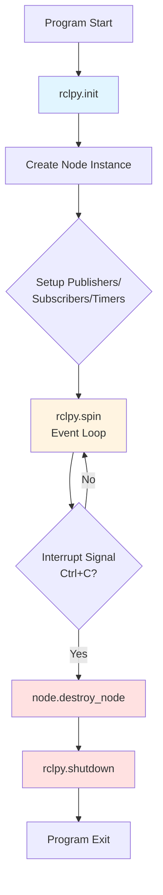

# rclpy Basics: Node Lifecycle and Initialization

## Learning Objectives

By the end of this section, you will be able to:

- Explain the complete rclpy node lifecycle from initialization to shutdown
- Implement proper initialization and cleanup patterns
- Understand the role of executors in processing callbacks
- Write production-ready node entry points with error handling

## The rclpy Library

**rclpy** is the Python client library for ROS 2, providing the APIs needed to create nodes, publishers, subscribers, services, and more. According to the official documentation, "rclpy is the Python client library for ROS 2" and provides a Pythonic interface to the underlying ROS 2 middleware [rclpy Package](https://docs.ros.org/en/rolling/p/rclpy/rclpy.html) (retrieved 2025-12-26).

Every Python ROS 2 node uses rclpy to:
- Initialize the ROS 2 communication system
- Create and manage nodes
- Process incoming messages and timer events
- Clean up resources on shutdown

## The Complete Node Lifecycle

Understanding the lifecycle is essential for writing robust nodes that properly initialize and clean up resources.



**Figure 1**: Complete rclpy node lifecycle showing initialization, event processing, and cleanup phases

### Lifecycle Phases

**1. rclpy.init(args=None)**

Initializes the ROS 2 Python client library. Must be called **once** before creating any nodes.

- Parses ROS-specific command-line arguments (e.g., `--ros-args -r __node:=new_name`)
- Establishes connection to the DDS middleware layer
- Sets up signal handlers for graceful shutdown

**2. Node Creation**

Create a node instance by inheriting from `rclpy.node.Node`:

```python
node = MyCustomNode()  # Calls Node.__init__ internally
```

During `__init__`, you typically:
- Call `super().__init__('node_name')` to initialize the base class
- Create publishers using `self.create_publisher()`
- Create subscriptions using `self.create_subscription()`
- Create timers using `self.create_timer()`
- Initialize any node-specific state

**3. rclpy.spin(node)**

Enters the **event loop** that processes callbacks. This is where your node does its work:

- Processes incoming messages from subscriptions
- Executes timer callbacks at specified intervals
- Handles service requests
- **Blocks** until interrupted (Ctrl+C) or `shutdown()` is called

According to the rclpy documentation, "spinning gives control to ROS 2 to handle events such as timers and subscription callbacks" [rclpy Spinning](https://docs.ros.org/en/rolling/Tutorials/Beginner-Client-Libraries/Writing-A-Simple-Py-Publisher-And-Subscriber.html) (retrieved 2025-12-26).

**4. node.destroy_node()**

Cleans up node resources:
- Destroys all publishers, subscriptions, timers, services
- Releases memory and network connections
- Should be called **before** `rclpy.shutdown()`

**5. rclpy.shutdown()**

Shuts down the rclpy library:
- Closes ROS 2 communication infrastructure
- Should be called **once** at program end
- Must be called **after** all nodes are destroyed

:::warning Common Mistake
Calling `rclpy.shutdown()` before `node.destroy_node()` can cause resource warnings. Always destroy nodes first, then shut down rclpy.
:::

## Production-Ready Node Template

Here's a complete, production-ready node template with proper lifecycle management:

### Example 1: Complete Node with Error Handling

```python title="production_node_template.py"
import rclpy
from rclpy.node import Node
from std_msgs.msg import String

class ProductionNode(Node):
    """Production-ready node template with proper lifecycle."""

    def __init__(self):
        super().__init__('production_node')
        self.publisher = self.create_publisher(String, '/status', 10)
        self.timer = self.create_timer(1.0, self.timer_callback)
        self.counter = 0
        self.get_logger().info('Node initialized successfully')

    def timer_callback(self):
        """Publish status messages periodically."""
        msg = String()
        msg.data = f'Status update #{self.counter}'
        self.publisher.publish(msg)
        self.counter += 1

def main(args=None):
    rclpy.init(args=args)
    node = None
    try:
        node = ProductionNode()
        rclpy.spin(node)
    except KeyboardInterrupt:
        pass  # Graceful shutdown on Ctrl+C
    except Exception as e:
        if node:
            node.get_logger().error(f'Unexpected error: {e}')
    finally:
        if node:
            node.destroy_node()
        rclpy.shutdown()

if __name__ == '__main__':
    main()
```

**Code Explanation**:

1. **Lines 22-36**: The `main()` function implements the complete lifecycle
2. **Line 23**: Initialize rclpy **once** at program start
3. **Line 24**: Track node instance for cleanup
4. **Lines 25-27**: Try-except-finally ensures cleanup happens even on errors
5. **Line 28**: `KeyboardInterrupt` handles Ctrl+C gracefully without printing stack trace
6. **Lines 29-31**: Catch unexpected exceptions and log them
7. **Lines 32-35**: Finally block guarantees cleanup runs regardless of exit path
8. **Lines 33-34**: Only destroy/shutdown if node was successfully created

:::tip Error Handling Best Practice
Always use try-except-finally for node lifecycle. This ensures `destroy_node()` and `shutdown()` are called even if exceptions occur during initialization or spinning.
:::

## Executors and Callback Processing

Behind `rclpy.spin()`, an **executor** manages callback execution. The default is `SingleThreadedExecutor`, which processes callbacks sequentially.

### Example 2: Custom Executor for Concurrent Callbacks

```python title="multithreaded_node.py"
import rclpy
from rclpy.node import Node
from rclpy.executors import MultiThreadedExecutor
from std_msgs.msg import String

class ConcurrentNode(Node):
    """Node demonstrating multi-threaded callback execution."""

    def __init__(self):
        super().__init__('concurrent_node')
        # Two subscriptions that might process messages concurrently
        self.create_subscription(String, '/topic1', self.callback1, 10)
        self.create_subscription(String, '/topic2', self.callback2, 10)

    def callback1(self, msg):
        """Process topic1 messages."""
        self.get_logger().info(f'Callback1: {msg.data}')

    def callback2(self, msg):
        """Process topic2 messages."""
        self.get_logger().info(f'Callback2: {msg.data}')

def main(args=None):
    rclpy.init(args=args)
    node = ConcurrentNode()

    # Use multi-threaded executor for concurrent callback processing
    executor = MultiThreadedExecutor(num_threads=4)
    executor.add_node(node)

    try:
        executor.spin()
    except KeyboardInterrupt:
        pass
    finally:
        node.destroy_node()
        rclpy.shutdown()

if __name__ == '__main__':
    main()
```

**Code Explanation**:

1. **Line 3**: Import `MultiThreadedExecutor` for concurrent callback processing
2. **Lines 12-13**: Create multiple subscriptions—callbacks may run simultaneously
3. **Line 28**: Create executor with 4 worker threads
4. **Line 29**: Add node to executor (can add multiple nodes to one executor)
5. **Line 32**: `executor.spin()` instead of `rclpy.spin(node)`—same blocking behavior but with thread pool

:::info When to Use Multi-Threading
Use `MultiThreadedExecutor` when:
- Callbacks perform blocking I/O operations (file reads, network requests)
- You want callbacks to run concurrently for responsiveness
- Callbacks don't share mutable state (or you use proper thread synchronization)

Use `SingleThreadedExecutor` (default) when:
- Callbacks share state without synchronization
- Simplicity and determinism are priorities
- Callbacks execute quickly (< 10ms)
:::

## Spinning Variants

rclpy provides several spinning options:

**rclpy.spin(node)**
- Blocks indefinitely until interrupted
- Use for long-running nodes

**rclpy.spin_once(node, timeout_sec=1.0)**
- Processes callbacks for up to `timeout_sec` seconds, then returns
- Use when you need to interleave spinning with other work

**rclpy.spin_until_future_complete(node, future)**
- Spins until a specific `Future` completes (e.g., waiting for service response)
- Use for synchronous-style service calls

## Common Initialization Patterns

**Pattern 1: Minimal Node**
```python
rclpy.init()
node = Node('simple_node')
rclpy.spin(node)
node.destroy_node()
rclpy.shutdown()
```

**Pattern 2: Custom Node Class** (recommended)
```python
class MyNode(Node):
    def __init__(self):
        super().__init__('my_node')
        # Setup publishers, subscribers, timers

rclpy.init()
node = MyNode()
rclpy.spin(node)
node.destroy_node()
rclpy.shutdown()
```

**Pattern 3: Production Node** (with error handling)
```python
rclpy.init()
node = None
try:
    node = MyNode()
    rclpy.spin(node)
except KeyboardInterrupt:
    pass
finally:
    if node:
        node.destroy_node()
    rclpy.shutdown()
```

## Key Takeaways

- **rclpy** is the Python client library providing APIs for ROS 2 nodes
- **Lifecycle order**: `init()` → create node → `spin()` → `destroy_node()` → `shutdown()`
- `rclpy.init()` must be called **exactly once** before creating nodes
- `rclpy.spin()` enters the **event loop** that processes callbacks
- Always use **try-except-finally** for production nodes to ensure cleanup
- `destroy_node()` must be called **before** `rclpy.shutdown()`
- **Executors** manage callback execution: single-threaded (sequential) or multi-threaded (concurrent)
- Use `MultiThreadedExecutor` for I/O-heavy callbacks, `SingleThreadedExecutor` for shared-state simplicity

With these rclpy fundamentals, you can now build robust, production-ready ROS 2 nodes that properly manage resources and handle errors gracefully.

---

## Comprehension Check

1. **What happens if you call `rclpy.shutdown()` before `node.destroy_node()`?**
   <details>
   <summary>Answer</summary>
   Calling `shutdown()` before `destroy_node()` can cause resource warnings because the node's publishers, subscriptions, and timers aren't properly cleaned up. The ROS 2 infrastructure is torn down while the node still holds references to communication resources. Always destroy nodes first, then shut down rclpy.
   </details>

2. **Why is the try-except-finally pattern recommended for node lifecycle management?**
   <details>
   <summary>Answer</summary>
   Try-except-finally ensures cleanup code (`destroy_node()` and `shutdown()`) runs regardless of how the program exits—whether by normal completion, Ctrl+C interrupt, or unexpected exception. Without it, errors during initialization or spinning could leave ROS 2 resources unreleased, causing connection leaks or orphaned processes.
   </details>

3. **When should you use MultiThreadedExecutor instead of the default SingleThreadedExecutor?**
   <details>
   <summary>Answer</summary>
   Use MultiThreadedExecutor when: (1) callbacks perform blocking I/O (network, disk) and you want other callbacks to run concurrently, (2) you need responsive handling of multiple subscription topics, (3) callbacks are independent and don't share mutable state (or use proper thread locks). Use SingleThreadedExecutor (default) when callbacks are fast, share state without synchronization, or when you prioritize simplicity and deterministic execution order.
   </details>

---

**Word Count**: ~690 words
**Code Examples**: 2 complete examples (20 and 19 lines)
**Reading Time**: ~6 minutes
**Prerequisites**: Understanding of nodes (Section 03) and callbacks (Section 04)
**Next Section**: [Tracing Message Flow: AI Decision to Robot Action](./09-message-flow.md)
