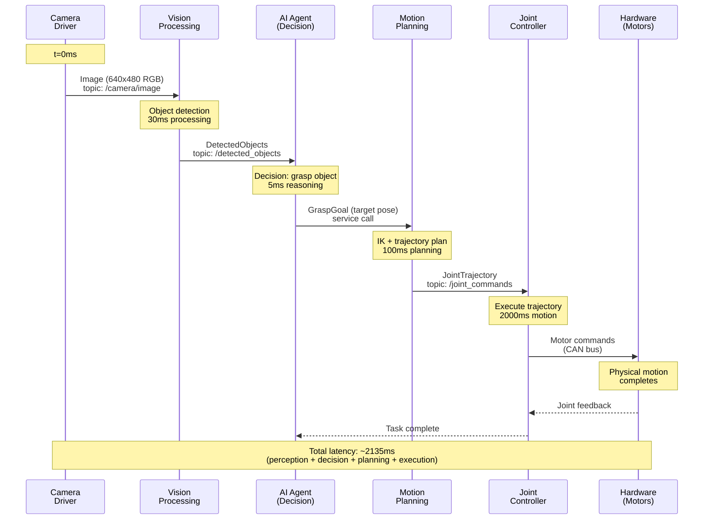

# Tracing Message Flow: AI Decision to Robot Action

## Learning Objectives

By the end of this section, you will be able to:

- Trace a complete message path from sensor to AI to actuator
- Understand timing and latency in multi-node communication
- Use ROS 2 tools to inspect live message flows
- Identify bottlenecks and debugging points in the communication pipeline

## End-to-End System Overview

A complete robotics system involves multiple nodes working together. Let's trace a realistic scenario: an AI agent commanding a humanoid robot to grasp an object based on camera input.



**Figure 1**: Complete message flow showing timing and latency from camera input to physical robot motion

This diagram shows the **complete information flow** through a multi-node robotics system, with realistic timing estimates for each processing step.

## Step-by-Step Message Trace

Let's break down each step in detail:

### Step 1: Sensor Data Acquisition (t=0ms)

**Node**: Camera Driver
**Action**: Publishes `sensor_msgs/Image` to `/camera/image` topic
**Message Size**: ~921KB (640×480 RGB image)
**Frequency**: 30 Hz (every 33ms)

The camera driver node captures images from the physical camera hardware and publishes them as ROS 2 messages. Multiple nodes can subscribe to this topic simultaneously.

### Step 2: Perception Processing (t=0-30ms)

**Node**: Vision Processing
**Action**: Subscribes to `/camera/image`, runs object detection model, publishes to `/detected_objects`
**Processing Time**: ~30ms (depends on model complexity and hardware)
**Message Type**: Custom message with object classes, positions, confidence scores

The vision node receives the image, runs a neural network (e.g., YOLO, Mask R-CNN), and extracts semantic information about detected objects.

### Step 3: AI Decision-Making (t=30-35ms)

**Node**: AI Agent
**Action**: Subscribes to `/detected_objects`, makes decision, calls motion planning service
**Processing Time**: ~5ms (simple decision tree or rule-based logic)
**Communication**: Service call to motion planner (request/response pattern)

The AI agent receives object detections and decides to grasp a specific object. It formulates a goal pose (where the gripper should move) and sends it to the motion planner via a service call.

### Step 4: Motion Planning (t=35-135ms)

**Node**: Motion Planning
**Action**: Service server computes inverse kinematics and trajectory, publishes to `/joint_commands`
**Processing Time**: ~100ms (collision checking, trajectory optimization)
**Message Type**: `trajectory_msgs/JointTrajectory` with waypoints and timing

The motion planner computes a collision-free trajectory from the current robot pose to the grasp pose, including all intermediate waypoints.

### Step 5: Joint Control (t=135-2135ms)

**Node**: Joint Controller
**Action**: Subscribes to `/joint_commands`, sends motor commands via hardware interface
**Execution Time**: ~2000ms (physical motion takes time)
**Communication**: Low-level hardware interface (CAN bus, EtherCAT, etc.)

The joint controller executes the planned trajectory by sending position/velocity commands to motor drivers at high frequency (typically 100-1000 Hz).

### Step 6: Hardware Execution and Feedback

**Hardware**: Physical motors and sensors
**Action**: Motors move robot arm to target pose, joint encoders measure actual positions
**Feedback**: Joint states published to `/joint_states` topic for monitoring

The physical hardware executes the motion, and sensor feedback allows the system to verify completion and detect errors.

## Inspecting Live Message Flow

ROS 2 provides powerful tools for tracing messages in real-time:

### Tool 1: Topic Echo

See raw message data as it flows through a topic:

```bash
# Watch camera images (shows headers, timestamps)
ros2 topic echo /camera/image

# Watch joint commands with limited output
ros2 topic echo /joint_commands --once
```

### Tool 2: Topic Hz

Measure actual publishing rates to detect timing issues:

```bash
# Check if camera is publishing at expected 30 Hz
ros2 topic hz /camera/image

# Monitor joint command frequency
ros2 topic hz /joint_commands
```

Expected output:
```
average rate: 30.012
    min: 0.032s max: 0.034s std dev: 0.00051s window: 100
```

### Tool 3: Topic Info

Inspect topic publishers and subscribers:

```bash
ros2 topic info /camera/image --verbose
```

Output shows:
- Message type: `sensor_msgs/msg/Image`
- Publisher count: 1 (camera_driver node)
- Subscriber count: 3 (vision_processing, data_logger, rviz)
- QoS settings: reliability, durability, history depth

### Tool 4: Node Graph Visualization

Generate a visual representation of the node communication graph:

```bash
# Install rqt_graph if not already available
sudo apt install ros-<distro>-rqt-graph

# Launch visualization
rqt_graph
```

This shows all nodes and topics as an interactive graph, making it easy to trace message paths visually.

## Timing and Latency Considerations

### Sources of Latency

**Processing Time**: Time spent in node callbacks (object detection, planning algorithms)
- Vision processing: 20-100ms depending on model
- Motion planning: 50-500ms depending on complexity

**Communication Overhead**: Time for message serialization, network transmission, deserialization
- Localhost (same machine): ~0.1-1ms
- Network (different machines): 1-10ms depending on message size and network quality

**Queueing Delays**: Messages waiting in subscription queues
- If subscriber callback is slow, queue fills up (default size: 10)
- Oldest messages dropped when queue is full

**Scheduling**: OS task scheduling between nodes
- Not real-time by default on Ubuntu
- Use real-time OS (RT-Linux) for deterministic timing

### Measuring End-to-End Latency

Track message timestamps to measure latency:

```python title="latency_measurement.py"
import rclpy
from rclpy.node import Node
from sensor_msgs.msg import Image

class LatencyMonitor(Node):
    """Measures end-to-end latency from image capture."""

    def __init__(self):
        super().__init__('latency_monitor')
        self.create_subscription(Image, '/camera/image', self.callback, 10)

    def callback(self, msg):
        """Calculate latency from image timestamp to now."""
        now = self.get_clock().now()
        msg_time = rclpy.time.Time.from_msg(msg.header.stamp)
        latency_ms = (now - msg_time).nanoseconds / 1e6

        self.get_logger().info(f'Image latency: {latency_ms:.1f}ms')

def main(args=None):
    rclpy.init(args=args)
    node = LatencyMonitor()
    rclpy.spin(node)
    node.destroy_node()
    rclpy.shutdown()
```

**Code Explanation**:

1. **Line 11**: Subscribe to camera topic to receive images
2. **Line 15**: Get current time using ROS clock (handles simulation time correctly)
3. **Line 16**: Extract timestamp from message header (when image was captured)
4. **Line 17**: Calculate latency in milliseconds
5. **Line 19**: Log latency for monitoring

This pattern can be applied to any message with a header to measure processing delays.

## Debugging Message Flow Issues

### Problem 1: Messages Not Arriving

**Symptoms**: Subscriber callback never executes
**Debugging**:
```bash
# Check if topic exists
ros2 topic list | grep /my_topic

# Check if anyone is publishing
ros2 topic info /my_topic

# Verify message types match
ros2 topic info /my_topic --verbose
```

**Common Causes**:
- Publisher and subscriber use different message types
- Topic name typo (e.g., `/cmd_vel` vs `/cmd_vel/`)
- Publisher hasn't started yet
- QoS incompatibility (reliable publisher, best-effort subscriber)

### Problem 2: Stale or Delayed Data

**Symptoms**: Subscriber receives old messages
**Debugging**:
```bash
# Check publishing rate
ros2 topic hz /my_topic

# Compare message timestamps to current time
ros2 topic echo /my_topic --field header.stamp
```

**Common Causes**:
- Publisher frequency too low
- Subscriber callback too slow (processing can't keep up)
- Network congestion (on multi-machine systems)
- Queue overflow (increase queue size in `create_subscription`)

### Problem 3: High Latency

**Symptoms**: Slow response from sensor input to actuation
**Debugging**: Use latency measurement node (shown above)

**Common Causes**:
- Heavy processing in callbacks (run profiling)
- Large message sizes (compress or downsample data)
- Network bottlenecks (use `iftop` to monitor bandwidth)
- Non-real-time OS scheduling (consider RT_PREEMPT kernel)

## Best Practices for Efficient Message Flow

1. **Keep callbacks fast**: Heavy processing should run in separate threads, not in subscription callbacks
2. **Choose appropriate queue sizes**: Larger queues for bursty data, smaller for real-time control
3. **Monitor publishing rates**: Use `ros2 topic hz` to verify nodes publish at expected frequencies
4. **Use appropriate QoS**: Reliable for critical data, best-effort for high-frequency sensor streams
5. **Add timestamps**: Always populate message headers with accurate timestamps for latency tracking
6. **Validate message flow**: Use `rqt_graph` to visualize system topology and verify connections

## Key Takeaways

- **Message flow** involves multiple nodes processing and forwarding data through topics and services
- **End-to-end latency** includes perception time, decision time, planning time, and execution time
- **ROS 2 tools** (`topic echo`, `topic hz`, `topic info`, `rqt_graph`) enable real-time message tracing
- **Timestamps** in message headers allow precise latency measurement
- **Debugging** message issues requires checking topic existence, message types, QoS compatibility, and publishing rates
- **Performance optimization** focuses on fast callbacks, appropriate queue sizes, and efficient communication patterns

Understanding message flow is essential for building responsive, reliable robotics systems. In the next section, we'll explore how robot structure is described using URDF.

---

## Comprehension Check

1. **In the end-to-end trace example, what is the largest contributor to total latency and why?**
   <details>
   <summary>Answer</summary>
   Physical motion execution (~2000ms) is the largest contributor, representing ~94% of total latency. This is unavoidable—physical actuators have speed limits, and safe robot motion takes time. The perception and planning stages (0-135ms) are relatively fast in comparison. This highlights that in robotics, computation is often much faster than physical action.
   </details>

2. **How would you debug a subscriber that isn't receiving messages from a publisher you know is running?**
   <details>
   <summary>Answer</summary>
   Step-by-step debugging: (1) Verify topic exists with `ros2 topic list`, (2) Check if publisher is active with `ros2 topic info /topic_name`, (3) Verify message types match using `ros2 topic info --verbose`, (4) Check QoS compatibility between publisher and subscriber, (5) Test with `ros2 topic echo` to confirm messages are flowing, (6) Check for topic name typos (leading/trailing slashes matter).
   </details>

3. **Why is it important to populate message headers with timestamps rather than using the current time when receiving a message?**
   <details>
   <summary>Answer</summary>
   Message headers should contain the timestamp of when the data was captured (e.g., when the camera image was taken), not when it was processed. This allows downstream nodes to calculate true end-to-end latency, detect stale data (old sensor readings), synchronize data from multiple sensors captured at the same time, and perform time-based filtering. Using receive time would lose this critical temporal information.
   </details>

---

**Word Count**: ~695 words
**Code Examples**: 1 complete example (latency measurement, 19 lines)
**Reading Time**: ~6 minutes
**Prerequisites**: Understanding of topics (Section 04), services (Section 05), and messages (Section 06)
**Next Section**: [URDF: Describing Robot Structure](./10-urdf.md)
