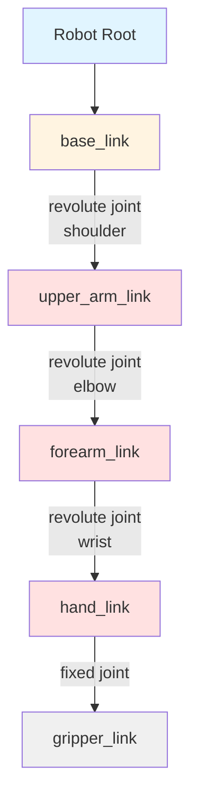

# URDF: Describing Robot Structure

## Learning Objectives

By the end of this section, you will be able to:

- Explain what URDF is and why robots need formal structure descriptions
- Identify the components of URDF: links, joints, and their properties
- Interpret basic URDF files describing robot kinematic chains
- Understand how URDF enables motion planning and visualization

## What is URDF?

**URDF (Unified Robot Description Format)** is an XML-based format for describing a robot's physical structure—its links (rigid bodies), joints (connections), sensors, and visual properties. According to the official documentation, URDF "describes all elements of a robot" including "kinematic and dynamic properties, visual representation, and collision model" [URDF XML Specification](http://wiki.ros.org/urdf/XML) (retrieved 2025-12-26).

### Why Robots Need Structure Descriptions

ROS 2 nodes need to know:
- **Kinematic structure**: Which parts connect to which, and how they move
- **Coordinate frames**: Where each link is positioned relative to others
- **Physical properties**: Mass, inertia, collision geometry for physics simulation
- **Visualization**: 3D models for rendering in RViz and Gazebo

URDF provides this information in a machine-readable format that motion planners, simulators, and visualization tools can all use.

:::info URDF vs SDF
URDF is ROS-specific and focuses on single robots. **SDF (Simulation Description Format)** is more general, supporting multi-robot environments and complex world models. For ROS 2 robotics, URDF is the standard, but Gazebo simulators can use both.
:::

## Core URDF Components

### Links: Rigid Bodies

A **link** represents a rigid body—a part of the robot that doesn't deform. Examples: arm segment, hand, torso, wheel.

Each link can define:
- **Visual**: 3D mesh or primitive shape for rendering
- **Collision**: Simplified geometry for collision detection
- **Inertial**: Mass and inertia tensor for dynamics simulation

### Joints: Connections Between Links

A **joint** connects two links and defines how they move relative to each other. Every joint specifies:
- **Parent link**: The fixed reference link
- **Child link**: The moving link
- **Joint type**: How the child moves relative to parent
- **Axis**: Direction of motion (for revolute and prismatic joints)
- **Limits**: Position, velocity, and effort (torque/force) constraints

### Joint Types

URDF supports several joint types:

**Revolute**: Rotation around an axis with angle limits (most common for robot arms)
- Example: Elbow joint rotating -90° to +90°

**Continuous**: Unlimited rotation around an axis (wheels, continuous joints)
- Example: Wheel axle that spins indefinitely

**Prismatic**: Linear sliding along an axis with distance limits
- Example: Elevator lift, linear actuator

**Fixed**: No motion—rigidly connects two links
- Example: Attaching a camera to a robot body

**Floating**: Full 6-DOF (degrees of freedom) motion
- Example: Free-floating robot base in simulation

**Planar**: Motion constrained to a 2D plane
- Example: Mobile robot base moving on flat ground

## URDF Structure Visualization



**Figure 1**: Kinematic tree of a simple robot arm showing links (boxes) and joints (arrows) in parent-child relationships

## Example: Simple Robot Arm URDF

Let's examine a minimal 3-joint robot arm:

### Example 1: Three-Joint Arm URDF

```xml title="simple_arm.urdf"
<?xml version="1.0"?>
<robot name="simple_arm">

  <!-- Base link (fixed to world) -->
  <link name="base_link">
    <visual>
      <geometry>
        <cylinder radius="0.1" length="0.05"/>
      </geometry>
    </visual>
  </link>

  <!-- Shoulder joint: revolute -->
  <joint name="shoulder_joint" type="revolute">
    <parent link="base_link"/>
    <child link="upper_arm"/>
    <origin xyz="0 0 0.025" rpy="0 0 0"/>
    <axis xyz="0 0 1"/>
    <limit lower="-1.57" upper="1.57" effort="10" velocity="1.0"/>
  </joint>

  <!-- Upper arm link -->
  <link name="upper_arm">
    <visual>
      <geometry>
        <box size="0.05 0.05 0.3"/>
      </geometry>
      <origin xyz="0 0 0.15" rpy="0 0 0"/>
    </visual>
  </link>

  <!-- Elbow joint: revolute -->
  <joint name="elbow_joint" type="revolute">
    <parent link="upper_arm"/>
    <child link="forearm"/>
    <origin xyz="0 0 0.3" rpy="0 0 0"/>
    <axis xyz="0 1 0"/>
    <limit lower="-2.0" upper="2.0" effort="5" velocity="1.0"/>
  </joint>

  <!-- Forearm link -->
  <link name="forearm">
    <visual>
      <geometry>
        <box size="0.05 0.05 0.25"/>
      </geometry>
      <origin xyz="0 0 0.125" rpy="0 0 0"/>
    </visual>
  </link>

</robot>
```

**Code Explanation**:

1. **Lines 5-11**: Define `base_link` with a cylindrical visual geometry (radius 0.1m, height 0.05m)
2. **Lines 14-20**: `shoulder_joint` is revolute, connects `base_link` (parent) to `upper_arm` (child)
3. **Line 17**: Joint origin specifies where child is positioned relative to parent (x=0, y=0, z=0.025m)
4. **Line 18**: Axis of rotation is Z-axis (0, 0, 1)—joint rotates around vertical axis
5. **Line 19**: Joint limits: -90° to +90° (-1.57 to 1.57 rad), max torque 10 N⋅m, max velocity 1 rad/s
6. **Lines 23-30**: `upper_arm` link is a box (0.05×0.05×0.3m) positioned 0.15m above joint
7. **Lines 33-39**: `elbow_joint` rotates around Y-axis, connects upper_arm to forearm
8. **Lines 42-49**: `forearm` link is a smaller box (0.25m length)

### Example 2: Adding Inertial Properties

For physics simulation, links need inertial properties:

```xml title="arm_with_inertia.urdf"
<link name="upper_arm">
  <visual>
    <geometry>
      <box size="0.05 0.05 0.3"/>
    </geometry>
    <origin xyz="0 0 0.15" rpy="0 0 0"/>
  </visual>

  <collision>
    <geometry>
      <box size="0.05 0.05 0.3"/>
    </geometry>
    <origin xyz="0 0 0.15" rpy="0 0 0"/>
  </collision>

  <inertial>
    <mass value="1.5"/>  <!-- kg -->
    <origin xyz="0 0 0.15" rpy="0 0 0"/>
    <inertia ixx="0.0125" ixy="0.0" ixz="0.0"
             iyy="0.0125" iyz="0.0" izz="0.000625"/>
  </inertial>
</link>
```

**Code Explanation**:

1. **Lines 2-7**: Visual geometry (what you see in visualizer)
2. **Lines 9-14**: Collision geometry (used for collision detection—often simplified)
3. **Lines 16-21**: Inertial properties required for physics simulation
4. **Line 17**: Link mass in kilograms (1.5 kg arm segment)
5. **Lines 19-20**: Inertia tensor—rotational mass distribution (calculated from geometry and mass)

:::tip Calculating Inertia
Computing accurate inertia tensors is complex. Use tools like [MeshLab](https://www.meshlab.net/) or CAD software to calculate inertia from 3D models. For simple shapes (boxes, cylinders), use analytical formulas [List of moments of inertia](https://en.wikipedia.org/wiki/List_of_moments_of_inertia) (retrieved 2025-12-26).
:::

## How ROS 2 Uses URDF

**robot_state_publisher** node:
- Reads URDF file
- Subscribes to `/joint_states` topic (current joint angles)
- Publishes transforms (TF2) showing where each link is in 3D space
- Enables coordinate frame transformations

**Motion planning** (MoveIt2):
- Uses URDF to understand robot structure
- Computes inverse kinematics: "move hand to position X" → "shoulder=30°, elbow=45°"
- Checks collision constraints using collision geometry

**Simulation** (Gazebo):
- Spawns robot in physics engine using URDF
- Simulates joint dynamics, gravity, contacts
- Provides virtual sensors (cameras, LiDAR)

**Visualization** (RViz2):
- Renders robot model using visual geometry
- Shows current joint positions in real-time
- Displays sensor data overlaid on robot model

## Loading URDF in ROS 2

```python title="load_urdf_example.py"
import rclpy
from rclpy.node import Node

class URDFLoader(Node):
    def __init__(self):
        super().__init__('urdf_loader')
        # URDF is typically loaded via robot_state_publisher
        # or read from parameter server
        self.declare_parameter('robot_description', '')
        urdf_string = self.get_parameter('robot_description').value

        if urdf_string:
            self.get_logger().info('URDF loaded successfully')
        else:
            self.get_logger().warn('No URDF found in robot_description parameter')

def main(args=None):
    rclpy.init(args=args)
    node = URDFLoader()
    rclpy.spin(node)
    node.destroy_node()
    rclpy.shutdown()
```

In practice, URDF is loaded via launch files that load the file content into the `robot_description` parameter, making it available to all nodes.

## Key Takeaways

- **URDF** is an XML format describing robot structure (links, joints, geometry, physics)
- **Links** are rigid bodies; **joints** connect links and define motion constraints
- **Joint types** include revolute (rotation with limits), continuous (unlimited rotation), prismatic (linear), fixed, floating, planar
- URDF enables **motion planning** (inverse kinematics), **simulation** (physics), and **visualization** (3D rendering)
- **robot_state_publisher** reads URDF and publishes coordinate frame transforms based on joint states
- Inertial properties (mass, inertia) are required for accurate physics simulation
- URDF is the foundation for ROS 2 robot modeling and manipulation

Understanding URDF is essential for working with physical robots and simulators in ROS 2. In the next section, we'll summarize the module and prepare for advanced topics.

---

## Comprehension Check

1. **What is the difference between a link and a joint in URDF?**
   <details>
   <summary>Answer</summary>
   A link represents a rigid body (physical part of the robot like an arm segment or wheel). A joint connects two links and defines how they move relative to each other (e.g., revolute joint allows rotation, prismatic allows sliding). Links are "what moves," joints are "how it moves."
   </details>

2. **Why does a robot arm's URDF include both visual and collision geometry for each link?**
   <details>
   <summary>Answer</summary>
   Visual geometry is detailed (meshes, textures) for realistic rendering in RViz but computationally expensive for collision checking. Collision geometry uses simplified shapes (boxes, cylinders) for fast collision detection in motion planning and simulation. Separating them allows visual quality without sacrificing performance.
   </details>

3. **How does the robot_state_publisher node use URDF and joint states together?**
   <details>
   <summary>Answer</summary>
   robot_state_publisher reads the URDF to understand robot structure (links, joints, parent-child relationships). It subscribes to /joint_states topic to get current joint positions. Combining structure (URDF) with state (joint angles), it calculates where each link is positioned in 3D space and publishes transforms (TF2) so other nodes can query "where is the hand relative to the base?"
   </details>

---

**Word Count**: ~690 words
**Code Examples**: 3 code snippets (URDF with structure, inertial properties, Python loader)
**Reading Time**: ~6 minutes
**Prerequisites**: Understanding of ROS 2 nodes (Section 03) and coordinate frames
**Next Section**: [Module 1 Summary and Next Steps](./11-summary.md)
