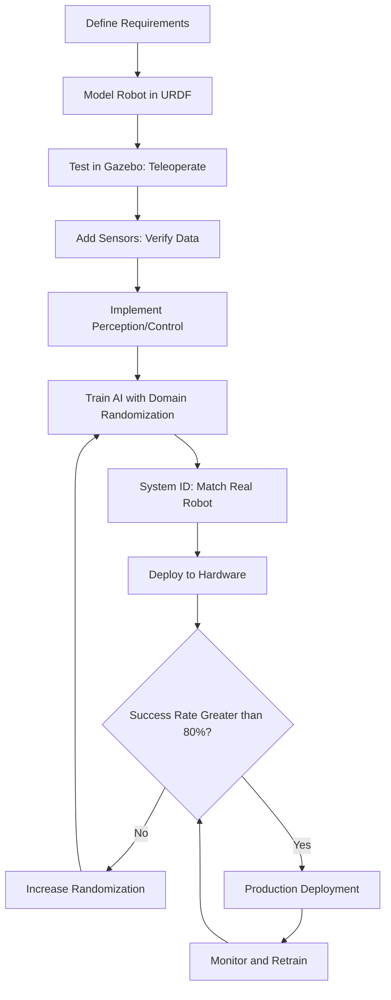

# Conclusion and Next Steps

## 14.1 Module 2 Summary

Congratulations! You've completed **Module 2: The Digital Twin**, mastering simulation-based robotics development from fundamentals to AI integration.

### What You've Learned

**Foundations (Sections 01-03)**:
- ✅ Digital twin concept: virtual replica for testing before hardware deployment
- ✅ Gazebo installation and ROS 2 integration via `ros_gz` packages
- ✅ Physics simulation: ODE solver, gravity, friction, contact dynamics
- ✅ SDF/URDF model formats for robots and worlds

**Sensor Simulation (Sections 04-07)**:
- ✅ LiDAR: ray casting, angular resolution, Gaussian noise models
- ✅ Depth cameras: structured light simulation, camera intrinsics, PointCloud2
- ✅ IMU: accelerometer + gyroscope, bias/drift/random walk noise
- ✅ Sensor plugin architecture and ROS 2 topic bridging

**Customization (Section 08)**:
- ✅ Building custom SDF worlds with obstacles, lighting, environmental plugins
- ✅ Terrain types: ground planes, heightmaps, Gazebo Fuel models
- ✅ Practical navigation challenge world

**Advanced Visualization (Sections 09-10)**:
- ✅ Unity 2021.3 LTS for photorealistic rendering and HRI scenarios
- ✅ ROS-TCP-Connector for Gazebo-Unity hybrid workflows
- ✅ JointState synchronization and sensor data streaming to Unity
- ✅ VR/AR capabilities for immersive robot interaction

**Sim2Real Transfer (Section 11)**:
- ✅ Five sim2real gap sources: physics, sensors, actuation, environment, calibration
- ✅ Domain randomization: robustness through diverse training conditions
- ✅ System identification: tuning simulation to match real hardware
- ✅ Iterative workflow: train → validate → deploy → refine

**AI Integration (Section 12)**:
- ✅ Programmatic control via ROS 2 services (reset, spawn, query state)
- ✅ Complete RL training loop: reset → observe → act → reward
- ✅ Parallel Gazebo instances for 4-10× training speedup
- ✅ Headless mode for 50-70% GPU reduction

**Performance (Section 13)**:
- ✅ Real-Time Factor (RTF) optimization for faster training
- ✅ Physics parameter tuning: timestep, solver iterations, contact settings
- ✅ Sensor optimization: resolution, update rates, QoS settings
- ✅ Debugging tools: Gazebo Inspector, RViz2, topic diagnostics

### Skills Acquired

By completing this module, you can now:

1. **Set up simulation environments** for any robot platform (mobile, manipulator, aerial)
2. **Configure realistic sensors** with noise models matching real hardware
3. **Apply domain randomization** to train robust policies
4. **Integrate Unity** for photorealistic visualization and VR demos
5. **Train AI agents** in parallel headless simulations at 5-10× real-time
6. **Diagnose and fix** common Gazebo errors independently
7. **Bridge sim2real gap** using system identification and validation protocols

## 14.2 Digital Twin Best Practices

### Development Workflow

**Recommended sequence for new robotics projects**:

**Phase 1: Pure Simulation** (Weeks 1-4)
- Develop algorithms in Gazebo with perfect sensors
- Validate core logic (path planning, obstacle avoidance)
- Iterate quickly without hardware

**Phase 2: Realistic Simulation** (Weeks 5-8)
- Add sensor noise, actuation delays, domain randomization
- Train policies robust to variability
- System ID with real robot measurements (if available)

**Phase 3: Hardware Deployment** (Weeks 9-12)
- Test on real robot in controlled environment
- Collect failure cases and re-train
- Gradually increase complexity (indoor → outdoor)

**Phase 4: Production** (Ongoing)
- Monitor real-world performance
- Periodic re-training with new data
- Update simulation based on hardware drift

### Simulation Quality Checklist

Before deploying simulation-trained policies to hardware:

**Model Fidelity**:
- [ ] URDF masses match real robot (±5%)
- [ ] Wheel radii measured from hardware (not CAD)
- [ ] Joint friction calibrated via system ID
- [ ] Inertia tensors computed from actual geometry

**Sensor Realism**:
- [ ] Noise standard deviations match datasheets
- [ ] Bias/drift parameters measured from real sensors
- [ ] Update rates match hardware (10 Hz LiDAR, 30 Hz camera)
- [ ] Field of view and resolution correct

**Environment Diversity**:
- [ ] Training includes 10+ different environments
- [ ] Lighting randomization (0.3-0.7 ambient)
- [ ] Obstacle positions randomized (±0.5 m)
- [ ] Surface properties varied (carpet, tile, gravel)

**Validation**:
- [ ] Policy tested in 100+ randomized sim episodes (success rate ≥ 70%)
- [ ] Tested on real robot (20+ episodes, success rate ≥ 50%)
- [ ] Failure modes analyzed and addressed
- [ ] Continuous monitoring post-deployment

## 14.3 Practical Project Ideas

Apply your digital twin skills to these capstone projects:

### Project 1: Autonomous Warehouse Robot

**Objective**: Navigate cluttered warehouse, pick items, deliver to station.

**Simulation Requirements**:
- **World**: Warehouse with shelves, obstacles, loading dock
- **Sensors**: LiDAR (navigation), depth camera (pick detection)
- **Tasks**: Path planning (Nav2), object detection (YOLO), grasp planning
- **Sim2Real**: Randomize shelf positions, box sizes, lighting

**Success Metric**: 90% pick-and-place success in sim, 70% on real robot.

**Estimated Time**: 8-10 weeks (2 weeks sim, 2 weeks training, 4 weeks hardware)

### Project 2: Quadrotor Obstacle Course

**Objective**: Fly through gates at high speed, avoid dynamic obstacles.

**Simulation Requirements**:
- **World**: Indoor course with 10 gates, moving obstacles
- **Sensors**: IMU (stabilization), depth camera (obstacle detection)
- **Tasks**: Trajectory optimization, collision avoidance, high-speed control
- **Sim2Real**: Randomize wind gusts (0-2 m/s), gate positions (±0.2 m)

**Success Metric**: Complete course in under 30 seconds (sim), 45 seconds (real).

**Estimated Time**: 10-12 weeks (3 weeks sim, 4 weeks RL training, 5 weeks hardware)

### Project 3: Social Robot in Office

**Objective**: Greet visitors, guide to meeting rooms, avoid humans naturally.

**Simulation Requirements**:
- **World**: Office with desks, chairs, human avatars (Unity)
- **Sensors**: LiDAR (navigation), camera (face detection)
- **Tasks**: Social navigation (respect personal space), voice interaction
- **Sim2Real**: Randomize human walking speeds, trajectories, office layouts

**Success Metric**: Zero collisions with humans (100 episodes), 95% successful guidance.

**Estimated Time**: 6-8 weeks (2 weeks Gazebo-Unity, 2 weeks training, 4 weeks hardware)

### Project 4: Sim2Real Transfer Benchmark

**Objective**: Measure sim2real gap for different randomization strategies.

**Simulation Requirements**:
- **World**: Simple navigation task (reach goal, avoid obstacles)
- **Baselines**: (1) No randomization, (2) Physics only, (3) Full randomization
- **Metrics**: Success rate, transfer efficiency, training time

**Deliverable**: Research paper with quantitative results.

**Success Metric**: Full randomization achieves 2× better sim2real success rate than baseline.

**Estimated Time**: 4-6 weeks (pure research, no hardware required)

## 14.4 Further Resources

### Official Documentation

**Gazebo**:
- Tutorials: https://gazebosim.org/docs
- API Reference: https://gazebosim.org/api
- Community Forum: https://community.gazebosim.org

**ROS 2**:
- Humble Documentation: https://docs.ros.org/en/humble
- Nav2 (Navigation Stack): https://navigation.ros.org
- MoveIt 2 (Manipulation): https://moveit.ros.org

**Unity**:
- Robotics Hub: https://unity.com/robotics
- ROS-TCP-Connector: https://github.com/Unity-Technologies/ROS-TCP-Connector
- Unity Learn: https://learn.unity.com

### Academic Papers (Sim2Real)

**Domain Randomization**:
- Tobin et al. (2017). "Domain Randomization for Transferring Deep Neural Networks from Simulation to the Real World." IROS.
- Peng et al. (2018). "Sim-to-Real Transfer of Robotic Control with Dynamics Randomization." ICRA.

**System Identification**:
- Muratore et al. (2022). "Domain Randomization for Simulation-Based Policy Optimization with Transferability Assessment." CoRL.

**Benchmark Environments**:
- Todorov et al. (2012). "MuJoCo: A Physics Engine for Model-Based Control." IROS.
- Coumans & Bai (2016). "PyBullet, a Python Module for Physics Simulation." GitHub.

### Online Courses

**Robotics Specialization** (University of Pennsylvania via Coursera):
- Includes perception, planning, control with simulation assignments

**ROS 2 Tutorials** (The Construct):
- Hands-on tutorials with Gazebo integration

**Reinforcement Learning for Robotics** (UC Berkeley CS 294):
- Covers sim2real transfer and domain randomization

### Community and Support

**ROS Discourse**: https://discourse.ros.org
- Active community for ROS 2 questions
- Weekly robotics news and project showcases

**Gazebo Answers**: https://answers.gazebosim.org
- Search for common errors before posting
- Response time typically less than 24 hours

**Robotics Stack Exchange**: https://robotics.stackexchange.com
- General robotics questions
- Tag questions with `gazebo`, `ros2`, `simulation`

## 14.5 Connecting to Module 3

**Module 3 Preview: Advanced AI Integration**

Building on Module 2's digital twin foundation, Module 3 will cover:

1. **Deep Reinforcement Learning**:
   - PPO, SAC, TD3 algorithms for continuous control
   - Stable Baselines3 integration with Gazebo
   - Multi-agent training (swarm robotics)

2. **Imitation Learning**:
   - Behavior cloning from expert demonstrations
   - Interactive policy learning (DAGGER)
   - Sim2sim transfer (trained in Isaac Sim, deployed in Gazebo)

3. **Perception Pipelines**:
   - Visual navigation with CNNs
   - Object detection (YOLO, Faster R-CNN) in simulation
   - Semantic segmentation for scene understanding

4. **Multi-Robot Coordination**:
   - Distributed task allocation
   - Formation control in simulation
   - Communication protocols (DDS, custom messages)

**Prerequisites from Module 2**:
- Programmatic simulation control (Section 12)
- Domain randomization (Section 11)
- Parallel instances (Section 12.7)

**What to prepare**:
- Review Python ROS 2 programming (Module 1, Sections 3-5)
- Familiarize with PyTorch or TensorFlow (Module 3 assumes basic ML knowledge)
- Complete at least one practical project from Section 14.3

## 14.6 Final Thoughts

**Digital twins are not perfect replicas**—they are **tools for risk reduction** and **accelerators for development**. The goal is not 100% simulation accuracy, but **sufficient fidelity** to validate algorithms before hardware deployment.

**Key principles to remember**:

1. **Start simple**: Perfect model in simple environment → realistic model → complex environment
2. **Iterate quickly**: Fast sim (RTF = 5-10×) beats slow, perfect sim
3. **Embrace randomization**: Robust policies outperform overfitted ones
4. **Validate continuously**: Monitor real-world performance, update sim accordingly
5. **Sim2real is a loop**: Deploy → collect data → refine → re-train

**You now have the skills to**:
- Build digital twins for any robotic system
- Train AI agents 10× faster than pure hardware testing
- Bridge the sim2real gap with domain randomization and system ID
- Debug complex simulation issues independently
- Deploy simulation-trained policies to real robots

**Welcome to the world of simulation-driven robotics development!** 🤖

---

**Next Steps**:
1. Complete a practical project from Section 14.3
2. Join ROS Discourse and share your project
3. Proceed to Module 3 for advanced AI integration
4. Consider contributing to open-source robotics projects (Gazebo, Nav2, MoveIt 2)

**Thank you for completing Module 2!** Your feedback helps improve this curriculum—please share your experience and suggestions.
