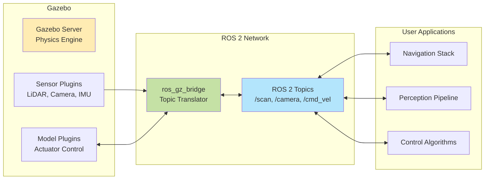

# Gazebo Fundamentals

In Section 1, you learned that digital twins provide a safe, scalable environment for developing AI agents before deploying to physical robots. Now you'll set up the simulation engine that powers this workflow: **Gazebo**. By the end of this section, you'll have Gazebo running on your system, understand its architecture, and launch your first ROS 2-integrated robot simulation.

## 2.1 What is Gazebo?

**Gazebo** is an open-source 3D robotics simulator that provides realistic physics simulation, high-fidelity sensor models, and seamless ROS 2 integration (Open Robotics, 2023). Originally developed in 2002 as part of the Player/Stage project, Gazebo has evolved into the industry standard for robot simulation, used by companies like Boston Dynamics, NASA, and automotive manufacturers for prototyping autonomous systems.

### Gazebo Naming and Versions

The Gazebo project underwent a major rewrite in 2019, leading to naming confusion you should understand:

- **Gazebo Classic** (versions 1-11): The original Gazebo, tightly coupled to ROS 1. End-of-life in 2025.
- **Ignition Gazebo** (2019-2022): The complete rewrite with modular architecture, initially branded "Ignition." Later releases: Citadel, Edifice, Fortress.
- **Gazebo** (2022-present): The Ignition project was renamed back to "Gazebo" in 2022. Current releases use alphabetical names: Fortress, Garden, Harmonic (Open Robotics, 2023).

**For this module, we use Gazebo Fortress**, the stable release recommended for ROS 2 Humble LTS. When you see "Gazebo" in documentation or command names like `gz sim`, this refers to the modern Gazebo (formerly Ignition), not Gazebo Classic.

### Why Gazebo for Physical AI?

Gazebo solves critical challenges in robotics development:

1. **Realistic Physics**: Uses industry-standard physics engines (ODE, Bullet, DART) to simulate gravity, friction, collisions, and joint dynamics. Your AI agent experiences sensor data and dynamics matching real hardware.

2. **Sensor Simulation**: Provides plugins for LiDAR, cameras, IMUs, depth sensors, and GPS that publish ROS 2 messages identical to physical sensors. As you learned in Module 1, your perception nodes don't need to know whether data comes from simulation or hardware.

3. **ROS 2 Native Integration**: Through the `ros_gz` package suite, Gazebo sensors and actuators communicate via standard ROS 2 topics and services (Gazebo Team, 2023). Your AI agent nodes from Module 1 work unchanged in simulation.

4. **Scalability**: Supports headless mode (no GUI) for running hundreds of parallel simulations for reinforcement learning, covered in Section 12.

## 2.2 Gazebo Architecture Overview

Gazebo uses a **client-server architecture** that separates physics computation from visualization, enabling headless simulation and remote access (Open Robotics, 2023, Architecture section).

### Core Components

**Gazebo Server (`gz sim -s`)**:
- Runs the physics engine (ODE by default, configurable)
- Executes simulation time stepping
- Manages sensor plugins and model updates
- Communicates via **Gazebo Transport** (a DDS-based message protocol)

**Gazebo Client (`gz sim -g`)**:
- Renders 3D visualization using OGRE 2.x graphics engine
- Provides GUI for interacting with simulation (pause, reset, model insertion)
- Connects to server via Gazebo Transport (can run on different machine)

**System Plugins**:
- Modular components that extend Gazebo functionality
- Examples: `Physics` (physics stepping), `SceneBroadcaster` (publishes scene state), `Sensors` (sensor data generation), `UserCommands` (model spawning/deletion)
- Configured in SDF world files (you'll create custom worlds in Section 8)

This separation is powerful: you can run the server on a high-performance workstation computing physics for 100 robots, while multiple clients on different machines visualize subsets of the simulation. For RL training (Section 12), you'll run headless servers with no clients, maximizing computational efficiency.

## 2.3 Installing Gazebo for ROS 2 Humble

Gazebo Fortress integrates with ROS 2 Humble through the `ros_gz` package suite. Follow these steps for Ubuntu 22.04 (the recommended platform for ROS 2 Humble):

### Step 1: Install ROS 2 Humble

If you haven't installed ROS 2 from Module 1, follow the official guide (Open Source Robotics Foundation, 2023):

```bash
# Add ROS 2 apt repository
sudo apt update && sudo apt install software-properties-common
sudo add-apt-repository universe
sudo apt update && sudo apt install curl -y
sudo curl -sSL https://raw.githubusercontent.com/ros/rosdistro/master/ros.asc | sudo apt-key add -
sudo sh -c 'echo "deb http://packages.ros.org/ros2/ubuntu $(lsb_release -sc) main" > /etc/apt/sources.list.d/ros2-latest.list'

# Install ROS 2 Humble desktop (includes RViz2, rqt tools)
sudo apt update
sudo apt install ros-humble-desktop

# Source ROS 2 environment
source /opt/ros/humble/setup.bash
```

### Step 2: Install Gazebo Fortress

Gazebo Fortress is available through the official Gazebo apt repository (Open Robotics, 2023):

```bash
# Add Gazebo repository
sudo sh -c 'echo "deb http://packages.osrfoundation.org/gazebo/ubuntu-stable $(lsb_release -sc) main" > /etc/apt/sources.list.d/gazebo-stable.list'
wget https://packages.osrfoundation.org/gazebo.key -O - | sudo apt-key add -

# Install Gazebo Fortress
sudo apt update
sudo apt install gz-fortress
```

### Step 3: Install ROS 2-Gazebo Bridge Packages

The `ros_gz` packages provide ROS 2 topic/service bridges to Gazebo (Gazebo Team, 2023):

```bash
# Install ros_gz bridge and integration packages
sudo apt install ros-humble-ros-gz
```

This installs three key packages:
- **ros_gz_bridge**: Translates between Gazebo Transport and ROS 2 DDS topics
- **ros_gz_sim**: ROS 2 launch files for starting Gazebo simulations
- **ros_gz_image**: Image transport conversions for camera sensors

### Step 4: Configure Environment

Add Gazebo and ROS 2 to your shell environment for persistent access:

```bash
# Add to ~/.bashrc for automatic sourcing
echo "source /opt/ros/humble/setup.bash" >> ~/.bashrc
echo "source /usr/share/gazebo/setup.bash" >> ~/.bashrc
source ~/.bashrc
```

**Installation time**: Approximately 10-15 minutes depending on internet connection and system performance.

## 2.4 Verifying Installation

Confirm Gazebo and ROS 2 integration are working correctly:

### Test 1: Launch Gazebo GUI

```bash
# Launch Gazebo with empty world
gz sim empty.sdf
```

Expected result: Gazebo GUI window opens showing an empty 3D environment with ground plane. If you see the window, Gazebo is installed correctly.

### Test 2: Verify ROS 2 Bridge

In a new terminal, launch a Gazebo world with ROS 2 bridge active:

```bash
# Source ROS 2 environment
source /opt/ros/humble/setup.bash

# Launch Gazebo with ROS 2 bridge
ros2 launch ros_gz_sim gz_sim.launch.py gz_args:="empty.sdf"
```

In another terminal, check for ROS 2 topics published by Gazebo:

```bash
source /opt/ros/humble/setup.bash
ros2 topic list
```

Expected output should include Gazebo-related topics:
```
/clock
/parameter_events
/rosout
```

The `/clock` topic is particularly important—Gazebo publishes simulation time here, allowing your ROS 2 nodes to synchronize with simulation time rather than wall-clock time (critical for reproducible testing, as you'll learn in Section 12).

## 2.5 Gazebo-ROS 2 Integration Architecture

Understanding how Gazebo communicates with ROS 2 is essential for debugging and configuring your digital twin workflow. The integration uses a **bidirectional bridge** that translates between two different message protocols (Open Robotics, 2023, ROS 2 Integration section):



### How the Bridge Works

**Sensor Data Flow (Gazebo → ROS 2)**:
1. Gazebo sensor plugin (e.g., `gpu_lidar`) generates simulated sensor data
2. Plugin publishes on **Gazebo Transport** topic (e.g., `/world/default/model/robot/link/lidar/scan`)
3. `ros_gz_bridge` subscribes to Gazebo topic, converts to ROS 2 message type (e.g., `sensor_msgs/LaserScan`)
4. Bridge publishes on **ROS 2 DDS** topic (e.g., `/scan`)
5. Your perception node from Module 1 subscribes to `/scan` without knowing it's simulated

**Control Command Flow (ROS 2 → Gazebo)**:
1. Your AI agent node publishes control commands (e.g., `geometry_msgs/Twist` on `/cmd_vel`)
2. `ros_gz_bridge` subscribes to ROS 2 topic
3. Bridge converts to Gazebo message type (`ignition.msgs.Twist`)
4. Bridge publishes on Gazebo Transport topic
5. Gazebo model plugin (e.g., `DiffDrive`) reads commands and applies forces/velocities to simulated robot

This architecture means **your AI agent code doesn't change** between simulation and hardware deployment—you just reconfigure which topics the bridge monitors.

## 2.6 Launching Your First Robot Simulation

Let's launch a complete robot simulation with ROS 2 integration using the TurtleBot3 model, a differential-drive robot you may have encountered in Module 1 examples.

### Step 1: Install TurtleBot3 Simulation Package

```bash
sudo apt install ros-humble-turtlebot3-gazebo
```

### Step 2: Set TurtleBot3 Model

TurtleBot3 has three variants (Burger, Waffle, Waffle Pi). Set the model type as an environment variable:

```bash
export TURTLEBOT3_MODEL=waffle
echo "export TURTLEBOT3_MODEL=waffle" >> ~/.bashrc
```

### Step 3: Launch Simulation

```bash
source /opt/ros/humble/setup.bash
ros2 launch turtlebot3_gazebo turtlebot3_world.launch.py
```

Expected result: Gazebo opens with a TurtleBot3 Waffle in a test environment with obstacles.

### Step 4: Verify ROS 2 Topics

In a new terminal, list active topics:

```bash
source /opt/ros/humble/setup.bash
ros2 topic list
```

You should see topics matching Module 1 patterns:

```
/camera/image_raw          # Camera sensor (sensor_msgs/Image)
/scan                      # LiDAR sensor (sensor_msgs/LaserScan)
/odom                      # Odometry (nav_msgs/Odometry)
/cmd_vel                   # Velocity commands (geometry_msgs/Twist)
/imu                       # IMU sensor (sensor_msgs/Imu)
/joint_states              # Joint positions (sensor_msgs/JointState)
```

### Step 5: Control the Robot

Publish a velocity command to make the robot move forward:

```bash
ros2 topic pub /cmd_vel geometry_msgs/Twist "{linear: {x: 0.2}, angular: {z: 0.0}}"
```

In the Gazebo window, you should see the TurtleBot3 drive forward. Press Ctrl+C to stop the command.

### Step 6: Visualize Sensor Data in RViz2

Launch RViz2 to visualize the LiDAR scan (Module 1, Section 9 covered message flow visualization):

```bash
source /opt/ros/humble/setup.bash
ros2 launch turtlebot3_gazebo turtlebot3_gazebo_rviz.launch.py
```

RViz2 opens showing the robot model and LiDAR point cloud. As the robot moves (publish more `/cmd_vel` commands), you'll see the scan data update in real-time—this is the same workflow you'd use with a physical TurtleBot3, demonstrating the power of digital twins.

## Summary

You've successfully installed Gazebo Fortress, integrated it with ROS 2 Humble, and launched your first simulated robot. Key takeaways:

1. **Gazebo Fortress** is the recommended version for ROS 2 Humble, providing realistic physics and sensor simulation.
2. **Client-server architecture** separates physics computation from visualization, enabling headless simulation for AI training.
3. **ros_gz_bridge** translates between Gazebo Transport and ROS 2 topics, allowing your AI agents to work unchanged in simulation and hardware.
4. **TurtleBot3 simulation** demonstrates end-to-end integration: simulated sensors publish on ROS 2 topics (`/scan`, `/camera/image_raw`) that your nodes from Module 1 can subscribe to.

In the next section, you'll dive deeper into physics simulation—learning how to configure physics engines, tune collision detection, and model joint dynamics for realistic robot behavior.

---

**Next**: [Section 03: Physics Simulation in Gazebo](./physics-simulation) — Master physics engines, configure simulation parameters, and understand collision dynamics.
