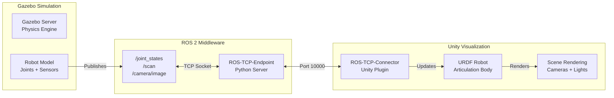

# Gazebo-Unity Integration

## 10.1 Integration Architecture

The **Gazebo-Unity hybrid workflow** combines Gazebo's physics simulation with Unity's photorealistic rendering. Data flows through ROS 2 topics, bridged by **ROS-TCP-Connector** (Unity Technologies, 2023, ROS-TCP-Connector documentation).

### Three-Component Architecture



**Data Flow**:
1. **Gazebo** runs physics simulation and publishes robot state (joint positions, sensor data) to ROS 2 topics
2. **ROS-TCP-Endpoint** (Python server) subscribes to ROS 2 topics and forwards messages to Unity via TCP socket (port 10000)
3. **ROS-TCP-Connector** (Unity plugin) receives messages and updates Unity robot model's joint positions
4. **Unity** renders the synchronized robot in a photorealistic environment

**Key Insight**: Gazebo and Unity run **independently**—if Gazebo pauses, Unity can continue rendering the last-known robot state. This decoupling enables flexible workflows (e.g., Gazebo headless + Unity visualization on a separate machine).

## 10.2 ROS-TCP-Connector Configuration

### Unity Side: Configure ROS-TCP-Connector

Assuming you completed Section 09 setup, verify ROS Settings:

1. **Robotics → ROS Settings**
2. **ROS IP Address**:
   - Same machine as Gazebo: `127.0.0.1`
   - Different machine: Gazebo machine's IP (e.g., `192.168.1.50`)
3. **ROS Port**: `10000`
4. **Protocol**: `ROS 2`

### ROS 2 Side: Launch ROS-TCP-Endpoint

On the machine running Gazebo and ROS 2:

```bash
# Terminal 1: Launch ROS-TCP-Endpoint server
source ~/ros2_ws/install/setup.bash
ros2 run ros_tcp_endpoint default_server_endpoint --ros-args -p ROS_IP:=0.0.0.0

# Expected output:
# [INFO] Starting server on 0.0.0.0:10000
```

**Firewall Note**: If Unity and ROS 2 are on different machines, ensure port 10000 is open:

```bash
# On ROS 2 machine (Linux):
sudo ufw allow 10000/tcp

# Verify connection from Unity machine:
# telnet <ros2-machine-ip> 10000
```

### Test Connection

**In Unity**:
1. Click **Play** button (enter Play Mode)
2. Check Unity Console (bottom) for connection logs:
   - ✅ Success: `[ROS-TCP-Connector] Connected to 127.0.0.1:10000`
   - ❌ Failure: `[ROS-TCP-Connector] Connection failed`

**If connection fails**, see Section 10.6 (Troubleshooting).

## 10.3 Synchronizing Robot State (JointState Messages)

The `sensor_msgs/msg/JointState` message contains robot joint positions, velocities, and efforts (Open Source Robotics Foundation, 2023, JointState message documentation). Gazebo publishes this topic; Unity subscribes to animate the robot.

### Gazebo: Publish JointState

**Verify Gazebo publishes `/joint_states`**:

```bash
# Launch Gazebo with a robot (e.g., TurtleBot3)
export TURTLEBOT3_MODEL=waffle
ros2 launch turtlebot3_gazebo turtlebot3_world.launch.py

# In another terminal, check if /joint_states topic exists
ros2 topic list | grep joint_states
# Output: /joint_states

# Echo the topic to see data
ros2 topic echo /joint_states --once
```

**Expected JointState Message**:
```yaml
header:
  stamp:
    sec: 10
    nanosec: 500000000
  frame_id: ''
name: [wheel_left_joint, wheel_right_joint]
position: [0.0, 0.0]
velocity: [0.0, 0.0]
effort: [0.0, 0.0]
```

### Unity: Subscribe to JointState

**Create a Unity C# Script** to receive JointState messages and update robot joints:

**File**: `Assets/Scripts/JointStateSubscriber.cs`

```csharp
using UnityEngine;
using Unity.Robotics.ROSTCPConnector;
using RosMessageTypes.Sensor;

public class JointStateSubscriber : MonoBehaviour
{
    private ROSConnection ros;
    private ArticulationBody[] articulationChain;

    void Start()
    {
        // Initialize ROS connection
        ros = ROSConnection.GetOrCreateInstance();
        ros.Subscribe<JointStateMsg>("/joint_states", UpdateJointStates);

        // Get all articulation bodies (robot joints) in hierarchy
        articulationChain = GetComponentsInChildren<ArticulationBody>();

        Debug.Log($"Found {articulationChain.Length} articulation bodies");
    }

    void UpdateJointStates(JointStateMsg jointState)
    {
        // Match joint names from ROS message to Unity articulation bodies
        for (int i = 0; i < jointState.name.Length; i++)
        {
            string jointName = jointState.name[i];
            float position = (float)jointState.position[i]; // radians

            // Find corresponding articulation body
            foreach (var joint in articulationChain)
            {
                if (joint.name.Contains(jointName) || jointName.Contains(joint.name))
                {
                    // Set joint position (Unity uses ArticulationDrive)
                    var drive = joint.xDrive;
                    drive.target = position * Mathf.Rad2Deg; // Convert radians to degrees
                    joint.xDrive = drive;
                    break;
                }
            }
        }
    }
}
```

**Attach Script to Robot**:
1. **Hierarchy View**: Select the imported robot GameObject
2. **Inspector**: Click **Add Component** → Search `JointStateSubscriber`
3. **Play Mode**: Click Play—robot should now mirror Gazebo's joint movements

### Test Synchronization

```bash
# Terminal 1: Gazebo running TurtleBot3
# (already launched)

# Terminal 2: Teleop to move robot
ros2 run teleop_twist_keyboard teleop_twist_keyboard

# Use keyboard (i/j/k/l) to drive robot
# Observe: Unity robot wheels rotate in sync with Gazebo
```

## 10.4 Streaming Sensor Data to Unity

Beyond joint states, you can stream sensor data (LiDAR scans, camera images) to Unity for visualization.

### Example: Visualize LaserScan in Unity

**ROS 2 Side** (already publishing from Gazebo):
```bash
# Verify /scan topic exists
ros2 topic list | grep scan
# Output: /scan
```

**Unity Side** (C# script to visualize):

**File**: `Assets/Scripts/LaserScanVisualizer.cs`

```csharp
using UnityEngine;
using Unity.Robotics.ROSTCPConnector;
using RosMessageTypes.Sensor;

public class LaserScanVisualizer : MonoBehaviour
{
    public GameObject pointPrefab; // Small sphere to represent laser point
    private ROSConnection ros;
    private GameObject[] laserPoints;

    void Start()
    {
        ros = ROSConnection.GetOrCreateInstance();
        ros.Subscribe<LaserScanMsg>("/scan", VisualizeScan);
    }

    void VisualizeScan(LaserScanMsg scan)
    {
        // Create point objects if not yet created
        if (laserPoints == null || laserPoints.Length != scan.ranges.Length)
        {
            // Destroy old points
            if (laserPoints != null)
                foreach (var p in laserPoints) Destroy(p);

            // Create new points
            laserPoints = new GameObject[scan.ranges.Length];
            for (int i = 0; i < scan.ranges.Length; i++)
            {
                laserPoints[i] = Instantiate(pointPrefab, Vector3.zero, Quaternion.identity);
                laserPoints[i].transform.parent = transform;
            }
        }

        // Update point positions
        for (int i = 0; i < scan.ranges.Length; i++)
        {
            float range = scan.ranges[i];
            float angle = scan.angle_min + i * scan.angle_increment;

            // Convert polar to Cartesian (Unity coordinates: Y-up, Z-forward)
            float x = range * Mathf.Cos(angle);
            float z = range * Mathf.Sin(angle);

            laserPoints[i].transform.localPosition = new Vector3(x, 0, z);

            // Hide invalid ranges
            laserPoints[i].SetActive(range > scan.range_min && range < scan.range_max);
        }
    }
}
```

**Setup**:
1. Create small sphere prefab (**GameObject → 3D Object → Sphere**, scale 0.05)
2. Drag sphere to **Project** view to save as prefab
3. Attach `LaserScanVisualizer` script to robot
4. Assign sphere prefab to `pointPrefab` field in Inspector

**Result**: Unity displays LiDAR scan points as small spheres around the robot in real-time.

## 10.5 Time Synchronization Strategies

Gazebo simulation time and Unity real-time may not match (e.g., Gazebo running at 0.5× real-time factor). For precise synchronization:

### Strategy 1: ROS Clock Synchronization

Unity can subscribe to `/clock` topic to match Gazebo's simulation time.

```csharp
using RosMessageTypes.Rosgraph;

ros.Subscribe<ClockMsg>("/clock", UpdateSimTime);

void UpdateSimTime(ClockMsg clockMsg)
{
    // Convert ROS time to Unity time
    double simTime = clockMsg.clock.sec + clockMsg.clock.nanosec * 1e-9;
    // Use simTime for time-sensitive logic
}
```

### Strategy 2: Interpolation (Smooth Motion)

For smoother visuals when Gazebo runs slower than Unity:

```csharp
// Instead of directly setting joint position:
// joint.xDrive.target = position;

// Use Lerp (linear interpolation):
float smoothSpeed = 5f; // Adjust for smoothness
currentPos = Mathf.Lerp(currentPos, targetPos, Time.deltaTime * smoothSpeed);
joint.xDrive.target = currentPos;
```

### Strategy 3: Replay (Decoupled Workflow)

For demonstrations, record Gazebo data to a ROS bag, then replay in Unity:

```bash
# Record all topics
ros2 bag record -a -o simulation_recording

# Later, replay in Unity (ROS-TCP-Endpoint still running)
ros2 bag play simulation_recording.db3
```

Unity visualizes the pre-recorded simulation data.

## 10.6 Troubleshooting Connection Issues

### Issue 1: "Connection Failed" in Unity Console

**Symptoms**: Unity shows `[ROS-TCP-Connector] Connection failed`

**Solutions**:
1. **Verify ROS-TCP-Endpoint is running**:
   ```bash
   ps aux | grep ros_tcp_endpoint
   # Should show process running
   ```
2. **Check IP address** in Unity ROS Settings matches ROS 2 machine
3. **Ping ROS 2 machine** from Unity machine:
   ```bash
   ping <ros2-machine-ip>
   ```
4. **Test port**:
   ```bash
   telnet <ros2-machine-ip> 10000
   # Should connect if server is running
   ```

### Issue 2: Robot Not Moving in Unity

**Symptoms**: JointState messages received, but robot doesn't animate

**Solutions**:
1. **Verify joint names match**: Print `jointState.name` in Unity and compare with Gazebo (`ros2 topic echo /joint_states`)
2. **Check ArticulationBody configuration**: Ensure URDF importer set up joints as `ArticulationBody` (not Rigidbody)
3. **Inspect xDrive settings**: Ensure `stiffness` and `damping` are non-zero

### Issue 3: Laggy/Stuttering Motion

**Symptoms**: Robot moves but stutters

**Solutions**:
1. **Reduce message rate**: In Gazebo, lower joint state publisher update rate
2. **Enable interpolation** (see Section 10.5, Strategy 2)
3. **Check network latency** (if Unity and Gazebo on different machines):
   ```bash
   ping <unity-machine-ip> -c 10
   # Look for low latency (<10ms for LAN)
   ```

## 10.7 Practical Exercise: Gazebo-Unity Hybrid Simulation

**Objective**: Run Gazebo physics simulation and visualize in Unity simultaneously.

### Setup

1. **Terminal 1**: Launch Gazebo with TurtleBot3
   ```bash
   export TURTLEBOT3_MODEL=waffle
   ros2 launch turtlebot3_gazebo turtlebot3_world.launch.py
   ```

2. **Terminal 2**: Launch ROS-TCP-Endpoint
   ```bash
   ros2 run ros_tcp_endpoint default_server_endpoint --ros-args -p ROS_IP:=0.0.0.0
   ```

3. **Unity**:
   - Open project from Section 09
   - Attach `JointStateSubscriber.cs` to TurtleBot3 GameObject
   - Click **Play**

4. **Terminal 3**: Teleop to move robot
   ```bash
   ros2 run teleop_twist_keyboard teleop_twist_keyboard
   ```

### Expected Result

- **Gazebo window**: Shows robot moving in default world
- **Unity window**: Shows same robot in photorealistic environment, wheels rotating in sync with Gazebo
- **Both views update together** as you drive the robot with keyboard

**Extension Ideas**:
- Add `LaserScanVisualizer` to Unity to show LiDAR points
- Stream camera images from Gazebo to Unity UI (RawImage component)
- Run Gazebo headless (`gz sim -s`) and use Unity as the only visualization

---

**Key Takeaways**:
- Gazebo-Unity integration uses ROS-TCP-Connector to bridge ROS 2 topics over TCP
- JointState messages synchronize robot joint positions between physics (Gazebo) and rendering (Unity)
- Stream sensor data (LaserScan, images) to Unity for advanced visualization
- Use time synchronization strategies (ROS clock, interpolation) for smooth motion
- Troubleshoot with connection tests, joint name verification, and network latency checks

This completes the Unity integration workflow. Next sections will cover sim-to-real transfer and AI integration strategies.
