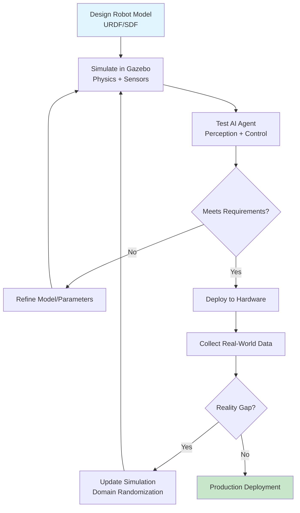

# Introduction to Digital Twins

Welcome to Module 2! In Module 1, you learned how ROS 2 serves as the nervous system connecting AI agents to robot hardware through topics, services, and messages. You built nodes that publish sensor data and subscribe to control commands. But here's the challenge: how do you test your AI agent's decision-making without access to physical robot hardware? How do you validate that your obstacle avoidance algorithm works before deploying it to a $50,000 robot arm? This is where **digital twins** become essential.

In this module, you'll learn how simulation environments create virtual replicas of physical robots, allowing you to develop and test AI agents in a safe, repeatable, and cost-effective way. You'll master Gazebo for physics simulation, Unity for high-fidelity visualization, and the critical process of transferring knowledge from simulation to reality.

## 1.1 What is a Digital Twin?

A **digital twin** is a virtual representation of a physical system that mirrors its behavior, structure, and dynamics. In robotics and Physical AI, a digital twin typically consists of three components:

1. **Robot Model**: A mathematical description of the robot's physical structure (links, joints, sensors, actuators) defined in formats like URDF or SDF. This model includes mass properties, collision geometries, and visual meshes.

2. **Simulation Environment**: A physics engine that computes how the robot interacts with its world—gravity, friction, collisions, joint dynamics. Gazebo Fortress, which you'll use in this module, provides realistic physics simulation using engines like ODE (Open Dynamics Engine).

3. **Sensor Simulation**: Virtual sensors (LiDAR, cameras, IMUs) that generate synthetic data matching what real sensors would produce. These simulated sensors publish ROS 2 messages identical to hardware sensors, allowing your AI agent to perceive the virtual world.

Think of a digital twin as a **sandbox for your AI agent**. Just as you learned in Module 1 that ROS 2 nodes communicate through standardized messages, your AI agent doesn't know whether sensor data comes from Gazebo or real hardware—the message types are identical. This abstraction is powerful: you can develop perception and control algorithms entirely in simulation, then deploy them to physical robots with minimal changes.

Digital twins aren't perfect replicas—there's always a **reality gap** between simulation and the physical world (sensor noise, friction coefficients, lighting variations). But as you'll learn in Section 11, techniques like domain randomization help bridge this gap, making sim-trained agents robust enough for real-world deployment.

## 1.2 The Role of Digital Twins in Physical AI

In Physical AI—where AI agents control robots interacting with the physical world—digital twins solve critical development challenges:

### Safe Testing of Risky Behaviors

Imagine training a quadruped robot to navigate stairs. In simulation, if your control algorithm fails, the virtual robot simply resets. On real hardware, a fall could cause thousands of dollars in damage or injury. Digital twins let you iterate rapidly on algorithms that involve physical risk, only deploying to hardware once behavior is validated in simulation.

### Scalability and Parallelization

Training reinforcement learning (RL) agents requires millions of trial-and-error interactions. Running these trials on physical robots is impractical—each episode takes real time, and you're limited by hardware availability. With Gazebo, you can spawn hundreds of parallel simulation instances (covered in Section 12), each running faster than real-time. An RL agent that would take months to train on hardware can converge in days using parallelized simulation.

### Reproducibility and Debugging

When your obstacle avoidance node from Module 1 fails, you need to understand why. In simulation, you can record exact sensor inputs, freeze time, visualize internal states, and replay scenarios deterministically. Physical experiments are difficult to reproduce—lighting changes, floor friction varies, battery voltage fluctuates. Digital twins give you the controlled environment needed for systematic debugging.

### Early-Stage Development Without Hardware

Not everyone has access to a TurtleBot3 or robotic arm. Digital twins democratize robotics education and development. Using only a laptop, you can prototype complex multi-robot systems, test sensor fusion algorithms, and validate motion planning—all before touching physical hardware. For research labs and startups, this accelerates development timelines and reduces capital costs.

## 1.3 Simulation vs. Reality: The Feedback Loop

A common misconception is that digital twins are a **one-way workflow**: design in simulation → deploy to hardware → done. In practice, digital twin development is **iterative and bidirectional**:

**Simulation Informs Reality**: You design a robot model, simulate sensor behavior, and test your AI agent's perception-decision-action loop (the pattern you learned in Module 1, Section 7). Simulation catches logical errors, edge cases, and performance issues before hardware deployment.

**Reality Informs Simulation**: When you deploy your sim-trained agent to a physical robot, you discover discrepancies—the reality gap. Real LiDAR has range-dependent noise. Real motors have backlash and lag. Real lighting creates shadows that confuse vision systems. You collect this real-world data and **update your simulation** with more realistic sensor models, friction coefficients, and environmental variations (domain randomization, Section 11).

This feedback loop continues throughout a robot's lifecycle. Even after production deployment, edge cases discovered in the field inform simulation improvements, which validate fixes before over-the-air updates to deployed robots. Digital twins aren't a one-time development tool—they're a continuous validation platform.

Think back to Module 1, where you learned that ROS 2's distributed architecture allows nodes to run on different machines. The same principle applies here: your AI agent node can subscribe to `/scan` topics from Gazebo during development, then subscribe to the same topic from real LiDAR hardware during deployment—no code changes required, just different message sources.

## 1.4 Digital Twin Workflow Overview

The complete digital twin development cycle involves multiple feedback loops. Here's the end-to-end process you'll implement in this module:

**Key Insights from This Workflow**:

1. **Inner Loop (Simulation Refinement)**: The path A → B → C → D → E represents rapid iteration in simulation. If your AI agent fails to avoid obstacles in Gazebo, you don't need hardware—you refine your perception algorithm, adjust sensor parameters, or improve your control logic and test again. This loop can run hundreds of times per day.

2. **Validation Gate (Decision D)**: Before deploying to hardware, you establish success criteria: 95% obstacle avoidance success rate, sub-100ms control loop latency, stable navigation for 1 hour continuous operation. Digital twins let you validate these metrics in simulation across thousands of scenarios.

3. **Hardware Deployment (F → G)**: Once simulation validates your agent, you deploy to physical robots and collect real-world performance data. This is where you measure the reality gap—differences between simulated and actual sensor readings, control responses, and task success rates.

4. **Outer Loop (Sim2Real Refinement)**: The path H → I → B represents continuous improvement. When real-world performance reveals gaps (e.g., your agent struggles with reflective surfaces that weren't modeled in simulation), you update Gazebo with better surface properties, add sensor noise profiles matching real hardware, and revalidate. This ensures your digital twin remains a faithful predictor of physical behavior.

5. **Production Monitoring (J → K → L)**: Even after deployment, the loop continues. Edge cases discovered in production (unexpected obstacles, sensor degradation over time) feed back into simulation, allowing you to test mitigation strategies before pushing firmware updates.

In this module, you'll implement the inner loop (Sections 2-7: Gazebo setup and sensor simulation) and the sim2real refinement loop (Section 11: domain randomization and validation). You'll use the same ROS 2 communication patterns from Module 1—your AI agent nodes remain unchanged whether subscribing to simulated or real sensor topics.

## 1.5 Module 2 Prerequisites and Learning Path

Before starting this module, ensure you've completed **Module 1: ROS 2 — The Robotic Nervous System**. You'll need solid understanding of:

- **ROS 2 Nodes and Topics** (Module 1, Sections 3-4): Gazebo sensors publish on ROS 2 topics like `/scan` and `/camera/image_raw`. Your AI agent nodes subscribe to these topics the same way they would with real hardware.
- **Services and Messages** (Module 1, Sections 5-6): You'll use services to control Gazebo programmatically (spawning models, resetting simulations).
- **AI Agent Integration** (Module 1, Section 7): The perception-decision-action loop you learned applies directly to digital twins—your agent perceives simulated sensor data, makes decisions, and publishes control commands.

**Module 2 Learning Path**:

This module follows a progressive structure:

1. **Foundations** (Sections 2-3): Install Gazebo, understand physics simulation, and verify ROS 2 integration. You'll launch your first simulated robot and observe topics matching Module 1 patterns.

2. **Sensor Simulation** (Sections 4-7): Configure LiDAR, depth cameras, and IMU sensors with realistic noise models. You'll learn how sensor parameters (range, resolution, update rate) affect AI agent performance.

3. **Advanced Integration** (Sections 8-10): Build custom simulation worlds, integrate Unity for visualization, and create hybrid Gazebo-Unity workflows for human-robot interaction scenarios.

4. **Sim2Real Transfer** (Section 11): Master domain randomization techniques to bridge the reality gap and validate sim-trained agents on physical hardware.

5. **AI Integration and Optimization** (Sections 12-13): Control Gazebo programmatically for RL training loops and optimize simulation performance for parallel training.

**Time Commitment**: Plan 6-8 hours to complete this module, with hands-on exercises requiring a Linux environment (Ubuntu 22.04 recommended) with ROS 2 Humble and Gazebo Fortress installed. All code examples build on Module 1 rclpy patterns, so you'll recognize familiar subscriber and publisher structures.

By the end of this module, you'll be able to design complete digital twin workflows—from robot modeling to sim2real deployment—accelerating your Physical AI development while minimizing hardware risk and cost.

---

**Next**: [Section 02: Gazebo Fundamentals](./gazebo-fundamentals) — Install Gazebo Fortress, understand its architecture, and launch your first ROS 2-integrated simulation.
