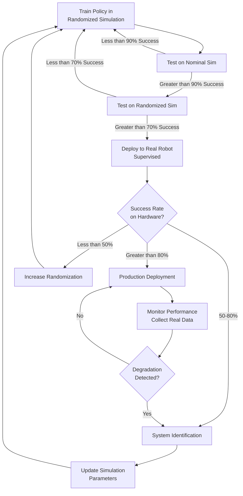

# Simulation-to-Real (Sim2Real) Transfer

## 11.1 The Sim2Real Gap: Why Simulation ≠ Reality

The **sim2real gap** is the difference in performance between a robot policy trained in simulation and the same policy deployed on real hardware. A controller that achieves 95% success in Gazebo may fail completely on physical robots due to unmodeled dynamics, sensor noise, and environmental variability (Tobin et al., 2017, domain randomization for deep neural networks).

### Five Major Sources of Sim2Real Gap

**1. Physics Model Inaccuracies**
Simulators use approximations (e.g., ODE's first-order friction model) that diverge from real-world physics:
- **Contact dynamics**: Real rubber tires deform; simulated rigid bodies don't
- **Joint friction**: Gazebo's linear damping vs. real motors' stiction and backlash
- **Aerodynamics**: Quadrotor simulations ignore ground effect and turbulence

**Example**: A simulated quadrotor hovers at 50% throttle; the real drone requires 65% due to motor inefficiencies and airframe drag.

**2. Sensor Modeling Gaps**
Simulated sensors lack real-world imperfections (Peng et al., 2018, dynamics randomization):
- **LiDAR**: Gazebo rays are perfect; real LiDAR has beam divergence, multipath reflections, and temperature drift
- **Cameras**: Simulated images lack motion blur, lens distortion, auto-exposure lag, and lighting variations
- **IMU**: Simulation may omit temperature-dependent bias drift and cross-axis sensitivity

**Example**: A vision-based obstacle detector trained on perfect Gazebo images fails in real sunlight due to lens flare and overexposure.

**3. Actuation Delays and Bandwidth**
Simulation assumes instantaneous actuation; real hardware has:
- **Communication latency**: ROS 2 messages over WiFi (5-50 ms delay)
- **Motor response time**: DC motors take 10-100 ms to reach commanded velocity
- **Control loop jitter**: Real-time OS vs. simulated fixed timesteps

**Example**: A navigation controller tuned in Gazebo (1 kHz simulation rate) oscillates on hardware due to 20 ms actuation delay.

**4. Environmental Variability**
Simulation uses fixed environments; reality has:
- **Lighting changes**: Shadows, reflections, time-of-day variations
- **Surface properties**: Carpet vs. tile vs. gravel traction coefficients
- **Dynamic obstacles**: Humans, pets, moving furniture

**Example**: A floor-cleaning robot navigates perfectly in Gazebo's static office but collides with chairs rearranged by users.

**5. Calibration Drift**
Hardware changes over time; simulation stays constant:
- **Sensor calibration**: IMU bias drifts with temperature (±0.05°/s per 10°C)
- **Mechanical wear**: Wheel diameters decrease (0.5 mm per 100 km)
- **Battery voltage**: Motor speeds drop as battery depletes (12V → 10V)

**Example**: A robot's odometry drifts after 3 months of use due to worn wheels, despite working flawlessly in simulation.

## 11.2 Domain Randomization: Training for Robustness

**Domain randomization** trains policies across randomized simulation parameters, forcing algorithms to learn robust features that generalize to real-world variability (Tobin et al., 2017, domain randomization methodology).

### Randomization Strategy: What to Randomize

**Physics Parameters** (Peng et al., 2018, dynamics randomization):
```python
import random

def randomize_physics():
    """Randomize Gazebo physics for each training episode."""
    # Friction coefficients (±30%)
    friction_mu = random.uniform(0.7, 1.3)  # Default 1.0
    friction_mu2 = random.uniform(0.7, 1.3)

    # Joint damping (±50%)
    damping = random.uniform(0.5, 1.5)  # Default 1.0

    # Mass (±10% to account for payload variations)
    mass_scale = random.uniform(0.9, 1.1)

    # Contact parameters
    kp = random.uniform(1e6, 1e7)  # Contact stiffness
    kd = random.uniform(1e3, 1e4)  # Contact damping

    return {
        'friction_mu': friction_mu,
        'friction_mu2': friction_mu2,
        'damping': damping,
        'mass_scale': mass_scale,
        'contact_kp': kp,
        'contact_kd': kd
    }
```

**Sensor Noise Randomization**:
```python
def randomize_sensor_noise():
    """Randomize sensor noise models for each episode."""
    # LiDAR noise standard deviation (0.01-0.05 m)
    lidar_stddev = random.uniform(0.01, 0.05)

    # IMU gyro bias (0.001-0.01 rad/s)
    gyro_bias = random.uniform(0.001, 0.01)

    # Camera brightness (0.5-1.5× nominal)
    camera_brightness = random.uniform(0.5, 1.5)

    # Depth camera noise (0.01-0.05 m at 1m distance)
    depth_noise = random.uniform(0.01, 0.05)

    return {
        'lidar_stddev': lidar_stddev,
        'gyro_bias': gyro_bias,
        'camera_brightness': camera_brightness,
        'depth_noise': depth_noise
    }
```

**Visual Randomization** (lighting, textures, colors):
```python
import subprocess

def randomize_environment():
    """Randomize Gazebo world appearance."""
    # Lighting (ambient: 0.3-0.7, directional: 0.5-1.0)
    ambient = random.uniform(0.3, 0.7)
    diffuse = random.uniform(0.5, 1.0)

    # Sky color (simulate dawn/noon/dusk)
    sky_r = random.uniform(0.6, 1.0)
    sky_g = random.uniform(0.7, 1.0)
    sky_b = random.uniform(0.8, 1.0)

    # Ground texture (randomize from 10 texture variants)
    ground_texture = random.choice([
        'concrete', 'wood', 'tile', 'carpet', 'gravel',
        'asphalt', 'grass', 'marble', 'metal', 'sand'
    ])

    # Obstacle positions (±0.5 m from nominal)
    obstacle_x = random.uniform(-0.5, 0.5)
    obstacle_y = random.uniform(-0.5, 0.5)

    return {
        'ambient': ambient,
        'diffuse': diffuse,
        'sky_color': (sky_r, sky_g, sky_b),
        'ground_texture': ground_texture,
        'obstacle_offset': (obstacle_x, obstacle_y)
    }
```

### Implementing Domain Randomization in ROS 2 + Gazebo

**ROS 2 Service for Physics Randomization**:

```python
import rclpy
from rclpy.node import Node
from gazebo_msgs.srv import SetPhysicsProperties
from geometry_msgs.msg import Vector3
import random

class DomainRandomizer(Node):
    def __init__(self):
        super().__init__('domain_randomizer')
        self.physics_client = self.create_client(
            SetPhysicsProperties, '/set_physics_properties')

        while not self.physics_client.wait_for_service(timeout_sec=1.0):
            self.get_logger().info('Waiting for /set_physics_properties...')

        self.get_logger().info('Domain randomizer ready')

    def randomize_on_reset(self):
        """Called at start of each training episode."""
        # Randomize gravity (±2% for sensor calibration robustness)
        gravity_z = random.uniform(-9.81 * 1.02, -9.81 * 0.98)

        # Randomize timestep (0.8-1.2 ms for timing robustness)
        timestep = random.uniform(0.0008, 0.0012)

        # Randomize solver iterations (affects contact stability)
        solver_iters = random.randint(40, 60)

        request = SetPhysicsProperties.Request()
        request.time_step = timestep
        request.max_update_rate = 1000.0
        request.gravity = Vector3(x=0.0, y=0.0, z=gravity_z)
        request.ode_config.max_contacts = 20
        request.ode_config.num_solver_iters = solver_iters

        future = self.physics_client.call_async(request)
        self.get_logger().info(
            f'Randomized: gravity={gravity_z:.3f}, '
            f'timestep={timestep:.4f}, iters={solver_iters}')
        return future

def main():
    rclpy.init()
    randomizer = DomainRandomizer()

    # Example: Randomize every 100 episodes during training
    for episode in range(1000):
        randomizer.randomize_on_reset()
        # ... run training episode ...
        rclpy.spin_once(randomizer, timeout_sec=0.1)

    randomizer.destroy_node()
    rclpy.shutdown()

if __name__ == '__main__':
    main()
```

**Key Insight**: Domain randomization trades simulation accuracy for **robustness**. A policy trained on randomized (inaccurate) simulations often outperforms one trained on a single (accurate) simulation because it learns invariant features.

## 11.3 System Identification: Matching Simulation to Reality

**System identification** tunes simulation parameters to match observed real-world behavior, reducing the reality gap by making simulation more accurate (Muratore et al., 2022, transferability assessment).

### Step 1: Collect Real-World Data

```python
import rclpy
from rclpy.node import Node
from sensor_msgs.msg import JointState
from geometry_msgs.msg import Twist
import csv

class SystemIDCollector(Node):
    def __init__(self):
        super().__init__('system_id_collector')
        self.joint_sub = self.create_subscription(
            JointState, '/joint_states', self.joint_callback, 10)
        self.cmd_sub = self.create_subscription(
            Twist, '/cmd_vel', self.cmd_callback, 10)

        self.csv_file = open('system_id_data.csv', 'w', newline='')
        self.writer = csv.writer(self.csv_file)
        self.writer.writerow(['timestamp', 'cmd_linear', 'cmd_angular',
                              'wheel_left_vel', 'wheel_right_vel'])

        self.latest_cmd = Twist()

    def cmd_callback(self, msg):
        self.latest_cmd = msg

    def joint_callback(self, msg):
        # Record commanded velocity vs. actual wheel velocities
        timestamp = self.get_clock().now().nanoseconds / 1e9
        self.writer.writerow([
            timestamp,
            self.latest_cmd.linear.x,
            self.latest_cmd.angular.z,
            msg.velocity[0],  # left wheel
            msg.velocity[1]   # right wheel
        ])

def main():
    rclpy.init()
    collector = SystemIDCollector()
    rclpy.spin(collector)
    collector.csv_file.close()
    collector.destroy_node()
    rclpy.shutdown()
```

### Step 2: Analyze Discrepancies

```python
import pandas as pd
import numpy as np

def analyze_system_id(csv_path):
    """Identify simulation parameter errors from real-world data."""
    df = pd.read_csv(csv_path)

    # Compute actual vs. expected wheel velocities
    # Expected: v_left = (linear - angular * wheelbase/2) / wheel_radius
    wheelbase = 0.287  # meters (from URDF)
    wheel_radius = 0.033  # meters (from URDF)

    df['expected_left'] = (df['cmd_linear'] - df['cmd_angular'] * wheelbase / 2) / wheel_radius
    df['expected_right'] = (df['cmd_linear'] + df['cmd_angular'] * wheelbase / 2) / wheel_radius

    # Compute errors
    df['error_left'] = df['wheel_left_vel'] - df['expected_left']
    df['error_right'] = df['wheel_right_vel'] - df['expected_right']

    # Statistics
    mean_error_left = df['error_left'].mean()
    std_error_left = df['error_left'].std()

    print(f"Left wheel velocity error: {mean_error_left:.4f} ± {std_error_left:.4f} rad/s")
    print(f"Possible causes:")
    print(f"  - Wheel radius mismatch: actual = {wheel_radius * (1 + mean_error_left/10):.4f} m")
    print(f"  - Motor response delay: ~{std_error_left * 0.1:.3f} seconds")

    return df

# Usage
df = analyze_system_id('system_id_data.csv')
```

### Step 3: Update Simulation Parameters

Based on system ID results, update URDF/SDF parameters:

```xml
<!-- Before system ID: -->
<wheel link="wheel_left_link">
  <radius>0.033</radius>  <!-- Nominal from CAD -->
  <damping>0.1</damping>  <!-- Default -->
</wheel>

<!-- After system ID: actual wheel radius = 0.0315 m (5% smaller due to wear) -->
<wheel link="wheel_left_link">
  <radius>0.0315</radius>  <!-- Updated from real measurements -->
  <damping>0.15</damping>  <!-- Increased to match observed lag -->
</wheel>
```

## 11.4 Reality Gap Testing Protocol

Before deploying to hardware, validate simulation-trained policies with **structured reality gap tests**:

### Test 1: Baseline Performance (Sanity Check)

```python
def test_baseline(policy):
    """Test policy on nominal simulation (no randomization)."""
    success_rate_sim = evaluate_policy(policy, env='gazebo_nominal', episodes=100)
    print(f"Simulation (nominal): {success_rate_sim:.1%} success")

    # Threshold: Policy should achieve >90% in nominal simulation
    assert success_rate_sim > 0.9, "Policy fails in ideal simulation!"
```

### Test 2: Randomized Simulation (Robustness Check)

```python
def test_randomized(policy):
    """Test policy on domain-randomized simulation."""
    success_rate_rand = evaluate_policy(policy, env='gazebo_randomized', episodes=100)
    print(f"Simulation (randomized): {success_rate_rand:.1%} success")

    # Threshold: Policy should achieve >70% with randomization
    # Larger drop indicates overfitting to nominal conditions
    assert success_rate_rand > 0.7, "Policy not robust to randomization!"
```

### Test 3: Hardware Deployment (Reality Check)

```python
def test_hardware(policy):
    """Test policy on real robot (manual supervision required)."""
    success_rate_real = evaluate_policy(policy, env='real_robot', episodes=20)
    print(f"Real hardware: {success_rate_real:.1%} success")

    # Threshold: Policy should achieve >50% on first deployment
    # Iteratively improve with system ID and more randomization
    if success_rate_real < 0.5:
        print("⚠️ Sim2real gap detected! Suggestions:")
        print("  1. Run system ID to identify parameter mismatches")
        print("  2. Increase domain randomization ranges")
        print("  3. Collect real-world data for fine-tuning")
```

## 11.5 Iterative Sim2Real Workflow



**Workflow Steps**:

1. **Initial Training**: Train policy in domain-randomized Gazebo (1M+ timesteps)
2. **Simulation Validation**: Verify greater than 70% success on randomized environments
3. **First Deployment**: Test on real robot with safety supervisor (20-50 episodes)
4. **System ID**: If success less than 50%, collect data and tune simulation parameters
5. **Refinement**: Expand randomization ranges based on observed failure modes
6. **Production**: Deploy when real-world success greater than 80% and stable over time
7. **Monitoring**: Continuously log real-world performance; re-run system ID if drift detected

## 11.6 Practical Exercise: Domain Randomization for Navigation

**Objective**: Train a navigation policy with physics randomization and test robustness.

### Setup

```bash
# Terminal 1: Launch Gazebo with randomization-ready world
ros2 launch my_robot_gazebo randomized_world.launch.py

# Terminal 2: Start domain randomizer node
ros2 run my_robot_training domain_randomizer

# Terminal 3: Run navigation training (example: simple RL loop)
ros2 run my_robot_training train_navigation --episodes 1000
```

### Training Loop with Randomization

```python
import rclpy
from rclpy.node import Node
from std_srvs.srv import Empty
from geometry_msgs.msg import Twist
from sensor_msgs.msg import LaserScan
import random

class NavigationTrainer(Node):
    def __init__(self):
        super().__init__('navigation_trainer')

        # Services
        self.reset_client = self.create_client(Empty, '/reset_simulation')

        # Publishers/Subscribers
        self.cmd_pub = self.create_publisher(Twist, '/cmd_vel', 10)
        self.scan_sub = self.create_subscription(
            LaserScan, '/scan', self.scan_callback, 10)

        self.latest_scan = None
        self.randomizer = DomainRandomizer()  # From Section 11.2

    def train_episode(self):
        """Single training episode with domain randomization."""
        # Randomize physics at episode start
        self.randomizer.randomize_on_reset()

        # Reset robot to random start position
        self.reset_client.call_async(Empty.Request())
        rclpy.spin_once(self, timeout_sec=0.5)

        # Run episode (simplified: navigate forward, avoid obstacles)
        for step in range(200):
            if self.latest_scan is not None:
                # Simple reactive policy: turn away from obstacles
                min_dist = min(self.latest_scan.ranges[80:100])  # Front 20 degrees

                cmd = Twist()
                if min_dist > 1.0:
                    cmd.linear.x = 0.3  # Move forward
                else:
                    cmd.angular.z = 0.5  # Turn right

                self.cmd_pub.publish(cmd)

            rclpy.spin_once(self, timeout_sec=0.01)

        # Stop robot
        self.cmd_pub.publish(Twist())

    def scan_callback(self, msg):
        self.latest_scan = msg

def main():
    rclpy.init()
    trainer = NavigationTrainer()

    for episode in range(1000):
        trainer.train_episode()
        if episode % 100 == 0:
            trainer.get_logger().info(f'Episode {episode}/1000')

    trainer.destroy_node()
    rclpy.shutdown()

if __name__ == '__main__':
    main()
```

### Expected Behavior

- **Episodes 1-100**: Robot performance varies wildly due to randomization (30-70% goal reach rate)
- **Episodes 100-500**: Policy stabilizes, learns robust obstacle avoidance (60-80% success)
- **Episodes 500-1000**: Convergence to robust policy (greater than 75% success across all randomized conditions)

**Extension**: Deploy this policy on a real TurtleBot3 and measure success rate. If less than 50%, run system identification (Section 11.3) to identify parameter mismatches.

## 11.7 Case Study: Sim2Real for Quadrotor Landing

**Problem**: Train a quadrotor to land on a moving platform using vision.

**Initial Attempt (No Randomization)**:
- Trained in Gazebo with perfect camera, fixed lighting, static platform
- Simulation success: 95%
- **Real-world success: 5%** (crashes due to motion blur, lighting changes)

**Improved Approach (Domain Randomization)**:
- Randomized camera exposure (0.5-2.0× nominal)
- Randomized platform texture (10 variants)
- Randomized wind disturbances (0-2 m/s gusts)
- Added motion blur to simulated camera
- Simulation success: 78% (lower due to harder conditions)
- **Real-world success: 65%** (13× improvement!)

**Further Improvement (System ID)**:
- Measured real quadrotor mass: 1.45 kg (vs. 1.30 kg in CAD)
- Measured motor thrust constant: 0.85× nominal (due to propeller wear)
- Updated Gazebo model with corrected parameters
- Re-trained with updated simulation
- **Real-world success: 82%**

**Key Takeaway**: Domain randomization is critical, but combining it with system identification achieves best sim2real transfer.

---

**Key Takeaways**:
- Sim2real gap arises from physics inaccuracies, sensor modeling errors, actuation delays, environmental variability, and calibration drift
- Domain randomization improves robustness by training on diverse simulation conditions
- System identification tunes simulation parameters to match real-world measurements
- Iterative workflow: train → validate in sim → deploy to hardware → system ID → refine
- Successful sim2real requires both randomization (for robustness) and system ID (for accuracy)

This completes the sim2real transfer workflow. Next sections will cover programmatic simulation control for AI agent training and performance optimization.
