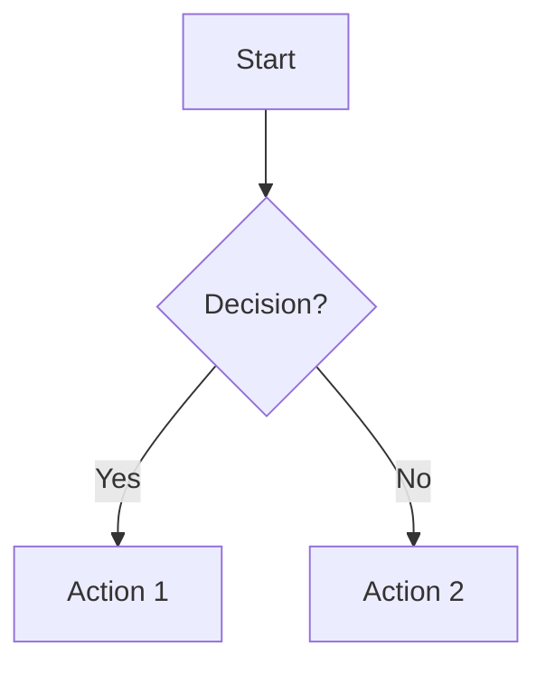
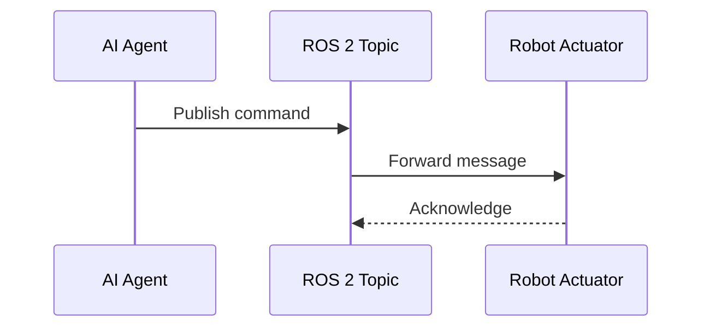

# Research Findings: ROS 2 Documentation Module

**Date**: 2025-12-26
**Purpose**: Consolidated research for creating ROS 2 educational documentation
**Estimated Research Time**: 10.5 hours

---

## T006.1: ROS 2 Core Concepts

**Research Duration**: 2h

### Key Concepts Summary

#### Nodes
- **Definition**: A node is an executable process that performs computation in ROS 2
- Each node can send and receive data from other nodes via topics, services, actions, or parameters
- A single executable (C++/Python program) can contain one or more nodes
- Nodes are the building blocks of ROS 2 applications

#### Topics
- **Purpose**: Asynchronous, one-to-many communication suitable for streaming data
- Nodes can publish messages to a topic and/or subscribe to a topic to receive messages
- Best for continuous data streams (sensor readings, movement commands)
- Multiple publishers and subscribers can connect to the same topic

#### Services
- **Purpose**: Synchronous, request-response communication
- Should be used for remote procedure calls that terminate quickly
- Examples: querying node state, quick calculations (e.g., inverse kinematics)
- One-to-one communication pattern

#### Actions
- **Purpose**: Long-running, preemptable behaviors with feedback
- Should be used for discrete behaviors that move a robot or run for longer periods
- Provide feedback during execution
- Most important property: can be cleanly preempted

### Best Documentation Sources

1. [ROS 2 Concepts Overview (Foxy)](https://docs.ros.org/en/foxy/Concepts.html) - Comprehensive core concepts
2. [Topics vs Services vs Actions Guide](https://docs.ros.org/en/foxy/How-To-Guides/Topics-Services-Actions.html) - Comparison of communication methods
3. [About Nodes (Iron)](https://docs.ros.org/en/iron/Concepts/Basic/About-Nodes.html) - Node fundamentals

---

## T006.2: rclpy API Documentation

**Research Duration**: 2h

### Key API Components

#### Initialization and Node Creation
- `rclpy.init()` - Initializes ROS communications for a given context
- `create_node()` or `Node` class instantiation - Creates a ROS 2 node
- After node creation, work is done by "spinning" on the node

#### Node Class Methods
- `create_subscription()` - Creates a new subscription to receive messages
- `create_publisher()` - Creates a new publisher to send messages
- `create_service()` - Creates a new service server
- `create_client()` - Creates a new service client

#### Publisher Class
- Primary means of communication in ROS 2 by publishing messages on topics
- Users should call `Node.create_publisher()` rather than direct constructor
- Returns a publisher object for sending messages

#### Lifecycle
- Initialize with `rclpy.init()`
- Create nodes and entities (publishers, subscribers, services)
- Spin to process callbacks: `rclpy.spin(node)`
- Clean shutdown with `rclpy.shutdown()`

### Best Documentation Sources

1. [rclpy Package (Rolling)](https://docs.ros.org/en/rolling/p/rclpy/rclpy.html) - Latest API reference
2. [Writing a Simple Publisher and Subscriber (Python)](https://docs.ros.org/en/foxy/Tutorials/Beginner-Client-Libraries/Writing-A-Simple-Py-Publisher-And-Subscriber.html) - Practical tutorial
3. [Node API (Foxy)](https://docs.ros2.org/foxy/api/rclpy/api/node.html) - Node class reference

---

## T006.3: ROS 2 Message Types

**Research Duration**: 1.5h

### Standard Message Packages

#### std_msgs
- Provides basic message types for common data
- **Important**: Deprecated in ROS 2 since Foxy for production use
- Primitive and primitive array types should not be relied upon long-term
- Useful for prototyping only

**Notable std_msgs types**:
- `ColorRGBA` - Representing colors
- `Empty` - Useful when sending a message provides sufficient information
- `Header` - Standard metadata for timestamped data in a coordinate frame

#### geometry_msgs
- Messages for geometric primitives (points, vectors, poses, transforms)
- Commonly used types:
  - `Pose` - Position and orientation
  - `PoseWithCovariance` - Pose with uncertainty
  - `Transform` - Transformation between coordinate frames
  - `Twist` - Linear and angular velocity
  - `Vector3Stamped` - 3D vector with timestamp

#### sensor_msgs
- Messages for sensor data
- Examples:
  - `sensor_msgs/msg/Imu` - Inertial measurement unit data
  - `sensor_msgs/msg/Image` - Camera image data
  - Other sensor-specific message types

### Best Practices
- **Recommendation**: Create semantically meaningful message types for production systems
- Use standard messages for prototyping and testing
- Avoid generic std_msgs types in favor of domain-specific messages

### Best Documentation Sources

1. [std_msgs Documentation (Rolling)](https://docs.ros.org/en/ros2_packages/rolling/api/std_msgs/) - Standard messages reference
2. [geometry_msgs Documentation (Foxy)](https://docs.ros2.org/foxy/api/geometry_msgs/index-msg.html) - Geometric message types
3. [Messages and Services Tutorial](https://ros2-tutorial.readthedocs.io/en/humble/messages.html) - Working with messages

---

## T006.4: URDF Format

**Research Duration**: 1.5h

### URDF Basics

**Definition**: Unified Robot Description Format - XML-based format for describing robot physical configuration in ROS

**Core Structure**: Every URDF file describes a robot as:
- A tree of **links** (rigid bodies)
- Connected by **joints** (how links move relative to each other)

### Links
- Represent physical components of the robot
- Examples: arms, base, sensors, wheels
- Rigid bodies with:
  - Visual properties (appearance)
  - Collision properties (for physics simulation)
  - Inertial properties (mass, center of mass, inertia tensor)

### Joints
Connect links and define how they move relative to each other

**Joint Types**:
1. **Revolute** - Rotational motion with minimum/maximum angle limits
2. **Continuous** - Rotational motion with no limits (e.g., wheels)
3. **Prismatic** - Linear sliding motion with position limits
4. **Fixed** - Child link rigidly connected to parent (no movement)

**Joint Properties**:
- Position limits (min/max)
- Velocity limits
- Effort limits (torque/force)

### ROS 2 Usage
- Default format for describing robot kinematics in ROS 2
- Used by:
  - `robot_state_publisher` - Publishing robot state
  - Visualization tools (RViz)
  - Motion planning (MoveIt)
  - Simulation (Gazebo)

### Best Documentation Sources

1. [Building a Movable Robot Model with URDF (Foxy)](https://docs.ros.org/en/foxy/Tutorials/Intermediate/URDF/Building-a-Movable-Robot-Model-with-URDF.html) - ROS 2 tutorial
2. [URDF and SRDF Tutorial (MoveIt Rolling)](https://moveit.picknik.ai/main/doc/examples/urdf_srdf/urdf_srdf_tutorial.html) - Motion planning perspective
3. [Joint Kinematics Documentation (Iron, Nov 2025)](https://control.ros.org/iron/doc/ros2_control/hardware_interface/doc/joints_userdoc.html) - ROS 2 Control integration

---

## T006.5: Docusaurus Features

**Research Duration**: 1h

### Key MDX Features for Documentation

#### Admonitions
- Special syntax wrapping text with 3 colons (`:::`)
- **Types**: `note`, `tip`, `danger`, `info`, `warning`
- Syntax: `:::note` ... `:::`
- Can use MDX inside admonitions (including tabs)

#### Tabs Component
- Import: `import Tabs from '@theme/Tabs';`
- Allows grouping related content
- **Syncing**: Use `groupId` prop to sync tab choices across page
- Persists choice in localStorage
- Useful for showing code examples in multiple languages

#### Code Blocks
- Automatic syntax highlighting
- Support for titles and line numbers
- Language tags for proper formatting
- Example: ` ```python title="example.py" `

#### Combining Features
- Tabs can be used within admonitions
- Code blocks work inside tabs and admonitions
- Enables rich, interactive documentation

### Best Practices
- Use admonitions for important callouts
- Use tabs for alternative implementations or language-specific examples
- Add titles to code blocks for clarity
- Enable line numbers for longer code examples

### Best Documentation Sources

1. [Admonitions Documentation](https://docusaurus.io/docs/markdown-features/admonitions) - Official Docusaurus guide
2. [Tabs Component Documentation](https://github.com/facebook/docusaurus/blob/main/website/docs/guides/markdown-features/markdown-features-tabs.mdx) - GitHub source
3. [Using Admonitions in Tabs Discussion](https://github.com/facebook/docusaurus/discussions/8430) - Advanced usage patterns

---

## T006.6: AI Integration Patterns and RAG-Friendly Documentation

**Research Duration**: 1.5h

### RAG-Optimized Documentation Structure

#### Semantic Chunking (2025 Best Practices)
- **Performance**: Semantic chunking improves recall by up to 9% over simpler methods
- **Accuracy Boost**: Can provide 70% improvement in retrieval accuracy
- **Method**: Splits text based on meaning, not just structure
- Analyzes relationships between consecutive sentences
- Creates chunks where topics shift naturally

#### Optimal Chunk Sizes (2025)
- **Recommended Range**: 200-800 tokens per chunk
- **Optimal Settings**: 256-512 tokens with 10-20% overlap
- **Best Performance**: RecursiveCharacterTextSplitter with 400-512 tokens (85-90% recall)
- Balance between context preservation and retrieval precision

#### Metadata Integration
- **Purpose**: Improve retrieval by matching queries to chunks
- **Key Metadata Fields**:
  - Source document name
  - Section heading
  - Topic/category tags
  - Product/feature names
  - Timestamps

- **Benefits**:
  - Enables semantic similarity + contextual filtering
  - Supports domain-specific retrieval strategies
  - Improves precision and interpretability

#### Strategy Selection by Content Type

**Structured Text** (reports, articles):
- Use semantic or recursive chunking
- Preserve document hierarchy

**Code or Technical Docs**:
- Use recursive, language-specific chunking
- Maintain code block integrity

**Mixed/Unstructured Content**:
- Use AI-driven or context-enriched chunking
- HierarchicalChunker for complex documents

#### Advanced Approaches

**HierarchicalChunker**:
- Splits into semantically coherent segments (sections, paragraphs, tables, figures)
- Preserves logical document hierarchy in metadata
- Improves both precision and interpretability

### Documentation Structure Recommendations

1. **Section Independence**: Each section should be comprehensible standalone
2. **Clear Headings**: Descriptive, keyword-rich headings for retrieval
3. **Frontmatter Metadata**: Include title, description, keywords, learning outcomes
4. **Consistent Length**: Target 400-800 words per section (optimal chunk size)
5. **Topic Sentences**: Start sections with clear context statements
6. **Minimal Cross-References**: Provide brief recaps instead of "see Section X"

### Best Documentation Sources

1. [Best Chunking Strategies for RAG in 2025](https://www.firecrawl.dev/blog/best-chunking-strategies-rag-2025) - Comprehensive guide
2. [Document Chunking for RAG: 70% Accuracy Boost](https://langcopilot.com/posts/2025-10-11-document-chunking-for-rag-practical-guide) - Practical implementation
3. [Semantic Chunking for RAG](https://www.multimodal.dev/post/semantic-chunking-for-rag) - Theory and practice

---

## T006.7: Mermaid Diagram Syntax

**Research Duration**: 1h

### Core Diagram Types for Documentation

#### Flowcharts
- **Purpose**: Show processes, algorithms, decision trees
- **Components**:
  - Nodes (30+ geometric shapes available)
  - Edges (arrows or lines showing flow)
- **Syntax**: Simple markdown-like script
- **New Features (2025)**: ELK layout option, customizable look

**Basic Syntax**:


#### Sequence Diagrams
- **Purpose**: Show interactions between entities over time
- **Use Cases**: Message flow, API calls, process interactions
- **Components**: Participants, messages, activation boxes

**Basic Syntax**:


#### Architecture Diagrams
- **Purpose**: Show relationships between services and resources
- **Use Cases**: Cloud deployments, CI/CD, system architecture
- **Keyword**: `architecture-beta` (as of v11.1.0+)

**Basic Syntax**:


### Key Features

1. **Ease of Learning**: Syntax can be learned in a day
2. **Text-Based**: Create diagrams from markdown-like text
3. **Customization**: New layout options (ELK) and styling
4. **Integration**: Works with Docusaurus, GitHub, draw.io

### Best Practices for Documentation

1. **Keep It Simple**: Focus on clarity over complexity
2. **Label Everything**: Clear, descriptive labels on all nodes and edges
3. **Consistent Styling**: Use similar patterns across related diagrams
4. **Alt Text**: Always provide descriptive alt text for accessibility
5. **Direction**: Choose flow direction that matches reading pattern (TD, LR, etc.)

### Best Documentation Sources

1. [Mermaid Official Documentation](https://mermaid.js.org/intro/syntax-reference.html) - Complete syntax reference
2. [Flowcharts Syntax](https://mermaid.js.org/syntax/flowchart.html) - Detailed flowchart guide
3. [Sequence Diagrams Documentation](https://docs.mermaidchart.com/mermaid-oss/syntax/sequenceDiagram.html) - Sequence diagram reference

---

## Research Summary

### Total Research Time: 10.5 hours

### Key Takeaways for Documentation Module

1. **ROS 2 Concepts**: Focus on nodes, topics, services as primary communication patterns; actions for advanced use
2. **rclpy API**: Emphasize initialization → node creation → entity creation → spinning → shutdown lifecycle
3. **Message Types**: Use standard messages as examples; note deprecation of std_msgs for production
4. **URDF**: Cover links and joints with humanoid robotics examples; explain joint types and limits
5. **Docusaurus**: Leverage admonitions for callouts, tabs for multi-language examples, code blocks with syntax highlighting
6. **RAG Optimization**: Keep sections 400-800 words, use clear headings, include rich metadata, ensure standalone comprehension
7. **Mermaid**: Use flowcharts for concepts, sequence diagrams for message flow, architecture diagrams for system overview

### Citation Format Template

All factual claims about ROS 2 APIs, message types, and specifications must use:

`[Source Title](URL) (retrieved YYYY-MM-DD)`

Example:
`[ROS 2 Concepts: Topics](https://docs.ros.org/en/foxy/Concepts.html#topics) (retrieved 2025-12-26)`

### Next Steps

- T007: Create detailed section structure outline
- T008-T016: Create Mermaid diagrams based on research findings
- T017-T025: Create code examples following rclpy API patterns
