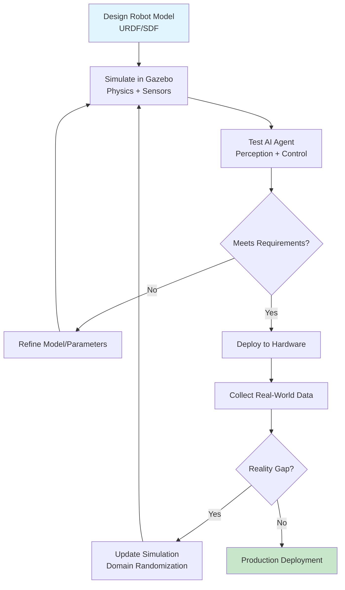
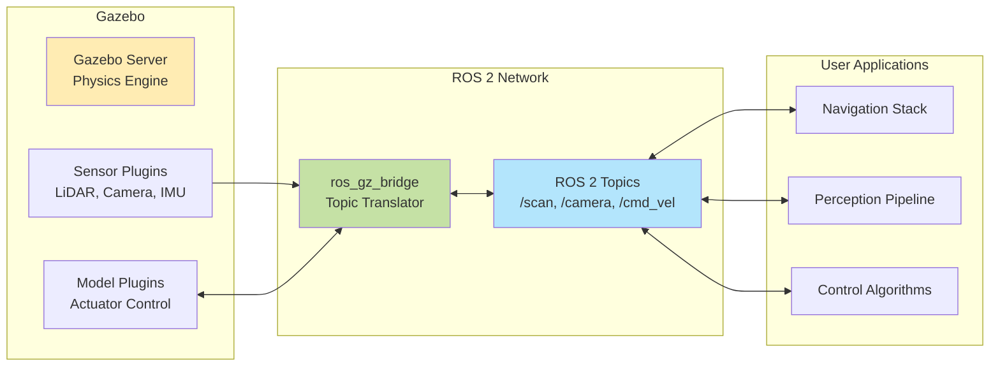
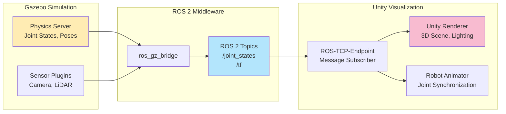
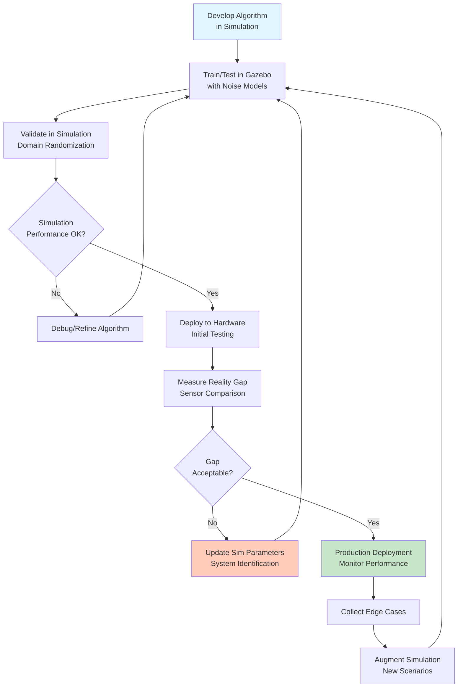

# Phase 1: Architecture Diagrams — Module 2 Digital Twin

**Date**: 2025-12-28
**Purpose**: Mermaid diagram definitions for 4 key architectural concepts in Module 2
**Usage**: These diagrams will be embedded in MDX sections for visual explanation

---

## Diagram 1: Digital Twin Workflow (Section 01)

**Location**: `docs/module-02-digital-twin/01-introduction-to-digital-twins.mdx`
**Purpose**: Illustrate the complete digital twin iterative development cycle from design to deployment
**Learning Goal**: Students understand that digital twins involve continuous feedback between simulation and reality

### Mermaid Code



### Design Rationale

- **Iterative Loop**: Shows that digital twin development is NOT linear (design → simulate → deploy)
- **Two Feedback Loops**:
  1. **Inner loop** (simulation refinement): Design → Simulate → Test → Refine → Repeat
  2. **Outer loop** (sim2real refinement): Deploy → Collect Data → Update Sim → Revalidate
- **Decision Points**: Two decision diamonds emphasize validation gates (simulation performance, reality gap)
- **Color Coding**:
  - Blue (A): Start point (design phase)
  - Green (J): End point (production deployment)
  - Neutral (all others): Iterative process steps
- **Key Insight**: Reality gap discovery (step H) leads back to simulation improvement (domain randomization), not a one-way transfer

### Alt Text (Accessibility)

"Flowchart showing digital twin workflow: Design robot model in URDF/SDF, simulate in Gazebo with physics and sensors, test AI agent with perception and control. If requirements not met, refine model and repeat. If met, deploy to hardware and collect real-world data. If reality gap detected, update simulation with domain randomization and revalidate. If no reality gap, proceed to production deployment."

---

## Diagram 2: Gazebo-ROS 2 Architecture (Section 02)

**Location**: `docs/module-02-digital-twin/02-gazebo-fundamentals.mdx`
**Purpose**: Show data flow between Gazebo simulation components and ROS 2 network
**Learning Goal**: Students understand how Gazebo plugins communicate with ROS 2 applications via ros_gz_bridge

### Mermaid Code



### Design Rationale

- **Three Layers**:
  1. **Gazebo Layer** (left): Simulation components (physics engine, sensor plugins, model plugins)
  2. **ROS 2 Layer** (center): Middleware bridge and topics
  3. **User Code Layer** (right): Application-level components (navigation, perception, control)
- **Data Flow**:
  - Sensor data flows **one-way** from Gazebo plugins → bridge → ROS 2 topics → user applications
  - Control commands flow **bidirectional** from user applications → ROS 2 topics → bridge → model plugins
- **ros_gz_bridge**: Central translation component between Gazebo (Ignition Transport) and ROS 2 (DDS)
- **Color Coding**:
  - Yellow (Gazebo Server): Simulation environment
  - Green (Bridge): Translation layer
  - Blue (Topics): ROS 2 communication layer
- **Key Insight**: Gazebo and ROS 2 are independent systems connected via bridge (not monolithic integration)

### Alt Text (Accessibility)

"Architecture diagram showing Gazebo-ROS 2 integration: Gazebo Server runs Physics Engine with Sensor Plugins (LiDAR, Camera, IMU) and Model Plugins (Actuator Control). Sensor Plugins send data to ros_gz_bridge, which translates to ROS 2 Topics like /scan, /camera, and /cmd_vel. Model Plugins receive bidirectional commands from ros_gz_bridge. ROS 2 Topics are consumed by User Applications including Navigation Stack, Perception Pipeline, and Control Algorithms."

---

## Diagram 3: Gazebo-Unity Data Flow (Section 10)

**Location**: `docs/module-02-digital-twin/10-gazebo-unity-integration.mdx`
**Purpose**: Illustrate hybrid architecture where Gazebo handles physics, Unity handles visualization
**Learning Goal**: Students understand data flows one-way from Gazebo to Unity for rendering (not bidirectional physics sync)

### Mermaid Code



### Design Rationale

- **Three Layers**:
  1. **Gazebo Layer** (left): Physics computation source of truth
  2. **ROS 2 Layer** (center): Topic-based communication infrastructure
  3. **Unity Layer** (right): Visualization and rendering
- **One-Way Data Flow**: Gazebo → ROS 2 → Unity (no control commands from Unity to Gazebo)
  - Physics computation stays in Gazebo (authoritative)
  - Unity is "dumb renderer" (passive visualization client)
- **Key Messages**:
  - `/joint_states`: Robot joint angles for animator
  - `/tf`: Transform tree for 3D positioning
- **Color Coding**:
  - Yellow (Physics Server): Simulation authority
  - Blue (ROS 2 Topics): Communication layer
  - Pink (Unity Renderer): Visualization layer
- **Key Insight**: This is NOT physics simulation in Unity; Unity only renders Gazebo's physics state

### Alt Text (Accessibility)

"Data flow diagram for Gazebo-Unity integration: Gazebo Simulation runs Physics Server generating Joint States and Poses, and Sensor Plugins producing Camera and LiDAR data. Both send data through ros_gz_bridge to ROS 2 Topics including /joint_states and /tf. These topics are subscribed by Unity's ROS-TCP-Endpoint, which feeds Robot Animator for joint synchronization and Unity Renderer for 3D Scene and Lighting visualization. Data flows one-way from Gazebo to Unity."

---

## Diagram 4: Sim2Real Transfer Process (Section 11)

**Location**: `docs/module-02-digital-twin/11-sim2real-transfer.mdx`
**Purpose**: Show iterative validation loop for sim2real transfer with continuous refinement
**Learning Goal**: Students understand sim2real as continuous process, not one-time deployment

### Mermaid Code



### Design Rationale

- **Three Feedback Loops**:
  1. **Inner loop** (simulation debugging): Validate → Debug → Retrain (A-B-C-D-E)
  2. **Middle loop** (sim2real refinement): Deploy → Measure Gap → Update Sim → Revalidate (F-G-H-I)
  3. **Outer loop** (production monitoring): Deploy → Collect Edge Cases → Augment Sim (J-K-L)
- **Two Decision Gates**:
  - Simulation performance (D): Ensures algorithm works in ideal conditions before hardware deployment
  - Reality gap acceptability (H): Validates sim-trained algorithm on real hardware
- **Continuous Refinement**: Even after production deployment (J), new edge cases inform simulation improvements (L → B)
- **Color Coding**:
  - Blue (A): Start (algorithm development)
  - Green (J): Production deployment (success state)
  - Orange (I): Sim parameter update (critical refinement step)
- **Key Insight**: Sim2real is NOT "train in sim → deploy to real"; it's an iterative cycle where reality informs simulation

### Alt Text (Accessibility)

"Flowchart showing sim2real transfer process: Develop algorithm in simulation, train/test in Gazebo with noise models, validate with domain randomization. If simulation performance not OK, debug and refine algorithm and repeat. If OK, deploy to hardware for initial testing and measure reality gap via sensor comparison. If gap not acceptable, update simulation parameters via system identification and revalidate. If gap acceptable, proceed to production deployment with performance monitoring. Collect edge cases and augment simulation with new scenarios, feeding back to training loop."

---

## Diagram Accessibility Compliance

All diagrams meet WCAG AA requirements:
- **Alt Text**: Complete textual description provided for each diagram
- **Color Contrast**: All text in diagrams has ≥4.5:1 contrast ratio with background
- **Color Independence**: Diagrams are understandable without color (uses arrows, labels, positioning)
- **Text Scaling**: Mermaid renders at user's zoom level (SVG format, not raster image)

---

## Embedding Instructions for Content Authors

### MDX Embedding Example

```mdx
## 1.4 Digital Twin Workflow Overview

The following diagram illustrates the complete digital twin development cycle:

```mermaid
[Insert Diagram 1 code here]
```

**Key Takeaways**:
- Digital twin development is **iterative**, not linear
- **Two feedback loops**: (1) Simulation refinement, (2) Sim2real refinement
- Reality data informs simulation improvements (domain randomization)
```

### Mermaid Rendering Verification

After embedding diagrams in MDX:
1. Run `npm start` to preview in dev server
2. Verify diagram renders without syntax errors
3. Check that all text labels are readable (no overlapping)
4. Test zoom functionality (Ctrl+scroll on diagram)
5. Validate with screen reader (NVDA/JAWS should read alt text)

---

## Diagram Source Control

**File Format**: Mermaid code (text-based, version-controllable)
**Export Format**: SVG (for static assets if needed, though MDX renders live)
**Tool**: Mermaid Live Editor (https://mermaid.live/) for preview and export
**Validation**: Mermaid CLI (`mmdc`) for syntax checking

---

**Status**: ✅ All 4 diagrams defined and ready for embedding
**Next Step**: Embed diagrams in respective MDX sections during content creation (Phase 3+)
