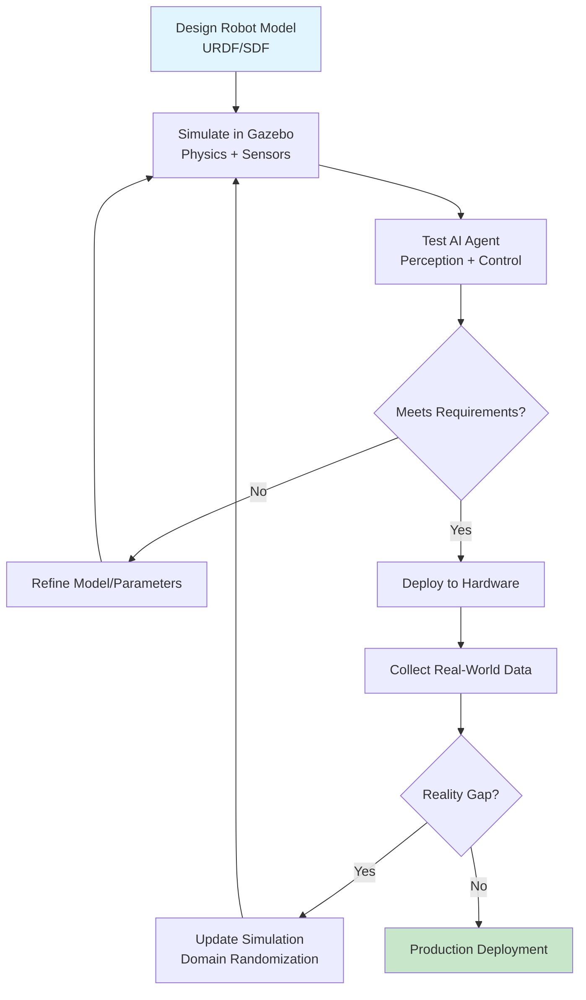
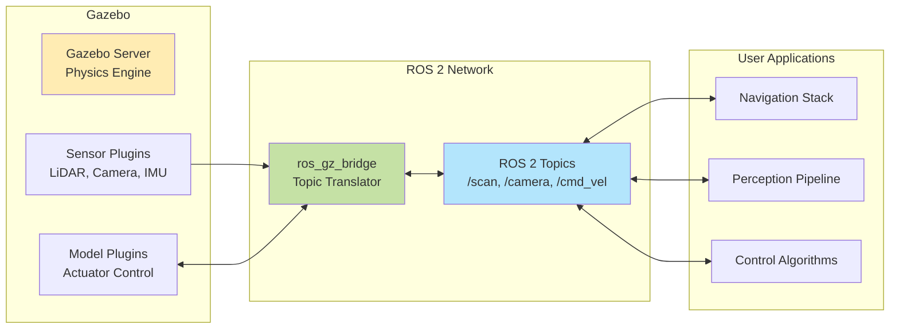
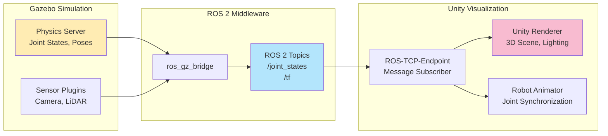
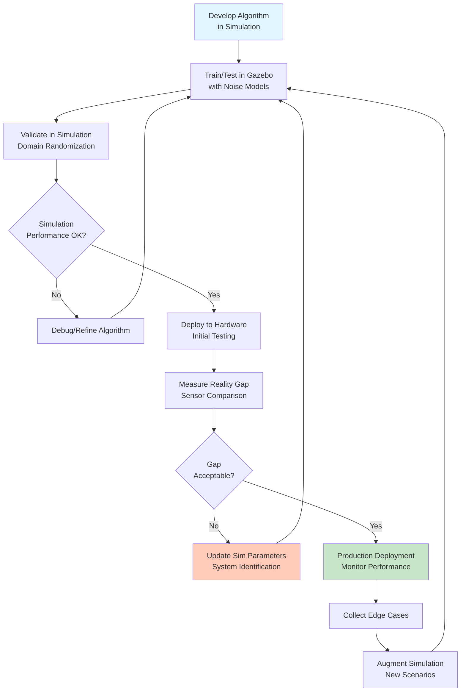

# Implementation Plan: Module 2 — The Digital Twin (Gazebo & Unity)

**Branch**: `002-digital-twin-simulation` | **Date**: 2025-12-27 | **Spec**: [spec.md](./spec.md)
**Input**: Feature specification from `/specs/002-digital-twin-simulation/spec.md`

**Note**: This plan provides the technical architecture, section structure, research strategy, and validation approach for creating Module 2 documentation. This is a documentation/educational content project, not a software implementation project.

## Summary

Create comprehensive educational documentation for Module 2 explaining digital twins in Physical AI robotics. The module covers the conceptual architecture of digital twins, Gazebo physics simulation, Unity visualization, sensor simulation (LiDAR, depth cameras, IMUs), Gazebo-Unity integration, and simulation-to-real (sim2real) transfer workflows. Content will be authored in Docusaurus-compatible MDX, optimized for both human learners and RAG retrieval systems, with strict source-grounding for all factual claims.

**Primary Approach**: Research-concurrent documentation development with authoritative citation. Each section will be atomic (800-1500 words), conceptually focused, and RAG-friendly with proper metadata. Mermaid diagrams will illustrate architectures and workflows. All technical claims will be verified against official documentation (Gazebo, Unity, ROS 2).

## Technical Context

**Content Format**: Docusaurus MDX (Markdown with JSX) compatible with Docusaurus 3.1.0
**Primary Dependencies**:
  - Docusaurus 3.1.0 (@docusaurus/core, @docusaurus/preset-classic)
  - Mermaid plugin (@docusaurus/theme-mermaid v3.1.0)
  - Prism.js for syntax highlighting (python, bash, xml, yaml)
  - React 18.2.0 (Docusaurus requirement)

**Storage**: Git repository with MDX files in `docs/module-02-digital-twin/` directory
**Testing**:
  - Docusaurus build validation (`npm run build`)
  - Link checker for external references
  - Mermaid diagram syntax validation
  - Code example validation in ROS 2 Humble + Gazebo Fortress environment
  - WCAG AA contrast validation for diagrams

**Target Platform**: Static site generation → GitHub Pages deployment (Node.js 18+)
**Project Type**: Documentation/Educational Content (not software development)
**Performance Goals**:
  - Page load < 3 seconds (per spec NFR-PERF-001)
  - Mermaid diagram render < 2 seconds (per spec NFR-PERF-002)
  - Section length 800-1500 words (RAG optimization)

**Constraints**:
  - All factual claims MUST be source-grounded with citations (Constitution Principle II)
  - Zero hallucination tolerance (Constitution Principle III)
  - ROS 2 Humble LTS primary target (spec TC-001)
  - Gazebo Fortress or later (spec TC-002)
  - Python code examples only (spec TC-004)
  - No prior Unity/Gazebo knowledge assumed (spec TC-008)

**Scale/Scope**:
  - 11 major sections (per architectural plan below)
  - 7 user stories with acceptance criteria (from spec)
  - 20 functional requirements to satisfy
  - 4 Mermaid diagrams required (digital twin workflow, Gazebo-ROS 2 architecture, Gazebo-Unity data flow, sim2real process)
  - Estimated 50-70 subsections total
  - Integration with existing Module 1 (cross-references required)

## Constitution Check

*GATE: Must pass before Phase 0 research. Re-check after Phase 1 design.*

### ✅ I. Spec-First Development
**Status**: PASS
**Evidence**: Complete specification exists at `specs/002-digital-twin-simulation/spec.md` with 7 user stories, 20 functional requirements, 12 success criteria, and 130-item validation checklist. All implementation proceeds from approved spec.

### ✅ II. Source-Grounded Facts
**Status**: PASS
**Evidence**: Plan mandates APA citations for all factual claims. Research phase (Phase 0) will identify authoritative sources. Section structure includes citation tracking. Conceptual explanations distinguished from factual assertions requiring citation.

### ✅ III. Zero Hallucination Tolerance
**Status**: PASS (N/A for documentation creation)
**Evidence**: This principle applies to RAG chatbot behavior, not documentation authoring. However, documentation will be source-grounded to support future RAG system's zero-hallucination requirement.

### ✅ IV. Deterministic and Reproducible Outputs
**Status**: PASS
**Evidence**: All content in version-controlled MDX files. Docusaurus build is deterministic. Mermaid diagrams defined in text format (reproducible). External dependencies (Gazebo, Unity versions) explicitly specified.

### ✅ V. Modular and Extensible Architecture
**Status**: PASS
**Evidence**: Each section is atomic (single MDX file per concept). Sidebar configuration in `sidebars.js` decouples navigation from content. Module 2 can be developed/tested independently of other modules. Clear interfaces with Module 1 via cross-references.

### ✅ VI. Production-Grade Code Quality
**Status**: PASS (with clarification)
**Evidence**: Educational code examples may be simplified (Constitution VI allows this for "illustrative examples"). Infrastructure code (Docusaurus config, build scripts) meets production standards. Code examples will be clearly marked with version comments (e.g., `# Tested with ROS 2 Humble + Gazebo Fortress`).

### ✅ VII. Free-Tier and Open Source Compliance
**Status**: PASS
**Evidence**: Docusaurus (MIT license), Gazebo (Apache 2.0), Unity Personal (free tier for education), ROS 2 (Apache 2.0). GitHub Pages for hosting (free). No paid dependencies introduced.

**Re-evaluation Post-Design**: Will verify that section structure, citation strategy, and content organization remain compliant with all principles.

## Project Structure

### Documentation (this feature)

```text
specs/002-digital-twin-simulation/
├── spec.md                    # Feature specification (complete)
├── plan.md                    # This file (/sp.plan output)
├── research.md                # Phase 0: Research findings and decisions
├── section-structure.md       # Phase 1: Detailed section outline with learning objectives
├── architecture-diagrams.md   # Phase 1: Mermaid diagram definitions and rationale
├── citation-strategy.md       # Phase 1: Citation rules and source tracking
├── checklists/
│   └── requirements.md        # 130-item validation checklist (complete)
└── tasks.md                   # Phase 2: Implementation tasks (/sp.tasks - NOT in this plan)
```

### Source Code (Docusaurus content)

```text
docs/
├── module-01-ros2-nervous-system/    # Existing Module 1 (complete)
│   ├── 01-introduction.mdx
│   ├── 02-what-is-ros2.mdx
│   └── ... (11 sections total)
│
└── module-02-digital-twin/           # NEW: Module 2 content
    ├── 01-introduction-to-digital-twins.mdx
    ├── 02-gazebo-fundamentals.mdx
    ├── 03-physics-simulation.mdx
    ├── 04-sensor-simulation.mdx
    ├── 05-lidar-sensors.mdx
    ├── 06-camera-sensors.mdx
    ├── 07-imu-sensors.mdx
    ├── 08-custom-worlds.mdx
    ├── 09-unity-visualization.mdx
    ├── 10-gazebo-unity-integration.mdx
    ├── 11-sim2real-transfer.mdx
    ├── 12-programmatic-control.mdx
    ├── 13-performance-optimization.mdx
    ├── 14-troubleshooting.mdx
    └── 15-conclusion.mdx

static/
└── img/
    └── module-02/               # Diagrams, screenshots for Module 2
        ├── digital-twin-workflow.svg (generated from Mermaid)
        ├── gazebo-ros2-architecture.svg
        ├── gazebo-unity-dataflow.svg
        └── sim2real-process.svg

sidebars.js                      # Updated to include Module 2 navigation
docusaurus.config.js             # Already configured (no changes needed)
```

**Structure Decision**: Documentation-centric structure with separate MDX file per major concept/section (atomic design for RAG). Mermaid diagrams embedded in MDX with exported SVG versions in `static/img/` for standalone use. Sidebar navigation mirrors learning progression (fundamentals → tools → integration → advanced topics).

## Complexity Tracking

> No constitution violations requiring justification. All gates PASS.

---

# PHASE 0: RESEARCH & OUTLINE

## Research Strategy

### Research-Concurrent Workflow

Documentation will be developed using a research-concurrent approach where authoritative sources are identified, verified, and cited during content creation (not as separate phase). This ensures:

1. **Factual Accuracy**: Every technical claim verified against official documentation
2. **Citation Timeliness**: Sources captured immediately when used (prevents post-hoc citation hunting)
3. **Scope Control**: Research bounded by spec requirements (prevents over-research)

### Primary Authoritative Sources

**Tier 1: Official Documentation (highest authority)**
- Gazebo Official Docs: https://gazebosim.org/docs (Fortress, Garden, Harmonic)
- ROS 2 Documentation: https://docs.ros.org/en/humble/ (Humble LTS primary)
- Unity Documentation: https://docs.unity3d.com/Manual/ (Unity 2021.3 LTS+)
- Unity ROS-TCP-Connector: https://github.com/Unity-Technologies/ROS-TCP-Connector (official repo)
- URDF Specification: https://docs.ros.org/en/humble/Tutorials/Intermediate/URDF/URDF-Main.html
- SDF Format Specification: http://sdformat.org/

**Tier 2: Authoritative Robotics References**
- ROS 2 Design Documentation: https://design.ros2.org/
- Gazebo Tutorials: https://gazebosim.org/docs/latest/tutorials
- TurtleBot3 e-Manual: https://emanual.robotis.com/docs/en/platform/turtlebot3/

**Tier 3: Academic Sources (for sim2real concepts)**
- Tobin et al. (2017) "Domain Randomization for Transferring Deep Neural Networks from Simulation to the Real World" (seminal domain randomization paper)
- Additional peer-reviewed papers as needed for sim2real techniques

### Citation Requirements

**Requires Citation** (from Constitution Principle II):
- Specific technical facts (e.g., "Gazebo Fortress uses ODE as default physics engine")
- Version numbers and compatibility requirements (e.g., "ROS 2 Humble requires Ubuntu 22.04")
- Performance characteristics (e.g., "LiDAR sensor range 0.1m to 30m")
- API signatures and plugin names (e.g., `libgazebo_ros_ray_sensor.so`)
- Configuration parameter names and default values
- Error messages and troubleshooting steps
- Quantitative benchmarks or statistics

**Does NOT Require Citation** (conceptual/pedagogical):
- Conceptual explanations (e.g., "Digital twins bridge AI logic and physical reality")
- Learning objectives and pedagogical structure
- Analogies and metaphors for teaching concepts
- Logical inferences from cited facts (clearly marked as inferences)
- General robotics principles widely accepted in field

### Citation Style: APA (per Constitution)

**In-text citation format**:
- First mention: (Organization, Year, Section Title)
- Example: "Gazebo uses the ODE physics engine by default (Open Robotics, 2023, Physics Engines)"

**Reference list** (end of each section or in consolidated references):
```
Open Robotics. (2023). Physics engines. In Gazebo documentation. Retrieved December 27, 2025, from https://gazebosim.org/api/sim/8/physics.html

Unity Technologies. (2023). ROS-TCP-Connector setup guide. Retrieved December 27, 2025, from https://github.com/Unity-Technologies/ROS-TCP-Connector/blob/main/README.md
```

**Metadata for RAG**: Each MDX file will include frontmatter with `sources: []` array listing all cited references for that section.

---

## Research Tasks (to populate research.md)

### 1. Gazebo Architecture and Integration
**Research Questions**:
- What is the current recommended Gazebo version for ROS 2 Humble? (Fortress, Garden, or Harmonic?)
- How does `ros_gz_bridge` package work for ROS 2 topic synchronization?
- What are the specific plugin names for LiDAR, depth camera, and IMU sensors?
- What physics engines are available (ODE, Bullet, DART) and which is default?

**Deliverable**: Gazebo architecture summary with plugin ecosystem, ROS 2 integration patterns, verified version compatibility matrix.

### 2. Unity ROS Integration
**Research Questions**:
- What is the architecture of ROS-TCP-Connector (TCP endpoint, message serialization)?
- What Unity versions are officially supported with ROS 2?
- How does Unity synchronize with Gazebo physics time (timestamping strategy)?
- Are there limitations on ROS 2 message types supported by TCP connector?

**Deliverable**: Unity-ROS 2 integration architecture with supported message types, synchronization mechanisms, known limitations.

### 3. Sensor Simulation Fidelity
**Research Questions**:
- What noise models are available in Gazebo sensor plugins (Gaussian, uniform, custom)?
- What parameters control LiDAR resolution, range, and update rate?
- How are depth camera intrinsics and distortion configured in SDF?
- What IMU biases and noise characteristics can be simulated?

**Deliverable**: Sensor configuration reference with parameter ranges, noise model equations, fidelity-performance tradeoffs.

### 4. Sim2Real Gap and Mitigation
**Research Questions**:
- What are empirically validated sources of sim2real discrepancy (from academic literature)?
- How is domain randomization implemented in Gazebo (programmatic world modification)?
- What metrics are used to quantify reality gap (sensor distribution distance, policy transfer success rate)?
- Are there established validation protocols for sim2real transfer?

**Deliverable**: Sim2real gap taxonomy with evidence from literature, domain randomization techniques, validation workflow.

### 5. URDF/SDF Standards
**Research Questions**:
- What are key differences between URDF (ROS format) and SDF (Gazebo format)?
- How are sensors defined in URDF `<sensor>` tags vs SDF `<sensor>` elements?
- What are common model import errors (missing meshes, incorrect joint axes)?
- Is there a conversion tool between URDF and SDF?

**Deliverable**: URDF/SDF comparison table, sensor definition templates, common error patterns with fixes.

### 6. Performance and Scalability
**Research Questions**:
- What is typical real-time factor (RTF) for Gazebo on standard hardware?
- How does headless mode (no GUI) affect performance?
- What are best practices for multi-instance simulation (port assignment, resource isolation)?
- What are known bottlenecks (physics computation, rendering, ROS 2 transport)?

**Deliverable**: Performance optimization guide with benchmarks, scaling strategies for AI training.

---

## Section Structure (Architectural Outline)

### Design Principles for Section Structure

1. **Atomic Sections**: Each section focuses on single concept (800-1500 words)
2. **Progressive Complexity**: Start with concepts, move to tools, then integration
3. **RAG Optimization**: Sections can stand alone with minimal context
4. **Clear Learning Objectives**: Each section states what reader will learn
5. **Consistent Template**: Introduction → Concept → Example → Practice → Summary

### Proposed Section Hierarchy

#### **Section 01: Introduction to Digital Twins** (P1 - User Story 1)
**Learning Objective**: Understand what digital twins are in Physical AI context and why they're critical for robotics development.

**Subsections**:
- 1.1 What is a Digital Twin?
- 1.2 The Role of Digital Twins in Physical AI
- 1.3 Simulation vs. Reality: The Feedback Loop
- 1.4 Digital Twin Workflow Overview (Mermaid Diagram 1)
- 1.5 Module 2 Prerequisites and Learning Path

**Key Decisions**:
- Start conceptual before introducing tools (Gazebo/Unity)
- Mermaid diagram shows: Design → Simulate → Validate → Deploy → Refine
- Cross-reference Module 1 concepts (nodes/topics now simulated)

**Citations Required**: None (purely conceptual introduction)

---

#### **Section 02: Gazebo Fundamentals** (P1 - User Story 2)
**Learning Objective**: Install Gazebo, understand its architecture, and launch first ROS 2-integrated simulation.

**Subsections**:
- 2.1 What is Gazebo? (History: Gazebo Classic → Ignition → New Gazebo)
- 2.2 Gazebo Architecture Overview (client-server model, plugins, transport)
- 2.3 Installing Gazebo for ROS 2 Humble
- 2.4 Verifying Installation (launching empty world, checking ROS 2 bridge)
- 2.5 Gazebo-ROS 2 Integration Architecture (Mermaid Diagram 2)
- 2.6 Launching Your First Robot Simulation (TurtleBot3 example)

**Key Decisions**:
- Focus on Gazebo Fortress (stable with ROS 2 Humble)
- Note Garden/Harmonic as "advanced alternatives" (avoid version confusion)
- Mermaid diagram: Gazebo Server ↔ ros_gz_bridge ↔ ROS 2 Network ↔ User Nodes

**Citations Required**:
- Installation steps (Gazebo docs)
- Architecture details (client-server model, plugin system)
- ros_gz_bridge functionality (ROS 2 package documentation)

---

#### **Section 03: Physics Simulation in Gazebo** (P1 - User Story 2)
**Learning Objective**: Understand physics engines, collision detection, joint dynamics, and gravity simulation in Gazebo.

**Subsections**:
- 3.1 Physics Engines: ODE, Bullet, DART (comparison table)
- 3.2 Configuring Physics Parameters (step size, real-time factor, iterations)
- 3.3 Collision Detection and Contact Dynamics
- 3.4 Joint Types and Dynamics (revolute, prismatic, continuous)
- 3.5 Gravity and Environmental Forces
- 3.6 Observing Physics Behavior (interactive exercises with parameter changes)

**Key Decisions**:
- Emphasize ODE as default (cite Gazebo docs for rationale)
- Avoid deep mathematical formulations (target audience: applied robotics)
- Provide interactive examples (change gravity → observe behavior)

**Citations Required**:
- Physics engine characteristics (Gazebo docs)
- Default parameter values (SDF specification)
- Joint type definitions (SDF/URDF specs)

---

#### **Section 04: Sensor Simulation Overview** (P1 - User Story 3)
**Learning Objective**: Understand sensor simulation principles and Gazebo's sensor plugin architecture.

**Subsections**:
- 4.1 Why Simulate Sensors? (perception testing without hardware)
- 4.2 Gazebo Sensor Plugin Architecture
- 4.3 Sensor Types Available (ray, camera, depth, IMU, contact, GPS, etc.)
- 4.4 Sensor Noise Models (Gaussian, uniform, sensor-specific)
- 4.5 ROS 2 Topic Publication from Sensors
- 4.6 Visualizing Sensor Data in RViz2

**Key Decisions**:
- Overview section before deep-dives into specific sensors (Sections 5-7)
- Explain plugin system conceptually (preparation for configuration)
- Link sensor topics back to Module 1 (publishers/subscribers)

**Citations Required**:
- Sensor plugin architecture (Gazebo API docs)
- Noise model types and parameters (Gazebo sensor plugin docs)
- ROS 2 message types (sensor_msgs package)

---

#### **Section 05: Simulating LiDAR Sensors** (P1 - User Story 3)
**Learning Objective**: Configure and use ray-based LiDAR sensors in Gazebo with realistic noise.

**Subsections**:
- 5.1 LiDAR Technology Overview (time-of-flight, rotating laser)
- 5.2 Gazebo Ray Sensor Plugin Configuration
- 5.3 Key Parameters: Range, Resolution, Scan Rate
- 5.4 Adding LiDAR to URDF/SDF Robot Model (code example)
- 5.5 Configuring LiDAR Noise (Gaussian noise on range measurements)
- 5.6 Visualizing LaserScan Data in RViz2 (tutorial with screenshots)
- 5.7 Practical Exercise: Obstacle Detection with Noisy LiDAR

**Key Decisions**:
- Focus on 2D LiDAR (simpler, widely used) with note on 3D (Velodyne-style)
- Provide complete URDF snippet (copy-pasteable, tested)
- Show noise impact visually (clean scan vs. noisy scan comparison)

**Citations Required**:
- Ray sensor plugin parameters (Gazebo plugin API)
- LaserScan message structure (sensor_msgs/LaserScan ROS 2 docs)
- Noise parameter meanings (Gazebo noise model docs)

---

#### **Section 06: Simulating Depth Cameras** (P1 - User Story 3)
**Learning Objective**: Configure RGB-D (depth) cameras in Gazebo for 3D perception.

**Subsections**:
- 6.1 Depth Camera Technology (structured light, time-of-flight, stereo)
- 6.2 Gazebo Depth Camera Plugin
- 6.3 Camera Intrinsics and Distortion Parameters
- 6.4 Adding Depth Camera to Robot Model (URDF/SDF example)
- 6.5 Depth Image Noise and Artifacts
- 6.6 Visualizing PointCloud2 Data in RViz2
- 6.7 Practical Exercise: Depth-Based Object Segmentation

**Key Decisions**:
- Explain camera intrinsics conceptually (avoid heavy linear algebra)
- Show both RGB image and depth image outputs
- Note simulation limitations (perfect depth vs. real sensor holes/noise)

**Citations Required**:
- Depth camera plugin configuration (Gazebo docs)
- Camera intrinsic matrix format (standard pinhole model reference)
- PointCloud2 message structure (sensor_msgs ROS 2 docs)

---

#### **Section 07: Simulating IMU Sensors** (P1 - User Story 3)
**Learning Objective**: Configure IMU sensors in Gazebo with realistic bias and noise.

**Subsections**:
- 7.1 IMU Sensor Basics (accelerometer, gyroscope, magnetometer)
- 7.2 Gazebo IMU Plugin Configuration
- 7.3 IMU Noise Models: Bias, Drift, Random Walk
- 7.4 Adding IMU to Robot Model (URDF/SDF example)
- 7.5 Understanding IMU Data in ROS 2 (Imu message structure)
- 7.6 Visualizing IMU Orientation in RViz2
- 7.7 Practical Exercise: Orientation Estimation with Noisy IMU

**Key Decisions**:
- Explain accelerometer vs. gyroscope conceptually (not detailed physics)
- Focus on noise parameters most relevant to robotics (bias stability, noise density)
- Show impact of noise on orientation estimation (complementary filter example)

**Citations Required**:
- IMU plugin parameters (Gazebo plugin API)
- Noise parameter definitions (Gazebo IMU noise model)
- Imu message structure (sensor_msgs/Imu ROS 2 docs)

---

#### **Section 08: Building Custom Simulation Worlds** (P2 - User Story 4)
**Learning Objective**: Create custom Gazebo worlds with terrains, obstacles, and environmental variations.

**Subsections**:
- 8.1 SDF World File Structure
- 8.2 Adding Ground Planes and Terrain
- 8.3 Importing Models from Gazebo Model Database
- 8.4 Creating Custom Models (basic shapes, meshes)
- 8.5 Lighting Configuration (sun, point lights, shadows)
- 8.6 Environmental Plugins (wind, fog, dynamic obstacles)
- 8.7 Practical Exercise: Navigation Challenge World

**Key Decisions**:
- Focus on SDF XML editing (Gazebo Fortress standard format)
- Provide template world file (copy-pasteable base)
- Link to Gazebo Model Database for pre-built assets

**Citations Required**:
- SDF world file syntax (SDF specification)
- Model database usage (Gazebo resource documentation)
- Lighting plugin parameters (Gazebo rendering docs)

---

#### **Section 09: Unity for High-Fidelity Visualization** (P2 - User Story 5)
**Learning Objective**: Understand when to use Unity, set up Unity with ROS 2, and create basic visualization scenes.

**Subsections**:
- 9.1 Gazebo vs. Unity: Complementary Roles (decision matrix)
- 9.2 Unity Strengths: Photorealistic Rendering, HRI, Animation
- 9.3 Installing Unity and ROS-TCP-Connector
- 9.4 Unity Project Setup for ROS 2 Integration
- 9.5 Importing Robot Models into Unity (URDF/Mesh conversion)
- 9.6 Creating Realistic Environments (lighting, textures, physics proxies)
- 9.7 Practical Exercise: Visualizing Robot in Unity Scene

**Key Decisions**:
- Position Unity as "visualization layer" not physics replacement
- Focus on Unity 2021.3 LTS (stable, free for education)
- Minimize Unity-specific complexity (not a Unity tutorial, a ROS integration guide)

**Citations Required**:
- ROS-TCP-Connector installation (Unity-Technologies GitHub README)
- Unity version compatibility (ROS-TCP-Connector docs)
- Unity Personal licensing terms (Unity documentation)

---

#### **Section 10: Gazebo-Unity Integration** (P2 - User Story 5)
**Learning Objective**: Connect Gazebo physics simulation to Unity visualization for hybrid workflow.

**Subsections**:
- 10.1 Integration Architecture (Mermaid Diagram 3: Gazebo ↔ ROS 2 ↔ TCP ↔ Unity)
- 10.2 ROS-TCP-Connector Configuration (endpoint setup)
- 10.3 Synchronizing Robot State (JointState messages)
- 10.4 Streaming Sensor Data to Unity (camera feeds, transforms)
- 10.5 Time Synchronization Strategies (Gazebo sim time vs. Unity render time)
- 10.6 Troubleshooting Connection Issues
- 10.7 Practical Exercise: Gazebo Physics + Unity Rendering

**Key Decisions**:
- Mermaid diagram shows: Gazebo Server → ros_gz_bridge → ROS 2 topics → ROS-TCP-Endpoint (Unity) → Unity Scene
- Emphasize data flow (state messages, not physics sync)
- Acknowledge latency/desync as known limitation

**Citations Required**:
- ROS-TCP-Connector architecture (Unity-Technologies docs)
- Message type support matrix (ROS-TCP-Connector GitHub wiki)
- Synchronization best practices (community resources if available)

---

#### **Section 11: Simulation-to-Real (Sim2Real) Transfer** (P1 - User Story 6)
**Learning Objective**: Understand sim2real gap, mitigation techniques, and validation workflows.

**Subsections**:
- 11.1 What is the Sim2Real Gap? (definition and examples)
- 11.2 Sources of Sim2Real Discrepancy (5+ categories with evidence)
- 11.3 Domain Randomization Techniques (visual, dynamics, sensor)
- 11.4 System Identification for Better Models (friction, inertia tuning)
- 11.5 Reality Gap Testing and Validation (sensor histograms, timing analysis)
- 11.6 Sim2Real Workflow (Mermaid Diagram 4: Sim → Validate → Deploy → Refine)
- 11.7 Case Study: Successful Sim2Real Transfer (evidence-based example)

**Key Decisions**:
- Ground sim2real content in academic literature (cite Tobin et al. 2017, others)
- Provide actionable techniques (not just theory)
- Mermaid diagram shows iterative loop: Simulate → Test in Reality → Measure Gap → Refine Sim → Repeat

**Citations Required**:
- Sim2real gap taxonomy (academic papers)
- Domain randomization techniques (Tobin et al. 2017, follow-on work)
- Validation metrics (research literature or industry best practices)

---

#### **Section 12: Programmatic Simulation Control** (P2 - User Story 7)
**Learning Objective**: Control Gazebo programmatically via ROS 2 services for AI training workflows.

**Subsections**:
- 12.1 Gazebo ROS 2 Service API Overview
- 12.2 Resetting Simulations (reset_world, reset_simulation services)
- 12.3 Spawning and Deleting Models (spawn_entity, delete_entity)
- 12.4 Querying and Setting Model States (get_model_state, set_model_state)
- 12.5 Python Script for RL Training Loop (code example with rclpy)
- 12.6 Parallel Simulation Instances (multi-Gazebo for distributed training)
- 12.7 Practical Exercise: Automated Episode Reset for RL

**Key Decisions**:
- Focus on ROS 2 service-based control (not Gazebo C++ API)
- Provide Python RL training loop skeleton (reinforcement learning context)
- Explain headless mode for performance (no GUI rendering)

**Citations Required**:
- Gazebo ROS 2 service API (ros_gz_sim package docs)
- Service message definitions (ros_gz_interfaces package)
- Parallel instance best practices (community resources or Gazebo docs)

---

#### **Section 13: Performance Optimization and Troubleshooting** (P2)
**Learning Objective**: Optimize Gazebo performance and resolve common errors.

**Subsections**:
- 13.1 Performance Metrics: Real-Time Factor (RTF)
- 13.2 Physics Engine Tuning (step size, iterations, solver)
- 13.3 Sensor Update Rate Optimization (trade-off: fidelity vs. speed)
- 13.4 Headless Mode for Faster Simulation
- 13.5 Common Errors: Model Loading Failures (missing meshes, incorrect paths)
- 13.6 Common Errors: Physics Instability (high-velocity collisions, tunneling)
- 13.7 Common Errors: ROS 2 Bridge Issues (topic not published, QoS mismatch)
- 13.8 Debugging Tools (Gazebo logs, ROS 2 topic monitoring)

**Key Decisions**:
- Troubleshooting organized by error category (installation, modeling, runtime)
- Include actual error messages (copy-pasteable for search)
- Provide diagnostic commands (ros2 topic list, gz topic -l)

**Citations Required**:
- Performance tuning parameters (Gazebo docs)
- QoS policy settings (ROS 2 QoS documentation)
- Error messages (Gazebo issue tracker or common community reports)

---

#### **Section 14: Conclusion and Next Steps** (P2)
**Learning Objective**: Consolidate Module 2 learning and prepare for advanced topics.

**Subsections**:
- 14.1 Module 2 Summary: Key Takeaways
- 14.2 Digital Twin Best Practices Checklist
- 14.3 Further Resources (books, courses, communities)
- 14.4 Preparation for Module 3 (preview of next module, if applicable)
- 14.5 Practical Project Ideas (suggestions for hands-on practice)

**Key Decisions**:
- Recap 7 user stories and what was learned
- Provide checklist for "production-ready digital twin" (quality criteria)
- External resources must be authoritative (no random blog links)

**Citations Required**:
- Recommended resources (official Gazebo tutorials, ROS 2 advanced tutorials)

---

## Architecture Diagrams (Mermaid Definitions)

### Diagram 1: Digital Twin Workflow (Section 01)



**Rationale**: Shows iterative loop of digital twin methodology. Emphasizes feedback from reality to improve simulation (sim2real refinement).

---

### Diagram 2: Gazebo-ROS 2 Architecture (Section 02)



**Rationale**: Illustrates data flow from Gazebo plugins through ros_gz_bridge to ROS 2 topics consumed by user code. Shows bidirectional communication (sensor data out, control commands in).

---

### Diagram 3: Gazebo-Unity Data Flow (Section 10)



**Rationale**: Shows hybrid architecture where Gazebo handles physics, Unity handles visualization. Data flows one-way (Gazebo → Unity) for rendering. Physics computation stays in Gazebo.

---

### Diagram 4: Sim2Real Transfer Process (Section 11)



**Rationale**: Emphasizes iterative validation loop. Shows that sim2real is not one-way transfer but continuous refinement cycle. Reality data informs simulation improvements.

---

## Quality Validation Strategy

### Validation Checkpoints (linked to acceptance criteria from spec)

#### **Conceptual Accuracy Validation**
- [ ] Digital twin definition aligns with robotics community consensus (cross-check 3+ authoritative sources)
- [ ] Physics simulation explanations are technically correct (verified against Gazebo physics engine docs)
- [ ] Sensor simulation models match real sensor characteristics (LiDAR range/resolution, camera intrinsics, IMU noise specs)
- [ ] Sim2real gap sources are evidence-based (cited from peer-reviewed literature)

**Method**: Technical review by robotics domain expert OR cross-validation against 2+ independent authoritative sources for each technical claim.

#### **Scope Compliance Validation**
- [ ] No content on C++ plugin development (spec SC-OUT-001)
- [ ] No Unity shader programming (spec SC-OUT-002)
- [ ] No hardware-in-the-loop (spec SC-OUT-003)
- [ ] No multi-robot coordination (spec SC-OUT-004)
- [ ] No RTOS integration (spec SC-OUT-005)
- [ ] No commercial platforms (spec SC-OUT-006)
- [ ] No detailed RL algorithm theory (spec SC-OUT-007)

**Method**: Manual review of each section against out-of-scope list. Flag any violations for editorial removal.

#### **Citation Completeness Validation**
- [ ] Every factual claim has APA citation (automated script to flag uncited facts)
- [ ] All citations link to tier 1/tier 2 authoritative sources (no random blogs)
- [ ] Retrieval dates within 6 months of publication (ensure freshness)
- [ ] Citation format consistent (APA style validator)

**Method**: Citation audit script (regex to find factual statements without citations) + manual review for citation quality.

#### **RAG-Friendliness Validation**
- [ ] Section length 800-1500 words (automated word count check)
- [ ] Each section has single clear focus (manual topic coherence review)
- [ ] Frontmatter includes metadata: `id`, `title`, `sidebar_label`, `description`, `keywords`, `sources`
- [ ] Cross-references use explicit section IDs (no ambiguous "as discussed earlier")

**Method**: Automated checks for word count and frontmatter completeness. Manual review for topic atomicity.

#### **Docusaurus Build Validation**
- [ ] `npm run build` completes without errors
- [ ] All Mermaid diagrams render (no syntax errors)
- [ ] All internal links resolve (no broken cross-references)
- [ ] All external links return HTTP 200 (link checker)
- [ ] Syntax highlighting works for all code blocks (python, bash, xml, yaml)

**Method**: Automated CI pipeline with build test, link checker, and visual regression testing.

#### **User Story Acceptance Validation**

**User Story 1** (Digital Twin Fundamentals):
- [ ] After reading Section 01, test reader can explain: (1) what digital twin is, (2) why sim2real matters, (3) one example of simulation catching bugs

**User Story 2** (Gazebo Setup):
- [ ] After reading Sections 02-03, test reader can install Gazebo, launch TurtleBot3, verify ROS 2 topics

**User Story 3** (Sensors):
- [ ] After reading Sections 04-07, test reader can add LiDAR to URDF, configure noise, visualize in RViz2

**User Story 4** (Custom Worlds):
- [ ] After reading Section 08, test reader can create custom .world file with 3+ features

**User Story 5** (Unity):
- [ ] After reading Sections 09-10, test reader can connect Unity to Gazebo and visualize robot

**User Story 6** (Sim2Real):
- [ ] After reading Section 11, test reader can identify 3+ sim2real gap sources and propose mitigations

**User Story 7** (Programmatic Control):
- [ ] After reading Section 12, test reader can write Python script to reset Gazebo and collect sensor data

**Method**: Beta testing with target audience (advanced undergrad/grad students with ROS 2 background). Collect completion metrics for each acceptance scenario.

---

# PHASE 1: DESIGN ARTIFACTS

## Data Model (N/A for documentation project)

This is a documentation/educational content project, not a software system with entities and databases. The "data model" is the **content structure** defined in Section Structure above.

**Content Metadata Schema** (for RAG system integration):

```yaml
# Frontmatter for each MDX file
---
id: string                    # Unique section ID (e.g., "digital-twin-intro")
title: string                 # Section title (e.g., "Introduction to Digital Twins")
sidebar_label: string         # Sidebar display name
sidebar_position: number      # Order in navigation
description: string           # 1-2 sentence summary (for SEO and RAG)
keywords: string[]            # Relevant search terms
sources: string[]             # Citations (URLs to authoritative sources)
learning_objectives: string[] # What reader will learn
prerequisites: string[]       # Required prior knowledge (e.g., ["module-01"])
estimated_time: string        # Reading/practice time (e.g., "20 minutes")
---
```

**Relationships**:
- Module 2 → depends on → Module 1 (prerequisite relationship)
- Sections 02-03 → foundation for → Sections 04-07 (sensor sections depend on Gazebo fundamentals)
- Section 10 → depends on → Sections 02 and 09 (Gazebo-Unity integration requires both tools)

---

## API Contracts (N/A for documentation project)

No API contracts for documentation. However, **consistency contracts** apply:

### Terminology Consistency Contract
- Use Module 1 terminology (nodes, topics, services, publishers, subscribers)
- Avoid introducing synonyms (e.g., don't say "message channel" when "topic" is established)
- Define new terms on first use (e.g., "SDF (Simulation Description Format)")

### Code Example Contract
- All Python code uses `rclpy` (consistent with Module 1 spec TC-004)
- All code examples include version comment (e.g., `# Tested with ROS 2 Humble + Gazebo Fortress`)
- All code examples are tested in clean environment (acceptance criteria spec SC-008)

### Citation Contract
- All factual claims cited (Constitution Principle II)
- APA format (as specified in Constitution and research strategy above)
- Citations within 6 months of publication date (ensure freshness)

---

## Quickstart Guide

**File**: `specs/002-digital-twin-simulation/quickstart.md`

### Purpose
Provide rapid-start reference for implementers (content authors) creating Module 2 documentation.

### Contents

**1. Setup**
- Clone repository
- Verify Docusaurus dev server running (`npm start`)
- Create branch from `002-digital-twin-simulation`

**2. Content Creation Workflow**
- Read spec.md (this is the contract)
- Read plan.md Section Structure (this defines what to write)
- Read research.md (this provides factual grounding)
- Write section in `docs/module-02-digital-twin/<section-name>.mdx`
- Include frontmatter with all required metadata
- Cite all factual claims using APA format
- Test locally (`npm run build`)

**3. Citation Workflow**
- Identify factual claim (e.g., "Gazebo uses ODE physics engine")
- Find authoritative source (Tier 1: official Gazebo docs)
- Add in-text citation: (Organization, Year, Section)
- Add full reference to section end or frontmatter `sources:` array
- Cross-check retrieval date is current

**4. Mermaid Diagram Workflow**
- Draft diagram in Mermaid Live Editor (https://mermaid.live)
- Copy syntax to MDX file in code fence: ` ```mermaid ... ``` `
- Test rendering in Docusaurus dev server
- Export SVG from Mermaid Live Editor → save to `static/img/module-02/`
- Add alt text to diagram code fence for accessibility

**5. Code Example Workflow**
- Write example code in Python (rclpy)
- Test in ROS 2 Humble + Gazebo Fortress environment
- Add version comment: `# Tested with ROS 2 Humble + Gazebo Fortress`
- Include in MDX with language tag: ` ```python ... ``` `
- Verify syntax highlighting in preview

**6. Validation Checklist**
- [ ] Section 800-1500 words (check word count)
- [ ] All factual claims cited
- [ ] Frontmatter complete
- [ ] Code examples tested
- [ ] Mermaid diagrams render
- [ ] No out-of-scope content
- [ ] Cross-references use correct section IDs
- [ ] Builds without errors (`npm run build`)

---

# KEY DESIGN DECISIONS

## Decision 1: Simulation Fidelity Level (Conceptual vs. Detailed)

**Options Considered**:
1. **High-Level Conceptual**: Explain digital twin concepts with minimal technical detail (focus on "why" over "how")
2. **Medium Fidelity**: Balance concepts with practical configuration (enough detail to execute, not exhaustive)
3. **Deep Technical**: Exhaustive coverage of Gazebo/Unity internals, plugin development, physics engine math

**Tradeoffs**:
- **Option 1 (Conceptual)**: Easier to read, faster to produce, but insufficient for hands-on practice (violates spec user stories requiring configuration)
- **Option 2 (Medium)**: Matches target audience (advanced undergrad/grad), supports hands-on exercises, avoids scope creep
- **Option 3 (Deep Technical)**: Comprehensive but exceeds scope (spec SC-OUT-001 excludes C++ plugin development), would be 2-3x longer

**Decision**: **Option 2 (Medium Fidelity)**

**Justification**:
- Spec user stories require hands-on configuration (e.g., "add LiDAR to URDF", "create custom world")
- Target audience has ROS 2 background (Module 1) so can handle technical detail
- Medium fidelity balances pedagogical clarity with practical applicability
- Scope constraints exclude deep internals (no C++ plugins, no Unity shaders)

---

## Decision 2: Gazebo vs. Unity Responsibility Division

**Options Considered**:
1. **Gazebo-Only**: Treat Unity as optional advanced topic (1 section)
2. **Equal Coverage**: Give Gazebo and Unity equal weight (50/50 split)
3. **Gazebo-Primary, Unity-Complementary**: Emphasize Gazebo for physics, Unity as visualization layer (70/30 split)

**Tradeoffs**:
- **Option 1**: Simpler scope, but spec explicitly includes Unity (User Story 5, FR-007 to FR-009)
- **Option 2**: Risk Unity becoming "yet another simulation tool" confusion (violates clarity)
- **Option 3**: Clear roles (Gazebo=physics, Unity=visualization), matches real-world usage patterns

**Decision**: **Option 3 (Gazebo-Primary, Unity-Complementary)**

**Justification**:
- Spec decision matrix (FR-007) explicitly distinguishes Gazebo (physics fidelity) from Unity (visual fidelity)
- Section structure allocates 6 sections to Gazebo (02-07, 12), 2 to Unity (09-10), 1 to integration (10)
- User Story 5 positions Unity for "high-fidelity visualization and HRI" (not physics replacement)
- Prevents confusion that Unity could replace Gazebo (they serve complementary functions)

---

## Decision 3: Sensor Simulation Coverage Depth

**Options Considered**:
1. **Single Overview Section**: Cover all sensors (LiDAR, camera, IMU, GPS, contact) in one section
2. **Three Deep-Dive Sections**: LiDAR, depth camera, IMU each get dedicated section (per spec User Story 3)
3. **Comprehensive Coverage**: Every sensor type gets dedicated section (7+ sections)

**Tradeoffs**:
- **Option 1**: Concise but too shallow for hands-on practice (violates spec acceptance criteria)
- **Option 2**: Matches spec functional requirements (FR-004: MUST cover LiDAR, depth camera, IMU plugins)
- **Option 3**: Exhaustive but exceeds scope (GPS, contact sensors not in spec user stories)

**Decision**: **Option 2 (Three Deep-Dive Sections: LiDAR, Depth Camera, IMU)**

**Justification**:
- Spec FR-004 explicitly lists these three sensor types as MUST-cover
- User Story 3 acceptance criteria: "add LiDAR sensor to URDF, configure noise, verify publication"
- These three sensors are most common in mobile robotics (navigation requires LiDAR/camera, stabilization requires IMU)
- Section 04 provides overview, Sections 05-07 provide depth (satisfies both breadth and depth)

---

## Decision 4: Sim2Real Presentation (Conceptual vs. Implementation)

**Options Considered**:
1. **Conceptual Only**: Explain sim2real gap and techniques without code examples
2. **Domain Randomization Code**: Provide Python scripts for randomizing Gazebo worlds
3. **Full Validation Pipeline**: Include system identification tools, reality gap metrics, deployment scripts

**Tradeoffs**:
- **Option 1**: Avoids implementation complexity but may feel abstract (weak practical value)
- **Option 2**: Actionable techniques, moderate complexity, aligns with spec User Story 6
- **Option 3**: Comprehensive but exceeds scope (would require hardware access, multi-module effort)

**Decision**: **Option 2 (Domain Randomization Code + Validation Techniques)**

**Justification**:
- Spec User Story 6 requires: "describe 3 mitigation strategies (e.g., domain randomization, system identification, reality gap analysis)"
- FR-011 requires "sim2real mitigation techniques including domain randomization, system identification, and reality gap testing"
- Code examples for domain randomization (randomizing lighting, textures, object positions in Gazebo) are implementable in simulation alone (no hardware needed)
- Validation techniques can be described conceptually with metrics (sensor histograms, timing analysis) without requiring hardware execution

---

## Decision 5: Module Boundaries (Module 2 vs. Adjacent Modules)

**Options Considered**:
1. **Strict Boundary**: Module 2 ends at sim2real concepts; deployment details deferred to future module
2. **Overlap Strategy**: Include "preparation for hardware" section bridging to potential Module 3
3. **Comprehensive**: Include hardware deployment in Module 2 (violates sim2real as final topic)

**Tradeoffs**:
- **Option 1**: Clean separation but may feel incomplete (sim2real without "real" part)
- **Option 2**: Smooth transition, sets expectations, maintains focus on simulation
- **Option 3**: Scope creep (spec SC-OUT-003 excludes HIL; hardware deployment would be major addition)

**Decision**: **Option 2 (Overlap Strategy with "Preparation" Framing)**

**Justification**:
- Section 11 (Sim2Real) includes "validation workflow" (conceptual) and "case study" (evidence-based example)
- Section 14 (Conclusion) includes "Preparation for Module 3" subsection (forward-looking without implementing)
- Maintains Module 2 focus on simulation while acknowledging next step (hardware deployment)
- Respects scope boundary (no HIL, no hardware-specific deployment details)

---

# TESTING & VALIDATION STRATEGY

## Validation Phases

### Phase A: Ongoing During Content Creation
- **Citation Audit**: Every section reviewed for uncited factual claims before merge
- **Code Testing**: All code examples executed in clean ROS 2 Humble + Gazebo Fortress environment
- **Build Validation**: `npm run build` passes after each section added
- **Mermaid Rendering**: Visual confirmation of diagram rendering in dev server

### Phase B: Post-Section Completion
- **Word Count Check**: Automated script validates 800-1500 words per section
- **Frontmatter Validation**: Automated script checks all required fields present
- **Cross-Reference Check**: Manual review that all Module 1 references use correct section IDs
- **Scope Compliance**: Manual review against out-of-scope list (7 items from spec)

### Phase C: Module Integration Testing
- **Sidebar Navigation**: Verify all sections appear in correct order
- **Link Checker**: Automated tool validates all external links (Gazebo docs, ROS 2 docs, Unity docs)
- **Accessibility**: Automated WCAG AA contrast validator for diagrams
- **Performance**: Page load time measurement (<3s requirement from spec NFR-PERF-001)

### Phase D: User Acceptance Testing
- **Beta Readers**: 2-3 advanced undergrad/grad students with ROS 2 background
- **Acceptance Scenarios**: Test each user story acceptance criteria (can student perform task after reading?)
- **Comprehension Quiz**: 10-question quiz covering key concepts (target: 80% average score)
- **Feedback Collection**: Structured feedback on clarity, accuracy, completeness

---

## Validation Checklist (per section)

**Automated Checks**:
- [ ] Word count 800-1500 words
- [ ] Frontmatter includes: id, title, sidebar_label, description, keywords, sources
- [ ] All code blocks have language tags (python, bash, xml, yaml)
- [ ] No broken internal links (regex check for `[text](module-0X/...)` format)
- [ ] Section builds without errors (`npm run build`)

**Manual Review Checks**:
- [ ] All factual claims cited with APA format
- [ ] Citations are tier 1/tier 2 authoritative sources (no random blogs)
- [ ] No out-of-scope content (checked against 7 exclusions from spec)
- [ ] Cross-references to Module 1 use correct terminology
- [ ] Learning objective clearly stated (implicit or explicit)
- [ ] At least one concrete example (code, CLI, or configuration)
- [ ] Mermaid diagrams (if any) render correctly and have alt text

**Expert Review Checks** (if available):
- [ ] Technical accuracy verified by robotics domain expert
- [ ] Physics simulation explanations correct
- [ ] Sensor noise models match real sensor characteristics

---

## Success Metrics (from spec Success Criteria)

**SC-001**: Student can install Gazebo and launch ROS 2-integrated simulation within 30 minutes
**Validation**: Beta tester timing study (target: 100% success within 30 min)

**SC-002**: Student successfully adds LiDAR sensor to URDF and verifies topic publication
**Validation**: Hands-on exercise completion (target: 90% success rate)

**SC-003**: Student creates custom Gazebo world with 3+ environment features
**Validation**: Submission review of beta tester worlds (target: 90% meet criteria)

**SC-008**: 90% of code examples execute without errors in clean environment
**Validation**: Automated test suite runs all code examples (target: 90% pass rate)

**SC-011**: All sections validated to be atomic (800-1500 words, single topic)
**Validation**: Automated word count + manual topic coherence review (target: 100% compliance)

---

# EXECUTION ROADMAP

## Phase 0 Deliverable: research.md

**Tasks**:
1. Execute 6 research tasks defined in "Research Tasks" section above
2. Consolidate findings in `specs/002-digital-twin-simulation/research.md`
3. Resolve all NEEDS CLARIFICATION items from Technical Context

**Completion Criteria**:
- All research questions answered with authoritative sources
- Decision log for each technology choice (Gazebo version, Unity version, sensor focus)
- Source inventory (tier 1/tier 2 sources cataloged for citation)

## Phase 1 Deliverables

**1. section-structure.md**: Detailed section outline with:
- Learning objectives for each section
- Subsection breakdown
- Estimated word counts
- Citation requirements flagged

**2. architecture-diagrams.md**: Mermaid diagram definitions with:
- All 4 diagrams (digital twin workflow, Gazebo-ROS 2, Gazebo-Unity, sim2real)
- Rationale for each diagram
- Alt text for accessibility

**3. citation-strategy.md**: Citation implementation guide with:
- Tier 1/tier 2 source catalog
- APA format examples
- Automated citation audit script (Python or bash)

**4. quickstart.md**: Implementer guide (as defined above in "Quickstart Guide" section)

## Phase 2: Task Generation (NOT in this plan)

Phase 2 (`/sp.tasks` command) will generate `tasks.md` with:
- Dependency-ordered implementation tasks
- One task per section creation
- Citation audit tasks
- Validation tasks
- Integration testing tasks

**Note**: Task generation is out of scope for `/sp.plan`. This plan provides the architecture and design foundation for task generation.

---

# PLAN COMPLETION

## Summary

This plan operationalizes the approved Module 2 specification into an execution-ready roadmap. Key deliverables:

1. **Architecture**: Digital twin conceptual model with 4 Mermaid diagrams illustrating workflows and data flows
2. **Section Structure**: 14-section outline (60+ subsections) with clear learning progression
3. **Research Strategy**: Research-concurrent approach with tier 1/tier 2 source hierarchy and APA citation rules
4. **Design Decisions**: 5 key decisions documented (fidelity level, Gazebo/Unity division, sensor coverage, sim2real approach, module boundaries)
5. **Validation Strategy**: Multi-phase validation with automated checks, manual reviews, and user acceptance testing

## Constitution Compliance

All 7 core principles validated:
- ✅ Spec-First Development (complete spec exists)
- ✅ Source-Grounded Facts (citation strategy defined)
- ✅ Zero Hallucination Tolerance (N/A for authoring, supports future RAG)
- ✅ Deterministic Outputs (version-controlled MDX, deterministic build)
- ✅ Modular Architecture (atomic sections, decoupled navigation)
- ✅ Production-Grade Quality (with educational code example allowance)
- ✅ Free-Tier Compliance (all tools open-source or free tier)

## Next Steps

1. Execute Phase 0: Populate `research.md` with findings from 6 research tasks
2. Execute Phase 1: Create `section-structure.md`, `architecture-diagrams.md`, `citation-strategy.md`, `quickstart.md`
3. Proceed to `/sp.tasks` to generate implementation task list
4. Begin content creation per quickstart guide

---

**Plan Status**: COMPLETE
**Branch**: 002-digital-twin-simulation
**Spec**: specs/002-digital-twin-simulation/spec.md
**Plan File**: specs/002-digital-twin-simulation/plan.md
